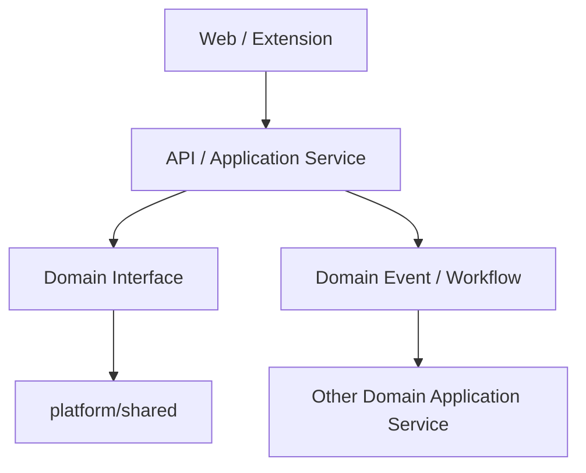

# AI Resume OS 架构师索引库 v1.1

> 定位：面向 AI Resume OS 开发现场的“架构检索与决策入口”。
> 基线：`AI Resume OS / JobOS 系统设计与技术架构方案 v1.1`（总体文件名保留 v1.0）。
> 读者：架构师、产品负责人、前后端、AI/算法、测试、运维及 AI Coding Agent。
> 使用方式：先按问题检索本库，再进入对应专题、契约、ADR 与代码模块。
> 更新日期：2026-09-18（原 v1.1 基线保留；新增待人审的多用户目标索引 `ARCH-SEC-003` / ADR-013）。
> 文件名沿用 v1.0 仅为路径稳定，内容以文内版本为准。

> **目标/现状区分**：2026-09-18 本人批准转向公网多用户，但 [ADR-013](docs/architecture/decisions/ADR-013-多用户与公网入口.md) 仍待独立人审；以下 v1.1 单用户/loopback 条目描述当前实现和历史验收基线，不构成公网代码已实现或可部署的声明。

---

## 0. 索引库解决什么问题

AI Resume OS 不缺架构内容，真正缺的是开发现场的“快速定位能力”：遇到一个需求或故障时，开发者需要在几分钟内知道它属于哪个领域、应采用什么模式、改哪些契约、遵守哪些红线、如何测试和验收。

本库建立五级导航：


每个正式条目至少回答：

1. 为什么需要它；
2. 什么时候使用或禁止使用；
3. 归属哪个领域、由谁负责；
4. 依赖哪些 API、事件、数据与 ADR；
5. 开发如何落地；
6. 如何验证完成；
7. 出问题如何降级或恢复。

> 链接约定：本文件位于仓库根，链接均指向仓库内真实文件。机器契约目录见 [`contracts/`](contracts/README.md)；AI 代理现场规则见 [`AGENTS.md`](AGENTS.md)。

---

## 1. 开发者一分钟入口

### 1.1 按“我现在要做什么”搜索

| 开发问题 | 首查索引 | 继续检查 |
|---|---|---|
| 新增业务功能 | `ARCH-BIZ-001`、`ARCH-MOD-001` | 领域边界、写模型、领域事件、验收指标 |
| 新增或修改 API | `ARCH-API-001`、`ARCH-CONTRACT-001` | OpenAPI、幂等、错误码映射、审计、契约测试 |
| 新增数据库表/字段 | `ARCH-DATA-001`、`ARCH-CONTRACT-001` | 数据分层、所有权、Alembic 迁移、索引、PII 等级 |
| 新增账号、角色或公网入口 | `ARCH-SEC-003`、`ARCH-SEC-001`、`ARCH-CONTRACT-001` | ADR-013 人审、服务端身份、跨账号隔离、公开/本机边界 |
| 跨模块调用 | `ARCH-MOD-002` | 同步接口或领域事件；禁止跨域直接写库 |
| 长耗时或 AI 任务 | `ARCH-WF-001` | Workflow、Worker、重试、超时、成本上限 |
| 浏览器扩展采集/填充/聊天解码 | `ARCH-EXT-001`、`ARCH-API-002` | WS 契约、幂等 upsert、限速、风控暂停 |
| 新增/修改筛选规则 | `ARCH-SCREEN-001` | Filter Set schema、规则边界集、零 LLM、捞回 |
| 生成简历/招呼语 | `ARCH-AI-002`、`ARCH-GOV-001` | Evidence→Claim、Truth Guard、人工审批 |
| 修改匹配算法 | `ARCH-MATCH-001` | Stage-0/Stage-1 边界、可解释性、离线评估 |
| 新增模板/DOCX 导入/导出格式 | `ARCH-TPL-001` | Claim 不变性、渠道约束、解析/视觉回归 |
| 做前端页面/组件/改视觉 | **根 [`DESIGN.md`](DESIGN.md)（视觉真源）** | 页面地图（01 篇）、参考库 `docs/design/references/`、taste skill pre-flight、AGENTS 红线 |
| 使用聊天记录 | `ARCH-SEC-002` | restricted PII、默认不出本机、不可作证据 |
| 做复盘/漏斗/策略建议 | `ARCH-RETRO-001` | 不可变版本、漏斗对账、建议人工审核 |
| 做自动投递/自动发消息 | `ARCH-GOV-002` | **禁止**；只能生成载荷并由本人确认发送 |
| 修改机器契约/协议 | `ARCH-CONTRACT-001` | 先 contracts/ 再文档再实现；契约测试 |
| 给 AI 代理派任务/审 AI 产出 | `ARCH-AIAGENT-001` | 任务头、三级授权、禁止清单、自评 |
| 性能慢或队列堆积 | `ARCH-NFR-001`、`ARCH-OBS-001` | P95、节点耗时、重试率、缓存与背压 |
| 上线/升级/迁移 | `ARCH-DEP-001` | Compose、迁移备份、回滚、健康检查 |
| 本地故障处理 | `ARCH-OPS-001` | Runbook、影响面、止损、恢复、复盘 |
| 技术选型产生争议 | `ARCH-ADR-001` | 记录 Context/Options/Decision/Consequences |

### 1.2 按关键词搜索

| 关键词或别名 | 索引 ID |
|---|---|
| 领域、DDD、Bounded Context、业务边界 | `ARCH-BIZ-001` |
| 模块化单体、依赖方向、跨域写入 | `ARCH-MOD-001`、`ARCH-MOD-002` |
| Raw/Parsed/Inferred/Confirmed、数据分层 | `ARCH-DATA-001` |
| 不可变、版本冻结、output_hash | `ARCH-DATA-002` |
| Event、Outbox、投影、最终一致性 | `ARCH-EVT-001` |
| Idempotency-Key、重复提交、去重 | `ARCH-REL-001` |
| Workflow、长任务、暂停恢复、人工节点 | `ARCH-WF-001` |
| Prompt、JSON Schema、模型路由、AI 留痕 | `ARCH-AI-001` |
| RAG、Evidence、Hybrid Retrieval | `ARCH-AI-002` |
| Claim、真实性、幻觉、Truth Guard | `ARCH-GOV-001` |
| Stage-0、Filter Set、规则引擎、捞回、活跃度 | `ARCH-SCREEN-001` |
| ATS、解析率、关键词、时间线 | `ARCH-ATS-001` |
| PII、聊天、protobuf 解码、脱敏、加密 | `ARCH-SEC-002`、`ARCH-EXT-001` |
| 多用户、邀请注册、会话、owner、跨账号访问 | `ARCH-SEC-003`、`ARCH-DATA-001` |
| Metrics、Trace、Audit、漏斗对账 | `ARCH-OBS-001` |
| Docker Compose、loopback、备份恢复 | `ARCH-DEP-001` |
| 模板、Blueprint、DOCX 导入、渠道隔离 | `ARCH-TPL-001` |
| 复盘、Retrospective、Strategy、漏斗 | `ARCH-RETRO-001` |
| 契约、codegen、OpenAPI、Schema、DoR | `ARCH-CONTRACT-001` |
| AGENTS、AI 边界、禁止清单、人审 | `ARCH-AIAGENT-001`、`ARCH-GOV-002` |

---

## 2. 架构全景与所有权

### 2.1 系统形态

当前采用“本机模块化单体 + 独立异步 Worker（含渲染 Worker）+ PostgreSQL/pgvector + Redis + 浏览器扩展”的形态。现有入站服务仅监听 `127.0.0.1`，没有已实现的多用户或公网入站能力。目标中的公网 Web 边缘与用户隔离见待人审 [ADR-013](docs/architecture/decisions/ADR-013-多用户与公网入口.md)；自动外发仍禁止。详见总体方案 §4 与专题 17。

### 2.2 领域索引

口径与总体方案 §3 一致：11 个顶级域，Template 在领域表中列为 Resume 下子域、但拥有独立代码目录与数据所有权（按所有权单元计 12 个）；Outreach 为逻辑域，代码落在 `domains/application`（投递包/事件）与 `domains/resume`（招呼语/在线载荷）。

| 领域 | 核心职责 | 拥有的数据 | 建议代码位置（总体 §4.3） | 禁止事项 |
|---|---|---|---|---|
| Capture | 扩展配对、采集批次、原始岗位、聊天回采 | `capture_source/batch_run/raw_job/chat_thread/chat_message` | `domains/capture` | 不做匹配，不改候选事实，不 hook 发送接口 |
| Screening | Stage-0 纯规则筛选和捞回 | `filter_set/screen_result` | `domains/screening` | reject 不得依赖 LLM；不可无原因淘汰 |
| Job Intelligence | JD、技能、要求和约束解析 | `job/job_requirement/job_constraint` | `domains/job` | 不读聊天、不生成简历 |
| Candidate | 个人履历、项目、技能和资产 | `candidate/experience/project/artifact` | `domains/candidate` | AI 推断不得覆盖确认事实 |
| Evidence OS | 切片、索引、混合检索、证据判定 | `evidence/evidence_link` | `domains/evidence` | 不直接创建 Resume Claim；不关联聊天 |
| Matching | 硬门槛、匹配评分、Fit/Gap/Risk、投递建议 | `match_result/match_requirement` | `domains/matching` | 不改履历与筛选规则；不承诺录用 |
| Resume Intelligence | Plan、Claim、Truth Guard、版本、招呼语、在线载荷 | `resume/resume_version/resume_claim/greeting_variant` | `domains/resume` | 无证据 Claim 不得发布 |
| └ Template（独立代码单元） | Blueprint、模板、渲染、DOCX 导入、编辑状态 | `resume_template/template_blueprint/template_import_batch/template_pack` | `domains/template` | 模板不得产生或改写事实；禁商业解析库 |
| Outreach（逻辑域） | 投递包编排、招呼语 A/B、在线载荷、人工发送记录 | `application_package` | `domains/application` + `domains/resume` | 不得自动发送或投递 |
| Application Intelligence | 投递事件、阶段投影、漏斗明细 | `application/application_event` | `domains/application` | draft 事件不得计入事实漏斗 |
| Retrospective | 单岗/阶段复盘、策略建议 | `retrospective/strategy_suggestion` | `domains/retrospective` | 不自动调权，不写候选事实 |
| Platform | Workflow、AI 适配、鉴权、审计、配置、WS 网关 | `workflow_*/model_run/audit_log` | `platform/*` | 不承载具体业务规则 |

### 2.3 依赖原则

允许的依赖方向：



- UI 不直接访问数据库或 Worker；扩展不直连数据库（WS 是唯一通道）。
- 领域模块只能依赖 `platform/shared` 和显式声明的端口接口。
- 跨域查询通过 Query Service/Read Model；跨域写入通过 Application Service、领域事件或 Workflow。
- 禁止 A 域 Repository 直接写 B 域数据表。
- 基础设施实现依赖领域接口，领域层不依赖 FastAPI、Redis、SQLAlchemy 或模型 SDK。

---

## 3. 核心架构条目

### ARCH-BIZ-001｜领域边界与业务能力拆分

- 场景：新增能力、判断模块归属、拆分需求或评审跨域设计。
- 决策：先识别业务能力与不变量，再确定 Bounded Context，不按页面或数据库表拆模块。
- 判断法：谁拥有规则、谁拥有状态、失败由谁承担、词义是否一致。
- 落地：需求必须标记 `domain_owner`、核心命令、状态变化、事件和验收结果。
- 完成标准：业务规则只在一个领域拥有；不存在双写和循环依赖。
- 参考：[总体方案 §3](docs/AI-Resume-OS-JobOS-系统设计与技术架构方案-v1.0.md)、[01-系统设计文档](docs/architecture/01-系统设计文档.md)、[02-技术架构设计](docs/architecture/02-技术架构设计.md)；ADR-001。
- 关联：`ARCH-MOD-001`、`ARCH-EVT-001`。

### ARCH-MOD-001｜模块化单体

- 场景：当前个人本地版的默认后端架构。
- 决策：FastAPI 模块化单体 + 独立 Worker（AI/解析/渲染分池）；按领域隔离（`domains/*` + `platform/*`），不是 Controller/Service/DAO 全局分层。
- 何时不拆微服务：个人单机、吞吐有限、领域仍在变化时。
- 拆分触发器：独立资源模型成为实测瓶颈；故障隔离或发布节奏冲突且边界已稳定——以实测数据触发，不提前拆。
- 门禁：模块公共入口明确；内部对象不跨域暴露；依赖检查无环。
- 参考：[总体方案 §4](docs/architecture/01-系统设计文档.md)、[02-技术架构设计](docs/architecture/02-技术架构设计.md)、[23-开发基线与契约固化](docs/architecture/23-开发基线与契约固化.md) §2；ADR-001。
- 关联：`ARCH-MOD-002`、`ARCH-DEP-001`。

### ARCH-MOD-002｜跨域协作

- 同步查询：用户正在等待、响应短、需要立即结果时，调用显式 Domain Port。
- 领域事件：一个域完成事实后通知其他域，允许最终一致性（命名用过去式事实，如 `shortlist.confirmed`）。
- Workflow：多步、长耗时、有重试/审批/补偿语义的业务过程。
- 禁止：跨域 Repository、共享可写表、在事件消费者中偷偷改源域状态。
- 检查：调用超时、幂等键、事件版本、失败归属和可观测字段必须明确。
- 参考：[02-技术架构设计](docs/architecture/02-技术架构设计.md)、[04-Workflow编排设计](docs/architecture/04-Workflow编排设计.md)。

### ARCH-DATA-001｜四层数据模型

| 层 | 示例 | 规则 |
|---|---|---|
| Raw 原始层 | JD 原文、抓取 JSON、原件、聊天原文 | 不被解析结果覆盖；保留来源和哈希 |
| Parsed 解析层 | Job、Requirement、Artifact Chunk | 可重建；记录解析器版本 |
| Inferred 推断层 | 模型标签、Match、事件草稿 | 带模型/Prompt/输入快照和置信度 |
| Confirmed 确认层 | 已确认事实、候选决定、事件、策略审批 | 追加记录；修改产生新版本 |

- 表必须有唯一 owner 域；跨域只持稳定 ID，不共享可写 ORM 实体。
- 时间统一 UTC ISO-8601；实体 ID 默认 UUIDv7。
- 迁移必须可前滚，破坏性字段删除至少跨一个版本完成；Alembic 是唯一变更入口。
- restricted PII 不进日志、指标、普通导出和第三方模型请求。
- 参考：[12-数据库设计](docs/architecture/12-数据库设计.md)、[contracts/db DDL 草案](contracts/db/0001_baseline.skeleton.sql)。

### ARCH-DATA-002｜证据与版本不可变性

- Resume Claim、投递包、复盘、策略建议发布后不可原地修改；修订产生新版本。
- `resume_version` 冻结 Claim、模板版本、渲染器版本、输入 Claim 哈希与 output_hash。
- 资产删除时撤销索引并处理派生导出件，但审计记录保留脱敏引用。
- 聊天消息与 Evidence 不建立任何关系路径，聊天不可自动转化为工作事实。
- 参考：[10-Resume-Engine](docs/architecture/10-Resume-Engine技术方案.md)、[22-简历模板与渲染引擎](docs/architecture/22-简历模板与渲染引擎技术方案.md) §8、[12-数据库设计](docs/architecture/12-数据库设计.md)。

### ARCH-API-001｜HTTP API 契约

- 基础：`/api/v1`、JSON、UTC、UUIDv7；OpenAPI 为机器可读事实源（当前核心路径骨架，随阶段补齐）。
- 写请求：接受 `Idempotency-Key`；创建类返回稳定资源 ID；长任务返回 `202 + execution_id`。
- 错误：统一 `{code,message,details,trace_id}`；错误码→HTTP/重试映射以 [13-API接口设计](docs/architecture/13-API接口设计.md) 表为准，业务错误不可只返回字符串。
- 兼容：字段只增不删；枚举扩展客户端必须容忍未知值；破坏性变更升版本。
- 安全：校验 loopback、扩展 origin 与配对 token；不在 URL 传秘密或 PII。
- 测试：OpenAPI diff、Schema validation（schemathesis）、消费者契约、鉴权负例、幂等重放。
- 契约：[`contracts/api/openapi.yaml`](contracts/api/openapi.yaml)。

### ARCH-API-002｜WebSocket 扩展协议

- 信封：`{v:1,kind:command|event|receipt,id,type,capture_id|command_id,payload}`，`127.0.0.1:8788/ws`。
- 每条消息有唯一 `id`；按事件 ID 与业务唯一键（`source+ext_id`、`ext_msg_id`）双重幂等；回执四态 started/progress/completed/error。
- 支持 abort、`capture.error{risk:true}` 暂停、断线按 cursor 恢复；未知 type 显式拒绝/忽略并记录，不得崩溃。
- 握手独立为 `auth_ping/auth_pong`；业务命令全集 6 个（capture_list/capture_details/abort/fill_online_resume/copy_greeting/capture_chat），业务事件全集 7 个，**不存在且永不注册**自动发送、投递、翻页、上传命令。
- 协议先改 Schema 与契约测试，再改服务端和扩展实现。
- 参考：[21-浏览器扩展集成协议](docs/architecture/21-浏览器扩展集成协议.md)；契约 [`contracts/ws/`](contracts/ws/protocol.schema.json)。

### ARCH-EXT-001｜浏览器扩展采集与填充边界

- 职责：扩展只负责 BOSS 页面侧采集、聊天协议解码、载荷填充预览和人工操作回执；分析与事实判断全部由主系统负责。
- 采集：列表零请求先筛、详情按需补采；`auto_next_page` 恒 false；节流 ≥1800ms + 抖动、并发恒 1；验证码/异常/风控词触发立即 `risk_halted` 停批。
- 数据：保留原始 payload、来源、采集时间、解析器/选择器版本；服务端按 `source+ext_id` upsert；老 MySQL 8789 数据一次性迁移后删除本地 Node 链路。
- 填充：只接受 Truth Guard 已通过且用户选定的四模块载荷，回填预览+逐模块高亮+当场人工确认；公司、职位、起止时间、学历为红线字段，载荷中出现也跳过并报 `skipped_redline`；不代点发送。
- 聊天：网络层 protobuf 解码为主、DOM 降级；分类只形成 draft 事件，人工确认后入账。
- 安全：仅连 loopback WS，校验 origin 与配对 token；扩展不保存模型 Key。
- 参考：ADR-005/009/012；[21-浏览器扩展集成协议](docs/architecture/21-浏览器扩展集成协议.md)；[commands.schema.json](contracts/ws/commands.schema.json)。
- 关联：`ARCH-API-002`、`ARCH-REL-001`、`ARCH-GOV-002`、`ARCH-SEC-002`。

### ARCH-EVT-001｜领域事件、Outbox 与投影

- 事件使用已发生事实命名，如 `shortlist.confirmed`，不用 `confirm.shortlist`。
- 业务领域事件 8 类：`screen.completed、shortlist.confirmed、template.selected、greeting.generated、application.greeted、chat.event_received、retrospective.generated、strategy.proposed`；扩展 WS 事件 7 类（见 21 篇），两者不混用。
- 事件最小字段：`event_id,event_type,event_version,aggregate_id,occurred_at,correlation_id,payload`。
- 事务内写业务数据和 Outbox；消费者至少一次处理并自行幂等。
- Application 阶段是事件投影，可重放；`review_status=draft` 的聊天事件确认前不参与投影。
- 事件 Schema 破坏性修改必须升 `event_version` 并提供兼容消费者。
- 参考：[04-Workflow编排设计](docs/architecture/04-Workflow编排设计.md)、[12-数据库设计](docs/architecture/12-数据库设计.md)。

### ARCH-REL-001｜幂等、重试与一致性

- API：`Idempotency-Key + operation + owner` 构成幂等域。
- Workflow 节点：`execution_id + node_key + attempt` 标识尝试，业务副作用另设稳定幂等键。
- 采集：`source + ext_id` upsert，fingerprint 用于跨批内容去重；聊天按 `thread_id + ext_msg_id` 去重。
- 重试只用于临时故障；校验错误、权限错误、Truth Guard 拒绝、风控暂停不重试。
- 外部调用采用 timeout、指数退避、抖动、熔断和最大成本；禁止无限重试。
- 参考：[13-API接口设计](docs/architecture/13-API接口设计.md)、[21-浏览器扩展集成协议](docs/architecture/21-浏览器扩展集成协议.md)。

### ARCH-WF-001｜受限 Workflow Engine

- 使用：批量筛选/解析、JD 深度解析、Evidence 检索、匹配、简历/招呼语生成、渲染、复盘。
- 不使用：普通 CRUD、单次低延迟规则计算。
- 节点类型（以 [15-Workflow-DSL](docs/architecture/15-Workflow-DSL设计.md) 与 [`workflow.schema.json`](contracts/dsl/workflow.schema.json) 为准）只有三种：`task`、`human_approval`、`event_wait`。并行/汇聚是 task 属性（`parallel:{items_path,max_fanout}` + `join:all_success|allow_partial`）；条件用 `when`/`depends_on` 表达；**v1.1 不提供独立 condition/parallel/join/compensation 节点**。
- 流程资产：总体 §8.1 的端到端主流程 `boss_application@1.0`（伞形视图）；专题 04 拆分为 `boss_batch@1.0`（批量采集筛选）、`job_to_package@1.0`（单岗投递包子图）、`retrospective@1.0`（事件驱动回采复盘），同一事实的两种粒度，命名不得混用。
- 每节点声明输入/输出、超时、重试、幂等、成本预算、`side_effect_level`（local_read|local_write|extension_command）、数据策略。
- 定义版本化；运行实例固定版本；handler 白名单注册，名字/元数据匹配 `send|deliver|apply_external|next_page|upload` 启动期拒绝；`fill_online_resume/copy_greeting` 只能在 send_approval 后由 API 单次下发，不编入自动执行图。
- 人工审批固定 approver=owner，超时动作只有 cancel，**不得默认批准**。
- 参考：[04-Workflow编排设计](docs/architecture/04-Workflow编排设计.md)、[15-Workflow-DSL设计](docs/architecture/15-Workflow-DSL设计.md)。

### ARCH-AI-001｜模型调用六道防线


- 输入最小化和脱敏（JD 防注入/SSRF）；Prompt 必须有稳定 ID 与版本。
- Provider Adapter 隔离模型 SDK，按任务质量、隐私、延迟和成本路由；Key 只在本机。
- 只接收结构化输出；Schema 不通过可有限修复，仍失败进入人工处理。
- 每次运行保存模型、参数、Prompt 版本、输入哈希、输出、token、延迟、费用和 trace ID。
- AI 只能提出推断或草稿，不能越权写 Confirmed Fact、改权重或执行外发。
- 参考：[14-AI模型与Prompt设计](docs/architecture/14-AI模型与Prompt设计.md)；ADR-004。

### ARCH-AI-002｜Evidence OS 与 RAG

- 检索链：Query/Requirement 标准化→关键词召回 + 向量召回（pgvector HNSW + GIN）→融合重排→Evidence Judge→引用。
- Evidence 必须保留来源资产、原文位置、时间、类型、哈希和可信度/隐私等级。
- Judge 判定支持/部分支持/冲突/不支持；相似不等于支持；量化结果需同一数值与语境。
- Claim 发布至少关联一条有效证据；KB 冷启动四来源（E:\Profile\work 八段式资料、career-kb、旧简历、引导录入），项目性质 real_world|secondary_dev|learning_ref 红线不可改写。
- 评估：Recall@K、引用正确率、支持判定 F1、unsupported Claim 数、过期证据比例。
- 参考：[07-Evidence-OS](docs/architecture/07-Evidence-OS技术方案.md)、[06-Candidate-Intelligence](docs/architecture/06-Candidate-Intelligence技术方案.md)；ADR-002。

### ARCH-SCREEN-001｜Stage-0 纯规则筛选（v1.1 新增）

- 职责归属 Screening 域：在任何 LLM 花费之前，用确定性规则节约分析成本，并让每条淘汰可解释、可捞回。
- 规则八组：hard / company / jd_content / dedup / activity / social / commute / optional_ai，形状冻结于 [`filter-set.schema.json`](contracts/filters/filter-set.schema.json)；Filter Set 版本化，历史结果留存所用版本。
- 执行管线：列表零请求先筛 → 通过/待补采入桶 → 节流拉详情（受风控暂停约束）→ 详情规则 → pass/reject/flag；薪资不明 flag 不默认淘汰；通勤未配 Key/缺地址 skip。
- 否定语境：黑名单词必须否定感知（“不需要会 Java”）并排除工具后缀；同 HR 多岗/好友岗/已沟通期内去重；活跃度（boss-helper 维度）分档，金牌面试官只 flag。
- optional_ai 默认关，且 AI 只能补充边界条件，**永不覆盖规则 verdict**。
- 验证：规则边界集（薪资口径、活跃度、否定语境、猎头/好友）+ 每条 reject 原因字段可对账 + 零 LLM 调用断言 + recover 留痕。
- 参考：[08-Matching-Engine](docs/architecture/08-Matching-Engine技术方案.md) Stage-0、[03-业务流程设计](docs/architecture/03-业务流程设计.md)。

### ARCH-MATCH-001｜两阶段匹配

- Stage-0：见 `ARCH-SCREEN-001`。Stage-1：硬门槛 + 加权软匹配 + Evidence Confidence + Recency Factor。
- 基线公式：`FinalScore = round(100 × HardGate × WeightedFit × EvidenceConfidence × RecencyFactor)`。
- 输出不能只有分数，必须含 Fit、Gap、Risk、ATS 投递建议（建议/谨慎/不建议）和逐项证据。
- 改权重必须基于版本化评估集与复盘建议，并经人工批准；历史结果保留版本；approved 建议不触发任何自动调权。
- 防止“95% 假精度”：分数是内部可解释指标，不宣称复刻真实 ATS 私有排序，不承诺沟通/约面。
- 参考：[08-Matching-Engine](docs/architecture/08-Matching-Engine技术方案.md)；ADR-003/008。

### ARCH-ATS-001｜ATS Simulator

- 维度：解析性、关键词覆盖、结构、时间线、联系方式；另检查在线四模块与模板渠道正确性。
- 输入：实际导出 PDF/DOCX/Markdown，不只检查编辑器中的 Resume JSON。
- 双路径解析并比较结果；缺陷定位到字段、页、模块或关键词。
- ATS 模板优先单栏；Showcase 模板不可作为 ATS 合格产物（wrong_channel 阻断）。
- 发布门禁：PDF/DOCX 解析成功率 ≥98%，关键字段完整率 ≥95%，金标集版本固定。
- 参考：[09-ATS-Simulator](docs/architecture/09-ATS-Simulator技术方案.md)、[16-测试与评估方案](docs/architecture/16-测试与评估方案.md)。

### ARCH-GOV-001｜Evidence→Claim→Truth Guard

- Claim 来源只能是 approved facts 与有效 Evidence。
- Truth Guard 同时覆盖简历 Claim、在线载荷、招呼语与渲染结果。
- `support_status=unsupported` 的 Claim 在已发布/已使用版本中必须为 0。
- 公司、职位、时间、学历红线字段禁止 AI 自动改写；招呼语禁用承诺/虚构了解/绝对化表述，变量槽走白名单。
- 人工内容编辑重新走 Claim 校验；排版编辑只能改 Template 渲染参数。
- 同一 Claim 快照跨 online/ats/showcase 三渠道文本与证据集合必须一致。
- 参考：[11-Truth-Guard](docs/architecture/11-Truth-Guard技术方案.md)、[10-Resume-Engine](docs/architecture/10-Resume-Engine技术方案.md)；ADR-002/007/010。

### ARCH-GOV-002｜Human-in-the-loop 与自动化红线

- 必须人工确认：进入候选区、对外发送（系统只填充/复制）、聊天事件入账、策略建议生效、模板导入启用。
- 系统可以准备载荷、展示建议、记录执行结果；可以自动完成采集、规则筛选、JD/匹配分析、草稿生成。
- 禁止：自动投递、自动发消息、自动上传附件、自动翻页、自动确认草稿、自动批准策略、自动调权（ADR-008/009）。
- 新 handler 和扩展 command 注册执行静态黑名单门禁；E2E + 静态扫描双重验证不存在可达外发路径。
- 参考：[24-AI协作开发规范与边界](docs/architecture/24-AI协作开发规范与边界.md)、[`AGENTS.md`](AGENTS.md)、[21-浏览器扩展集成协议](docs/architecture/21-浏览器扩展集成协议.md)、[20-风险与验收标准](docs/architecture/20-风险与验收标准.md)。

### ARCH-TPL-001｜模板与渲染

- 25 模块 × 23 布局 × 34 风格正交；模板只引用 Resume JSON 已存在槽位，不承载事实。
- 渠道分 `ats` 与 `showcase`（online 无模板）；渠道校验为发布硬门禁，错误使用返回 TEMPLATE_WRONG_CHANNEL。
- DOCX 默认 openxml/python-docx 开源管线（8 步），A/B/C 保真分级，C 级显式重建 ATS 单栏；Aspose 不进默认栈（ADR-011）；224 套按需导入不进默认发行，license/source 必填。
- 每次导出记录 template/blueprint/renderer 版本、render_params 与输入/输出哈希；独立解析器回读校验，失败 TEMPLATE_DRIFT。
- 导出 PDF/PNG/HTML/DOCX/MD；3D 画廊默认关闭；网格库为默认浏览形态。
- 测试：槽位映射回归、文本不变性、视觉截图、分页/中文字体、ATS 解析、DOCX 回填、降级报告、许可证扫描。
- 参考：[22-简历模板与渲染引擎](docs/architecture/22-简历模板与渲染引擎技术方案.md)；ADR-010/011。

### ARCH-RETRO-001｜复盘、漏斗与策略生命周期（v1.1 新增）

- 单岗复盘仅在岗位终态（offered/interview_rejected/chat_rejected/withdrawn）可生成；重跑新建不可变版本。
- 阶段汇总按统一漏斗口径：`captured → screened_pass → shortlisted → greeted → replied → interview_scheduled → offered`，看板各级必须能下钻明细对账。
- Strategy Suggestion 生命周期：`proposed → approved|rejected → applied`；applied 只能由本人落实后手动标记；系统不自动写回任何权重/规则/参数。
- 复盘引用聊天上下文时走本机模型或脱敏侧；复盘产物本身是 Inferred/Confirmed 混合，不得作为新事实证据。
- 参考：[18-监控与运维方案](docs/architecture/18-监控与运维方案.md)、[03-业务流程设计](docs/architecture/03-业务流程设计.md)、[12-数据库设计](docs/architecture/12-数据库设计.md)；ADR-008。

### ARCH-SEC-001｜现有本地信任边界

- API、WS、数据库管理入口仅绑定 `127.0.0.1`；拒绝非 loopback 来源与不允许的 Origin。
- 扩展首次人工配对；token 最小权限、可撤销、可轮换，不入仓库、镜像和日志。
- 前端/扩展不持有模型供应商 Key；Worker 只获取任务所需秘密；聊天 KEK 本机文件 600 权限。
- URL/文件解析防路径穿越、SSRF、压缩包炸弹与超大文件；DOCX/图片来自本机或用户显式提供。
- 参考：[17-部署架构](docs/architecture/17-部署架构.md)、[21-浏览器扩展集成协议](docs/architecture/21-浏览器扩展集成协议.md) §2/§9。

### ARCH-SEC-003｜多用户身份、归属与公网边缘（proposed）

- 场景：2026-09-18 本人批准的多用户目标；编码前需 [ADR-013](docs/architecture/decisions/ADR-013-多用户与公网入口.md) 独立人工 Review。
- 身份：邮箱密码 + 管理员一次性邀请；求职者/招聘者为业务角色，管理员为治理权限；首个管理员只能在服务器端引导。
- 边界：仅经 TLS、服务端会话、CSRF/Origin 校验的 Web 入口可公开；API/WS 扩展端、数据库、Redis、Worker 与管理接口不直接公开；扩展/聊天回采仍本机独立。
- 数据：用户拥有的行、缓存、文件、后台任务由认证主体确定归属；旧数据审计后归首个管理员，跨账号读写零成功；不可信客户端 owner 标识。
- 迁移与恢复：先契约再 Alembic；upgrade/downgrade 隔离库往返，不兼容的多用户降级必须拒绝；注销删除个人数据并撤销会话，最后管理员先移交权限。
- 参考：[ADR-013](docs/architecture/decisions/ADR-013-多用户与公网入口.md)、[P1-007 评审任务](docs/delivery/tasks/P1-007-multiuser-architecture-gate.md)、[20-风险与验收标准](docs/architecture/20-风险与验收标准.md)。

### ARCH-SEC-002｜PII 与聊天数据

- `chat_message`（含 payload_enc）与原始职业资产为 restricted 最高级数据，静态加密。
- 默认不进第三方模型、日志、指标、通用导出和错误堆栈；`CHAT_TO_THIRD_PARTY` 默认关，开启需二次确认 + 脱敏。
- 第三方辅助复盘必须显式开启并先脱敏，保存数据处理审计；出站请求测试断言零 chat 字段。
- 支持按会话清除聊天；清除后同步删除缓存、索引与派生临时文件；刻意不建 chat→evidence 关联。
- 参考：[21-浏览器扩展集成协议](docs/architecture/21-浏览器扩展集成协议.md) §6、[06-Candidate-Intelligence](docs/architecture/06-Candidate-Intelligence技术方案.md)、[20-风险与验收标准](docs/architecture/20-风险与验收标准.md)；ADR-006。

### ARCH-OBS-001｜可观测性与审计

- 三类信号：技术指标（延迟/错误/队列）、业务漏斗、不可抵赖审计。
- 统一关联：`trace_id/correlation_id/execution_id/model_run_id/application_id`（WS 信封 id 兼作 trace）。
- 重点指标：API P95、Workflow 节点耗时/失败/重试、队列年龄、模型费用、Truth Guard 拦截率、ATS 解析率、扩展断连率、导入失败率。
- 漏斗口径与 `ARCH-RETRO-001` 同源，必须能下钻明细对账。
- 日志严禁包含聊天原文、密钥、完整简历或原件内容。
- 审计覆盖配对、采集、筛选、候选确认、导出、填充回执、事件确认、策略审核、模板导入。
- 参考：[18-监控与运维方案](docs/architecture/18-监控与运维方案.md)。

### ARCH-NFR-001｜非功能需求与容量

| 指标 | 当前基线 |
|---|---|
| 本机 CRUD P95 | ≤300ms |
| Workflow 完成率 | ≥99%（用户取消与审批超时单列） |
| ATS 模板解析成功率 | ≥98% |
| ATS 关键字段完整率 | ≥95% |
| 已发布 unsupported Claim | 0 |
| 非 loopback 入站 | 100% 拒绝 |
| restricted 数据第三方外发 | 0 |
| 自动外发代码路径 | 0（静态扫描 + 红队双断言） |
| 数据规模 | 单批数百至数千岗位，累计数万 Raw Job，数百简历版本 |

- 新增 NFR 必须给测量方法、样本、阈值和失败处置；指标阈值属验收门禁，AI 不得修改。
- 优化顺序：测量→定位→减少工作→索引/缓存→并行化；不凭感觉加中间件。
- 参考：[18-监控与运维方案](docs/architecture/18-监控与运维方案.md)、[20-风险与验收标准](docs/architecture/20-风险与验收标准.md)。

### ARCH-DEP-001｜本地部署与演进

- Compose 服务：api / web / postgres(pgvector) / redis / worker / worker-renderer；全服务仅绑 loopback。
- 存储默认本机 FS bind mount（`data/files、templates、chat-raw、fonts、backups`，`ArtifactStore` 双 Adapter，MinIO 仅实验可选项、不进默认发行）；源职业资产目录只读挂载。
- 发布顺序：备份→迁移检查→拉起基础设施→Alembic 迁移→服务升级→健康/E2E 冒烟。
- 回滚先判断数据库兼容性；禁止用 `git reset --hard` 或直接删卷处理升级失败。
- 每次版本验证扩展协议兼容（v 协商）、中文字体、渲染器与模型配置。
- 参考：[17-部署架构](docs/architecture/17-部署架构.md)、[23-开发基线与契约固化](docs/architecture/23-开发基线与契约固化.md)。

### ARCH-OPS-001｜故障 Runbook

| 故障 | 首要动作 | 降级/恢复 |
|---|---|---|
| BOSS 出现验证/风控词/异常 | 批次自动 risk_halted | 人工处理后新建批次，禁止自动绕过/重试 |
| WS 断连 | 保留 cursor 与未确认事件 | 指数退避重连，按 ID 去重补传 |
| 页面/接口结构变化 | 停止对应解析器 | 网络解码→DOM 降级或人工导入；契约测试报警 |
| 聊天 proto 变更 | 解码失败转 DOM 路径 | 置信度下调进草稿队列，等待人工确认 |
| 模型不可用 | 熔断 Provider | 切换允许的 Provider 或转人工 |
| 队列堆积 | 暂停新 fan-out | 检查最老任务、重试风暴与 Worker 资源 |
| DOCX 导入失败 | 保留逐条失败报告 | 显式降级 ATS 单栏，禁止静默丢字段 |
| 数据损坏/丢失 | 停止写入 | pg_dump + 文件目录一致性恢复演练 |

每次高影响故障记录时间线、影响面、根因、临时处置、永久措施。参考 [18-监控与运维方案](docs/architecture/18-监控与运维方案.md)。

### ARCH-CONTRACT-001｜契约真源与冻结流程（v1.1 新增）

- 双层真源：**文档定义语义与红线，[`contracts/`](contracts/README.md) 定义形状**；冲突时先评审改文档再改契约，禁止反向。
- 契约集：WS 信封/命令/事件/岗位/聊天（JSON Schema 2020-12）、OpenAPI 3.1 骨架、PG DDL 草案（P1 落首个 Alembic 迁移）、Workflow DSL、Filter Set。
- 状态机：`v0-draft` → P0 评审转 `v1`；之后字段只增不删，破坏性变更升版本 + ADR。
- `packages/contracts-py|ts` 单向 codegen，禁止手改；CI 跑双端 Schema 一致性、OpenAPI 兼容 diff、协议未知 type 容错用例。
- 改契约的顺序：文档 → contracts/ → 生成代码 → 双端实现 → 契约测试；扩展与服务端靠 `v:1` 协商，不兼容返回 EXTENSION_VERSION_MISMATCH。
- 参考：[contracts/README](contracts/README.md)、[23-开发基线与契约固化](docs/architecture/23-开发基线与契约固化.md) §6/§7。

### ARCH-AIAGENT-001｜AI 编程代理协作边界（v1.1 新增）

- 三级授权：🟢 域内纯函数/测试/按冻结契约生成可自主；🟡 跨域、契约/DDL/迁移、Prompt/权重、配置默认值、扩展采集解码填充、安全/事实文案必须人审；🔴 禁止项见 [`AGENTS.md`](AGENTS.md) 与专题 24 §3。
- 标准任务流：任务单（含任务头与验收）→ DoR → 契约先行 → 最小实现 → 红线负向测试 → 自评清单 → 人审合并；AI 不得自行合并/推主干。
- 越界即停：任务触碰禁止项、契约与文档冲突、测试与红线冲突、PII/许可证不确定时，停止并请人裁决。
- 违规检测：违禁 handler 静态扫描、出站域名断言（无 chat 字段）、draft 不投影单测、许可证扫描、红线文件变更人审。
- 参考：[24-AI协作开发规范与边界](docs/architecture/24-AI协作开发规范与边界.md)、[`AGENTS.md`](AGENTS.md)；与 `ARCH-GOV-002`、`ARCH-CONTRACT-001` 配套。

### ARCH-ADR-001｜架构决策记录

- 触发：引入基础设施、改变领域边界、破坏契约、改变隐私/安全策略、改变不可逆数据模型、显著影响成本和运维。
- 状态：`proposed → accepted | rejected | superseded | deprecated`。
- 必填：Context、Decision Drivers、Options、Decision、Consequences、Validation、Rollback、Owners。
- ADR 记录“为什么”，专题设计记录“怎么做”，代码注释不替代 ADR；当前 ADR-001~012 见总体方案 §2，**AI 不得修改 ADR 与红线措辞**。

---

## 4. 开发流程索引

### 4.1 Architecture Definition of Ready（单任务级）

进入开发前至少满足：

- [ ] 需求目标、非目标和量化验收已明确；
- [ ] domain owner、核心实体和不变量已明确；
- [ ] 数据分级、所有权和迁移影响已明确；
- [ ] API/事件/Workflow/WS Schema 已先行或确认无需修改（对照 `ARCH-CONTRACT-001`）；
- [ ] 同步/异步边界、幂等、超时和失败处理已明确；
- [ ] 是否读取 Evidence、聊天、原件等敏感数据已明确；
- [ ] 是否需要人工审批及禁止自动化边界已明确；
- [ ] 关键 NFR、测试样本和观测指标已明确；
- [ ] 重大决策已建立 ADR。

> 阶段级（P0–P6）DoR 门禁见 [23 篇 §7](docs/architecture/23-开发基线与契约固化.md)；任务级以本节为准。

### 4.2 Architecture Definition of Done

- [ ] 实现未突破领域边界，无跨域写库与循环依赖；
- [ ] OpenAPI/JSON Schema/事件契约与代码同步（含 codegen 产物已重生成）；
- [ ] 单元、集成、契约、E2E 与安全负例（含红线“做不到”测试）通过；
- [ ] AI 输出通过 Schema Guard 与 Business/Truth Guard；
- [ ] 日志、指标、trace 和审计可定位本次运行且不含 PII；
- [ ] 数据迁移有备份、兼容与恢复方案；
- [ ] Runbook/文档已按需更新；
- [ ] 验收指标由自动报告或可复现步骤证明；
- [ ] ADR consequences 与实际结果一致，偏差已记录。

### 4.3 变更影响矩阵

| 变更类型 | 必查项 |
|---|---|
| UI 字段/页面 | API DTO、Zod Schema、权限、空态、审计、页面地图（01 篇） |
| API 字段 | OpenAPI、前端/扩展消费者、兼容性、错误码映射、契约测试 |
| WS 命令/事件 | 信封 schema、双端版本协商、幂等键、未知 type 容错、无 send 类断言 |
| 数据字段 | owner、PII、Alembic 迁移、索引、备份、删除闭环、DDL 草案对账 |
| 领域事件 | 生产者、所有消费者、event_version、重放、幂等、投影（draft 不投影） |
| Prompt | Prompt 版本、输出 Schema、Gold Set/红队集、费用、敏感数据 |
| 匹配权重/筛选规则 | 规则边界集、算法版本、历史可复现、零 LLM 断言（Stage-0）、人工审批 |
| 模板/Blueprint | Claim 不变性、渠道、字体、分页、ATS/视觉回归、license |
| Workflow | 定义版本、运行中实例、handler 白名单、重试、审批超时、取消 |
| 扩展选择器/proto | 风控暂停、DOM 降级、WS Schema、解码置信度、回归样本 |
| 配置默认值 | 下限约束（节流 1800ms/并发 1）、`.env.example`、设置页可见性 |

---

## 5. 仓库结构与文档地图

仓库目标结构以 [23-开发基线与契约固化 §2](docs/architecture/23-开发基线与契约固化.md) 为唯一真源（monorepo：`apps/extension`、`apps/web`、`services/api|worker|worker-renderer`、`packages/contracts-py|ts`、`contracts/`、`migrations/`、`data/`、`tests/`）；API 进程内部按总体方案 §4.3 的 `app/ + domains/ + platform/` 组织。本索引不再另立推荐结构，避免双份漂移。

- 专题文档：`docs/architecture/01–24`（索引见 [`README.md`](docs/architecture/README.md)），总体方案在 `docs/`。
- 机器契约：`contracts/ws|api|db|dsl|filters`（见 [`contracts/README.md`](contracts/README.md)）。
- 测试目录建议：`tests/contract/`（契约/schemathesis）、`tests/golden/`（Gold Set/规则边界集/红队集）、`tests/e2e/`（Playwright，禁真实账号）、`tests/security/`（loopback/外发零断言/无外发路径扫描）。
- ADR：当前 ADR-001~012 内聚在总体方案 §2；未来条目可落 `docs/architecture/decisions/`（编号延续，不拆散既有 12 条）。

## 6. 架构条目模板

新增模式时复制以下结构：

```markdown
### ARCH-<CATEGORY>-<NNN>｜<名称>

- 状态：draft/accepted/deprecated
- Owner：<领域>
- 场景：<何时使用>
- 决策：<采用的方式>
- 不适用/约束：<边界、安全隐私成本兼容>
- 落地：<模块、接口、表、事件、契约文件、配置>
- 验证：<测试与量化门槛>
- 降级/回滚：<失败处理>
- 参考：<真实文件链接>
- 关联：<ADR、其他 ARCH ID>
- 检索词：<中英文别名>
```

## 7. ADR 模板

```markdown
# ADR-NNN：标题

- Status: proposed
- Date: YYYY-MM-DD
- Owners:
- Related: ARCH-...

## Context / Decision Drivers / Options / Decision / Consequences / Validation / Rollback
```

字段要求同 `ARCH-ADR-001`。

## 8. AI Coding Agent 检索协议

给任何 AI 开发代理下发任务时，附加以下指令（与 [`AGENTS.md`](AGENTS.md) 现场规则一致）：

```text
开发 AI Resume OS 前：
1. 先读 AGENTS.md 红线，再在根目录《架构师索引库》按需求关键词搜索 ARCH-*；
2. 列出本次采用的 ARCH ID、受影响领域、契约文件、数据表和 ADR；
3. 若没有适用条目，先提出新条目或 ADR 交人审，不得自行引入新架构；
4. 禁止跨域直接写库，禁止绕过 Workflow/Truth Guard/人工审批/契约先行；
5. 先改机器可读契约与文档，再改实现，最后重生成 codegen；
6. 完成后按 Architecture Definition of Done 自检并报告证据（含红线负向测试）。
```

标准任务头：

```yaml
task: <任务名>
domain_owner: <领域>
architecture_refs: [ARCH-...]
contracts: [contracts/ws/..., contracts/api/openapi.yaml, ...]
data_classification: public|internal|confidential|restricted
human_approval: required|not_required
nfr: [<指标与阈值>]
acceptance_tests: [<可复现验收>]
red_lines: [<本任务相关 AGENTS 条目>]
```

## 9. 当前 ADR 快速映射

| ADR | 决策 | 对应索引 | 位置 |
|---|---|---|---|
| ADR-001 | 模块化单体 + 独立 Worker | `ARCH-MOD-001` | 总体 §2 |
| ADR-002 | Evidence→Claim 强溯源 | `ARCH-AI-002`、`ARCH-GOV-001` | 总体 §2 |
| ADR-003 | 结果学习先观测后校准 | `ARCH-MATCH-001`、`ARCH-OBS-001` | 总体 §2 |
| ADR-004 | AI 结构化输出与留痕 | `ARCH-AI-001` | 总体 §2 |
| ADR-005 | 本地单机 + 扩展唯一采集/执行端 | `ARCH-EXT-001`、`ARCH-SEC-001` | 总体 §2 |
| ADR-006 | 聊天原文仅本地存储 | `ARCH-SEC-002` | 总体 §2 |
| ADR-007 | 每岗招呼语多变体 | `ARCH-GOV-001` | 总体 §2 |
| ADR-008 | 策略建议人工审核生效 | `ARCH-GOV-002`、`ARCH-RETRO-001` | 总体 §2 |
| ADR-009 | 禁止自动投递/发消息/翻页 | `ARCH-GOV-002`、`ARCH-EXT-001` | 总体 §2 |
| ADR-010 | 模板只承载呈现 | `ARCH-TPL-001`、`ARCH-GOV-001` | 总体 §2 |
| ADR-011 | DOCX 仅默认使用开源解析 | `ARCH-TPL-001` | 总体 §2 |
| ADR-012 | 聊天网络解码为主、DOM 为辅 | `ARCH-API-002`、`ARCH-OPS-001` | 总体 §2 |
| ADR-013（proposed） | 多用户身份隔离与公网 Web 入口 | `ARCH-SEC-003`、`ARCH-SEC-001` | [独立 ADR](docs/architecture/decisions/ADR-013-多用户与公网入口.md) |

## 10. 架构治理节奏

> 人员角色、分阶段交付物、排期/里程碑、评审门 G1–G8、测试与 UAT 计划见 [`docs/delivery/`](docs/delivery/README.md)（01 角色 / 02 交付物 / 03 排期 / 04 评审 / 05 测试）。
>
> 前端视觉与组件的唯一真源是根 [`DESIGN.md`](DESIGN.md)（Stitch 九节：主题/token/组件/Do-Don't/响应式/Agent Prompt），参考库 `docs/design/references/`（Linear/Notion/Claude/Vercel，MIT）；前端任务检索链：本索引 → DESIGN.md → 参考库 → taste skill → AGENTS.md。

| 节奏 | 动作 | 产出 |
|---|---|---|
| 每个需求开始 | 架构 DoR + ARCH 检索 + G1 需求合理性评审 | 受影响索引与契约清单（任务头） |
| 每个 PR | 架构边界与契约检查、AI 自评 | ARCH 引用、契约 diff、自检结果 |
| 每阶段门禁（P0–P6） | NFR、E2E、恢复演练 | 可复现验收报告 |
| 每月或重大变更后 | 索引清理与 ADR 回顾 | 废弃/替代/新增条目 |
| 故障后 | Runbook 与决策复盘 | 根因、永久措施、索引更新 |

## 11. v1.1 对账变更摘要

相对索引 v1.0（2026-09-14）的实质修正：

1. **Workflow 节点词汇对齐 15 篇与契约**：只有 `task/human_approval/event_wait`；并行是 task 属性，条件用 when，v1.1 无 compensation 节点（旧版写的 6 种节点类型废弃）。
2. 领域口径对齐总体 §3：11 顶级域 + Template 独立代码单元；Outreach 为逻辑域并标明代码落点。
3. 仓库结构删除旧版英文文件名推荐，统一以 23 篇为真源。
4. MinIO 明确为非默认实验项；默认本机 FS。
5. 全部条目挂真实文件链接；新增 `ARCH-SCREEN-001`、`ARCH-CONTRACT-001`、`ARCH-RETRO-001`、`ARCH-AIAGENT-001`。
6. 检索协议改为 AGENTS.md + 根索引入口；任务头增加 contracts/red_lines 字段。

索引库的成功标准不是条目数量，而是：开发者能快速找到正确边界；同类问题采用一致方案；架构决策可追溯；实现与契约一致；系统在失败时可解释、可恢复。
