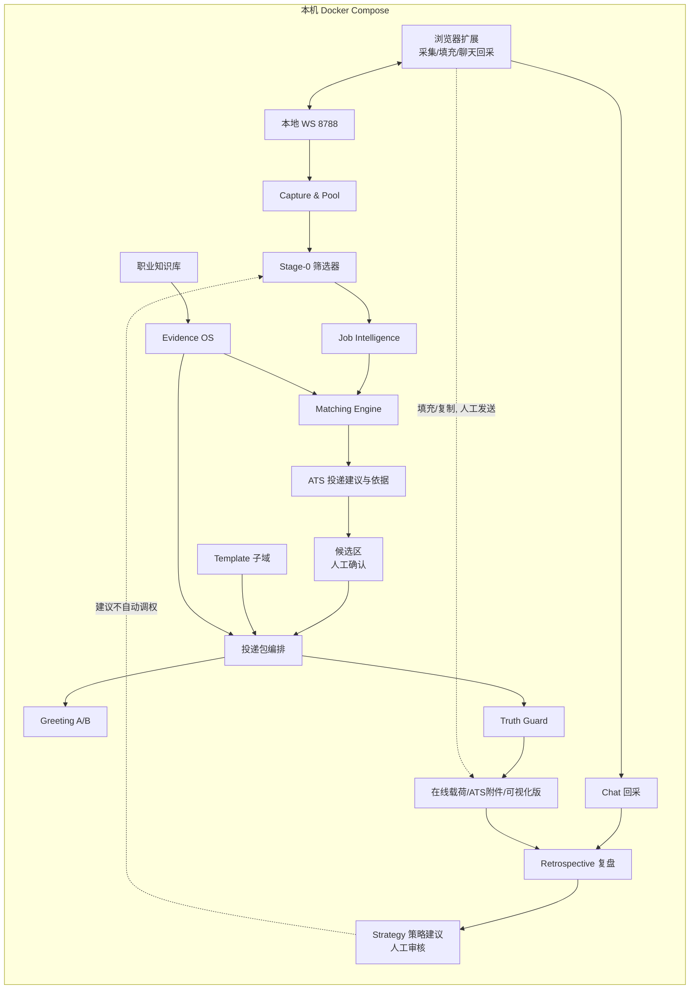
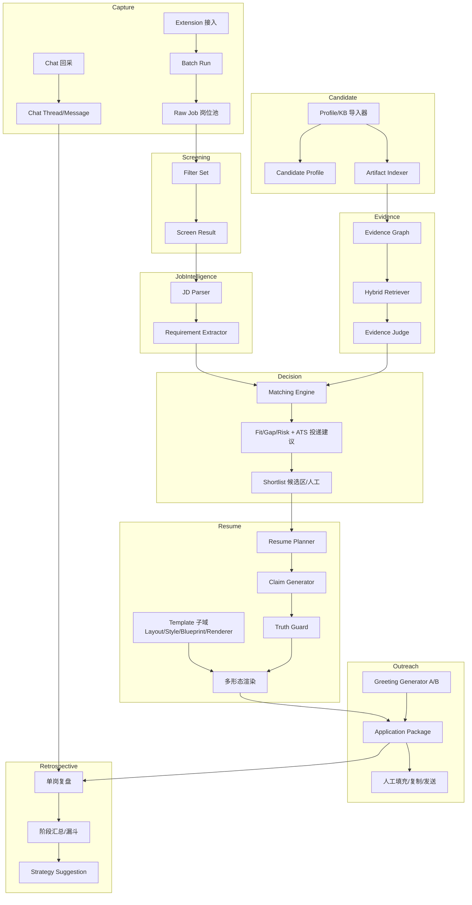
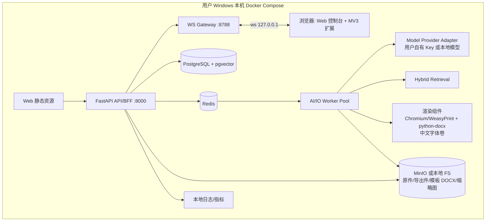
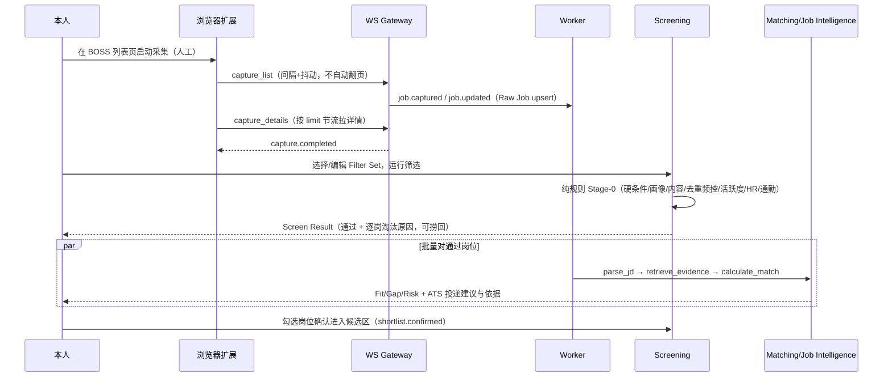
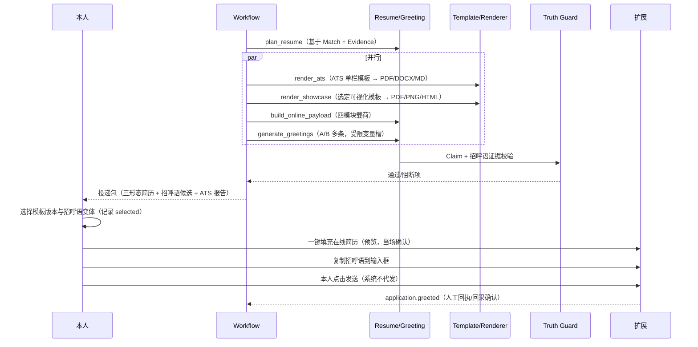
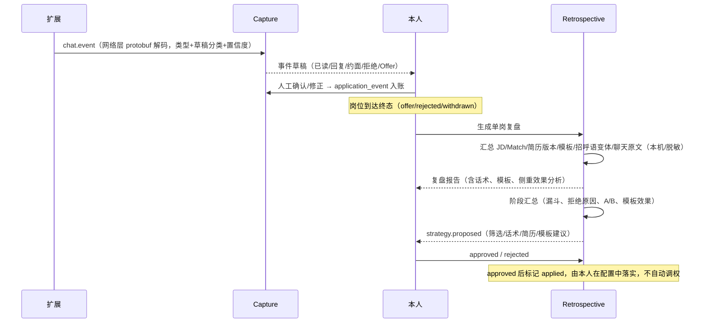
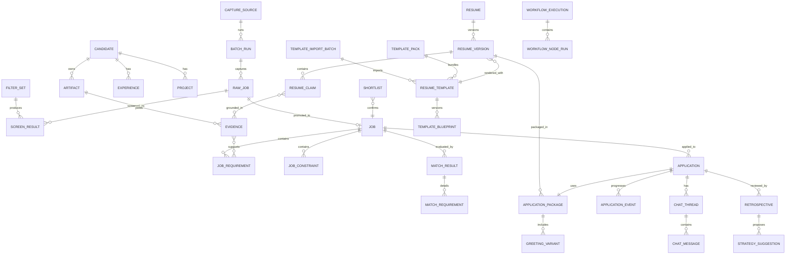

# AI Resume OS / JobOS 系统设计与技术架构方案 v1.1

> 文档状态：评审版
> 版本：v1.1（文件名保留 v1.0 以维持既有链接稳定，v1.0 内容可通过 git 历史回溯）
> 适用阶段：个人本地单机版 MVP → 职业智能闭环演进
> 读者：本人（产品/全栈/AI 一体）、协作评审者
> 最后更新：2026-09-13

> **v1.1 变更摘要**
>
> 1. 产品定位由「多租户 SaaS」调整为**个人本地职业资产操作系统**：Docker Compose 单机运行，服务仅监听 loopback；移除 RLS/OAuth/K8s/多环境/MAU 等云 SaaS 设计。
> 2. 打通 **BOSS 直聘求职闭环**：浏览器扩展批量采集 → 条件筛选 → JD 分析与 ATS 投递建议 → 人工确认候选区 → 岗位专属投递包（在线简历载荷 + ATS 附件 + 可视化模板版 + 打招呼语 A/B）→ 人工发送 → 聊天原文与状态回采 → 单岗复盘与阶段汇总 → 策略建议（人工审核生效）。
> 3. 新增**简历模板与渲染子系统**：内容/布局/风格正交，内置精选模板 + DOCX 开源导入管线，网格模板库（默认）+ A4 可视化编辑器 + 可关闭 3D 画廊。
> 4. 采集端重写并入主系统：废弃 Node+MySQL(8789) 旁路，主系统 Python/PG 生态接管 WS 8788 服务端；扩展只保留浏览器侧能力。
> 5. 新增 ADR-005～012、12 个领域对象、8 类业务领域事件（另 7 类扩展 WS 事件）、16 张新数据表；效果以**漏斗可观测**表达，不承诺沟通/约面结果。

## 1. 项目定义、目标与边界

### 1.1 系统定义

**AI Resume OS（JobOS）** 是以本人真实职业资产为知识底座、运行在本机的职业决策与求职操作系统。它把「岗位采集与筛选、JD 理解、可追溯证据检索、岗位匹配与 ATS 投递建议、岗位专属简历（三种形态）、打招呼语生成、人工投递执行、聊天状态回采、复盘与策略反哺」编排为完整闭环，并提供独立的简历模板与渲染子系统。

系统的核心输出不是一篇由模型自由生成的简历，也不是一个自动海投机器人，而是：

- 每一项筛选淘汰、每一条投递建议、每一条简历 Claim、每一句招呼语都**可解释、可追溯、可审计**；
- 一切对外动作（投递、发消息、翻页、上传附件）均由**本人人工触发**，系统只负责准备与记录；
- 所有个人数据（尤其聊天原文）默认不出本机，第三方模型调用范围可配、可脱敏。



### 1.2 业务目标

| 目标 | v1.1 可衡量定义 |
|---|---|
| 提升决策质量 | 单个岗位在进入候选区前自动给出 Fit/Gap/Risk 与「建议/谨慎/不建议」投递结论及逐项依据；批量采集后自动完成 Stage-0 筛选并给出可定位到字段的淘汰原因 |
| 保证真实性 | 已发布简历与已使用招呼语中 `support_status=unsupported` 的 Claim 为 0；模板排版变化不得改变 Claim 文本与证据链 |
| 提升定制效率 | 岗位确认进候选区后，自动产出三形态简历 + 多条招呼语候选，人工只需审核选择；不承诺固定时长 |
| 保证 ATS 可用性 | ATS 模板族导出 PDF/DOCX 的解析成功率 ≥ 98%，关键字段提取完整率 ≥ 95%；Showcase 模板不进入 ATS 渠道 |
| 触达过程可观测 | 漏斗 `采集 → 初筛 → 候选 → 打招呼 → 回复 → 约面 → Offer` 各级数量、转化率与淘汰原因可对账 |
| 建立复盘闭环 | 每个终态岗位可生成结合 JD/匹配/简历版本/模板/招呼语变体/聊天原文的单岗复盘；阶段汇总产出策略建议，人工审核后生效 |
| 数据主权 | 聊天原文等最高敏感数据仅存本机 loopback 内，默认不进第三方模型上下文；无任何自动外发动作 |

> 系统不承诺「保证被沟通/保证约面」。平台分发、HR 意愿、账号权重等外部因素不可控；系统只保证**准备质量可溯源、过程数据可观测、策略可持续复盘改进**。

### 1.3 非目标（v1.1）

- 不做自动投递、不自动发送打招呼语/聊天消息、不自动翻页采集、不自动上传附件；一切对外动作人工触发（ADR-009）。
- 不复刻 BOSS 或企业 ATS 的私有排序/风控逻辑；ATS Simulator 是透明的工程启发式模型。
- 不将「推断可能具备」自动转化为简历事实；不虚构经历、年限、学历、证书、量化成果或对目标公司的「了解」。
- 不做多租户、用户体系、云托管与在线协作；仅服务本人单机。
- 不做模板付费市场、在线协同设计、完全自由拖拽的设计软件；模板编辑限定在受控布局网格内。
- 不在 v1.1 接入 BOSS 之外的招聘渠道（数据模型预留 `source` 字段）。
- 不建设通用工作流低代码平台；仅提供职业域所需、版本化且受限的 Workflow DSL。

### 1.4 角色与权限

| 角色 | 权限 |
|---|---|
| Owner（本人） | 本机唯一人类用户：管理知识库、岗位池、筛选条件、候选区、投递包、模板、聊天记录、复盘；批准全部外部动作与策略建议 |
| Extension Service Account | 浏览器扩展持有的本地配对令牌；仅限 loopback，最小权限：上报采集/聊天数据、拉取填充载荷与招呼语、接收采集指令；无删除、无外发、无事实写入（分析结果由主系统产出） |
| 本地维护进程（Worker/Renderer） | 系统内部服务身份；无外网入站监听 |

v1.0 的 Career Coach、Admin（租户治理）角色删除；如未来恢复多用户，另行开 ADR。

## 2. 关键架构决策（ADR）

v1.1 沿用 v1.0 已确认的 ADR-001～004（模块化单体、Evidence→Claim 溯源链、结果学习先观测后校准、AI 输出结构化留痕），新增：

| ADR | 决策 | 要点 |
|---|---|---|
| ADR-001 | 模块化单体（FastAPI）+ 独立异步 Worker | 以领域接口、事件、独立 schema 保留拆服务边界 |
| ADR-002 | Evidence → Resume Claim 强溯源 | 无有效证据的 Claim 不得进入投递版本；历史不可变 |
| ADR-003 | 结果学习先观测、后校准 | 样本不足不自动改权重；Outcome 只用于去标识化分析 |
| ADR-004 | AI 输出结构化 + 留痕 | 结构化 JSON Schema 输出，`model_run_id/prompt_version/输入快照` 全留存 |
| **ADR-005** | **个人本地单机 + 浏览器扩展为唯一采集/执行端** | 所有服务仅绑定 127.0.0.1；扩展通过本地配对 token 接入；无公网入站 |
| **ADR-006** | **聊天原文仅本地存储** | Chat 为最高 PII；默认不进第三方模型上下文，脱敏开关可配；复盘 Agent 在本机侧/脱敏侧工作 |
| **ADR-007** | **招呼语每岗多变体 A/B** | 每岗生成多条受限变量槽候选，记录实际被选变体，用于话术效果复盘 |
| **ADR-008** | **复盘只产出策略建议，人工审核生效** | `proposed→approved|rejected→applied`；不自动调权（延续 ADR-003） |
| **ADR-009** | **禁止自动投递/发消息/翻页** | 系统不提供任何「一键群发/自动沟通」能力；填充与复制后必须人工点击发送；账号风险由用户承担 |
| **ADR-010** | **模板只承载呈现、不承载事实** | 内容/布局/风格正交；ATS 模板族与 Showcase 模板族渠道边界不可混用 |
| **ADR-011** | **DOCX 模板仅用开源解析** | python-docx/openxml 进默认栈；Aspose 商业库仅实验环境、不进发行版；复杂版式允许降级到 ATS 单栏并显式告知 |
| **ADR-012** | **聊天回采：网络层解码为主、DOM 为辅** | 参考 BOSS chat protobuf 定义在扩展侧解码；自动分类只生成事件草稿（带置信度），须人工确认后入账 |

## 3. 业务架构与领域职责

v1.1 在 v1.0 六域基础上新增 **Capture（采集与岗位池）、Screening（条件筛选）、Outreach（触达：投递包/招呼语/在线填充）、Retrospective（复盘与策略）** 四个域，并在 Resume Intelligence 下拆出 **Template（模板与渲染）子域**。



| 域 | 模块职责 | 输入 | 输出 |
|---|---|---|---|
| Capture | 扩展配对、采集会话、列表/详情原始数据入库与去重指纹、聊天原文回采 | 扩展 WS 事件、老数据迁移 | Capture Source、Batch Run、Raw Job、Chat Thread/Message |
| Screening | 纯规则条件筛选（不调 LLM）、逐岗淘汰原因、捞回 | Raw Job、Filter Set | Screen Result（pass/reject + 原因链） |
| Job Intelligence | 解析 JD，提取显式/隐式要求、技能、硬约束、标签 | Raw Job 字段与原文 | Job、Requirement、Skill、Constraint |
| Candidate Intelligence | 统一履历、项目、技能、偏好、文件资产；本地知识库冷启动迁移 | 本地文件夹连接器、career-kb 导出、旧简历、引导录入 | Candidate Profile、Experience、Project、Artifact |
| Evidence OS | 切片、索引、检索、判定「哪段事实支持哪项要求」 | Artifact、Profile、Requirement | Evidence、Evidence Link、支持置信度 |
| Matching Engine | Stage-1 评分匹配 + ATS 投递建议（Stage-0 筛选在 Screening 域） | Job 要求、Candidate、Evidence | Match Result、逐项依据、投递建议 |
| Resume Intelligence | Claim 规划/生成/Truth Guard/三形态渲染版本管理 | Match、Evidence、模板 | Resume Version（ats/showcase/online 三渠道）、Claim |
| └ Template 子域 | 模板库、DOCX 导入、Blueprint、渲染引擎、可视化编辑器、模板推荐 | 模板资产、Resume JSON、渲染参数 | Resume Template、Blueprint、PDF/PNG/HTML/DOCX/MD 导出件 |
| Outreach | 投递包编排、招呼语 A/B 生成、在线载荷构建、人工发送记录 | Resume 版本、Greeting、Raw Job | Application Package、Greeting Variant、Application 事件 |
| Application Intelligence | 投递与阶段事件、聊天事件确认入账、漏斗投影 | 人工输入、扩展回采 | Application、Application Event |
| Retrospective | 单岗复盘、阶段汇总、策略建议生命周期 | 终态岗位全链路数据 | Retrospective、Strategy Suggestion |
| Platform | 本地配对鉴权、工作流、审计、配置、WS 网关、渲染队列 | 全域事件 | 执行记录、本地审计日志 |

## 4. 技术架构

### 4.1 本地 Compose 拓扑



要点：

- **所有端口只绑定 127.0.0.1**；浏览器扩展与 Web 控制台均为本机客户端；配对 token 存放于本机配置。
- 对象存储默认**本地 bind mount 目录**（可选用单机 MinIO 容器）；模板 DOCX/缩略图、简历导出件、原件分层目录。
- 渲染组件内置**中文字体卷**与 HTML→PDF（Chromium headless 打印或 WeasyPrint）、DOCX 回填（python-docx）能力，作为无状态 Worker 任务被调用。
- 模型走**用户自有 Key**（仅存本机）或本地模型；Provider Adapter 支持按任务分级路由；聊天原文默认不发送给任何第三方。
- 无 CDN/WAF/Ingress/K8s/多可用区；容器镜像由本机 docker compose 构建。

### 4.2 前端与扩展

- Web 控制台：React + TypeScript + Vite；TanStack Query、React Hook Form + Zod；界面偏好**简洁、内容优先**。
- 页面：工作台漏斗看板、岗位池/筛选、岗位详情与投递建议、候选区、投递包与三形态简历、模板网格库、A4 可视化编辑器、招呼语候选、聊天/事件确认台、复盘与策略建议、知识库导入。
- MV3 扩展只保留浏览器侧能力：列表/详情采集、聊天网络层解码、在线简历四模块填充、侧栏展示；详见专题 **21-浏览器扩展集成协议**。
- 前端不持有模型供应商密钥；配对 token 仅本机使用。

### 4.3 后端模块边界

```text
apps/api                HTTP、本地配对鉴权、DTO、SSE、WS Gateway
domains/capture         扩展协议、Batch Run、Raw Job、去重指纹、Chat 回采
domains/screening       Filter Set、规则引擎、Screen Result、漏斗计数
domains/job             JD、Requirement、Skill、Constraint
domains/candidate       Profile、Experience、Project、Artifact、KB 导入连接器
domains/evidence        Ingestion、Chunk、Retrieval、Judge
domains/matching        Gate、Feature、Score、Explanation、ATS 投递建议
domains/resume          Plan、Claim、Truth Guard、ATS、Online Payload、Greeting
domains/template        Template、Blueprint、DOCX 导入、Renderer、Editor State、Advisor
domains/application     Package、投递事件、聊天事件草稿、看板
domains/retrospective   单岗复盘、汇总、Strategy Suggestion 生命周期
platform/workflow       Definition、Runner、Node Registry、人工审批
platform/ai             Provider Adapter、Prompt Registry、Schema Guard
platform/shared         ORM、事件、审计、配置、错误码、本地密钥
workers                 AI 节点、文件解析、渲染、模板批量导入
```

依赖规则不变：领域模块只依赖 `platform/shared` 与显式领域接口；跨域写入由 Application Service 或领域事件完成。

### 4.4 同步/异步边界

| 操作 | 模式 | 理由 |
|---|---|---|
| 岗位池浏览、筛选配置、候选区确认、看板 | 同步 API | 本机 CRUD，目标 P95 ≤ 300ms |
| WS 采集事件上报、在线填充指令 | 同步 WS/REST | 需要即时回执与风控暂停 |
| Stage-0 批量筛选 | 队列异步（规则计算，不调 LLM） | 大批量 fan-out，需进度与可取消 |
| JD 深度解析、匹配、简历/招呼语生成、模板渲染、DOCX 批量导入 | 异步 Workflow/任务 | 可能超时、成本高、需重试 |
| 复盘聚合、漏斗指标、策略生成 | 终态事件触发异步 | 不阻塞主链路 |

## 5. 核心时序流程

### 5.1 采集 → 筛选 → 候选区确认



### 5.2 投递包生成 → 人工发送



### 5.3 聊天回采 → 复盘 → 策略建议



## 6. 数据架构与 ER 设计

### 6.1 数据原则

1. 原始层（Raw Job 原文/JSON、聊天原文、原件文件）、解析层（结构化字段）、推断层（模型输出）、确认层（用户确认事实、事件）分层存储，禁止相互覆盖。
2. 关键 AI 输出带 `model_run_id、prompt_version、workflow_execution_id` 与输入快照哈希。
3. 所有 Resume Claim、招呼语中的能力/成果陈述必须连接至少一条有效证据；无法连接者不得进入已使用版本。
4. 单用户本地数据库：无 `tenant_id`/RLS；隔离依赖 loopback 绑定 + 配对 token + 本机文件权限。
5. 聊天原文为最高 PII：独立加密存储、默认不进模型上下文、不进日志与导出。
6. 淘汰、事件、复盘、策略建议全部**追加不可变**；状态由事件投影。

### 6.2 ER 图（v1.1 新增关系以加粗注释体现）



### 6.3 核心表（v1.1 增量与调整）

| 表 | 关键字段 | 说明 |
|---|---|---|
| `capture_source` | `id, code(boss), display_name, enabled, config_json` | 采集渠道；v1.1 仅 BOSS，`source` 全链预留 |
| `batch_run` | `id, source_id, kind(list/detail/chat), status, started_at, finished_at, stats_json, risk_halted` | 一次采集会话；统计成功/重复/风控暂停 |
| `raw_job` | `id, source_id, ext_id, fingerprint, list_json, detail_json, jd_text, title, company, city, salary_text, low_salary, high_salary, exp_text, degree, industry, stage, scale, list_tags, skill_tags, ats_direct_post, boss_json, active_time, list_at, detail_at, batch_id` | 原始岗位；按 `source+ext_id` upsert；指纹用于跨批去重 |
| `filter_set` | `id, name, rule_json(硬条件/画像/内容/去重/活跃度/HR/通勤), version, is_default` | 可版本化筛选条件集 |
| `screen_result` | `id, filter_set_id, raw_job_id, batch_id, verdict(pass/reject/recovered), reasons_json[{rule,field,expected,actual}], screened_at` | 逐岗结论；每条淘汰原因可定位字段值 |
| `shortlist` | `id, job_id/raw_job_id, match_result_id, status(confirmed/removed), confirmed_at` | 候选区人工决策记录 |
| `greeting_variant` | `id, package_id, variant_no, text, slots_json, evidence_ids, channel, selected_at` | A/B 招呼语；受限变量槽；记录被选变体 |
| `chat_thread` | `id, application_id, source_ext_chat_id, counterpart_name, last_msg_at, cursor_json` | 沟通会话 |
| `chat_message` | `id, thread_id, direction, type(text/image/voice/video/interview/notify/article), payload_enc, sent_at, decode_source(network/dom), raw_ref` | 聊天原文，本机加密，不默认出域 |
| `application` | `id, job_id, current_stage, package_id, source, created_at` | 阶段由事件投影（状态机见 03 篇） |
| `application_event` | `id, application_id, type, source(extension/manual), confidence, review_status(draft/confirmed/rejected), payload_json, occurred_at` | 类型含 greeted/chat_read/chat_replied/chat_rejected/interview_scheduled/interview_done/interview_rejected/offered/withdrawn |
| `resume_template` | `id, code, name, channel(ats/showcase), layout_type, style_preset, tags_json, lang, color, columns, pages, license, source(builtin/docx_import), quality_grade, thumbnail_key, enabled, version` | 模板元数据与检索维度 |
| `template_blueprint` | `id, template_id, version, spec_json(元素/槽位/样式), parser_engine, fidelity_grade` | DOCX 导入归一化蓝图 |
| `template_import_batch` | `id, source_dir, total, succeeded, failed, failed_report_json, engine, created_at` | 批量导入任务（断点/报告） |
| `template_pack` | `id, name, template_ids, license_note` | 模板包（如内置精选包、224 套分批包） |
| `resume_version`（调整） | `…, template_id, template_version, render_params_json, channel(ats/showcase/online), renderer_version, input_hash, output_hash` | 冻结模板与参数快照 |
| `retrospective` | `id, application_id, kind(single/stage), content_json, model_run_id, version, created_at` | 不可变复盘报告 |
| `strategy_suggestion` | `id, retrospective_id, scope(screen/greeting/resume/template), content_json, status(proposed/approved/rejected/applied), reviewed_at` | 建议生命周期 |

v1.0 既有表（candidate/experience/project/artifact/evidence/job/job_requirement/job_constraint/match_result/match_requirement/resume/resume_claim/claim_evidence/workflow_*/audit_log）保留，去掉多租户字段。完整 DDL 见专题 12。

### 6.4 关键约束

- `raw_job(source_id, ext_id)` 唯一；`screen_result(filter_set_id, raw_job_id)` 唯一。
- 招呼语变体进入「已使用」状态前同样过证据校验：能力/成果类陈述必须有 `evidence_ids`。
- `resume_version` 发布时校验：同一 `claim 快照 hash` 在不同模板/渠道下渲染，Claim 文本集合必须一致（模板只改呈现）。
- `chat_message` 不建立到 `evidence` 的任何外键——聊天内容**不作为** Claim 证据。

## 7. API 与扩展协议设计

### 7.1 约定

- 基础路径 `/api/v1`；JSON；UTC ISO-8601；UUIDv7；写请求支持 `Idempotency-Key`；异步返回 `202 + execution_id`。
- 鉴权：**本地配对 token**（首次启动在本机生成，扩展加载时人工配对），替代 OAuth/RLS；仅接受 loopback 来源与扩展 origin。
- WS：扩展 ↔ `ws://127.0.0.1:8788/ws`，信封 `{v:1, kind, id, type, capture_id/command_id, payload}`，协议细节、命令与事件全集见专题 21。

### 7.2 v1.1 主要接口（增量视角）

| 分类 | 方法/路径 | 作用 |
|---|---|---|
| 采集 | `WS commands` / `POST /captures/batches`、`GET /captures/batches/{id}` | 采集会话与进度；`abort`；风控暂停 |
| 岗位池 | `GET /pool/jobs`、`GET /pool/jobs/{id}`、`POST /pool/jobs/{id}:recover` | 列表/筛选/详情/捞回 |
| 筛选 | `GET/POST /filter-sets`、`POST /screening-runs`、`GET /screening-runs/{id}` | 条件集与筛选运行 |
| 候选区 | `POST /shortlists`、`DELETE /shortlists/{id}` | 人工确认/移除 |
| 投递包 | `POST /applications/{id}/package`、`GET /applications/{id}/package` | 三形态简历 + 招呼语集合 |
| 招呼语 | `GET /packages/{id}/greetings`、`POST /greetings/{id}:select` | 候选与被选记录 |
| 聊天/事件 | `POST /chat-events`（扩展上报草稿）、`GET /chat-events?status=draft`、`POST /chat-events/{id}:confirm` | 草稿确认台 |
| 模板 | `GET /templates`（多维筛选）、`POST /templates/import-docx`、`POST /templates/{id}/render`、`POST /templates/{id}/preview` | 库/导入/渲染/预览 |
| 简历编辑 | `GET/PUT /resume-versions/{id}/editor-state` | 可视化编辑器状态 |
| 复盘 | `POST /applications/{id}/retrospective`、`GET /retrospectives` | 单岗/阶段复盘 |
| 策略 | `GET /strategy-suggestions`、`POST /strategy-suggestions/{id}:review` | 批准/拒绝 |
| 知识库 | `POST /kb/imports/profile-work`、`POST /kb/imports/career-kb`、`POST /kb/imports/resume`、`POST /kb/imports/guided` | 四类冷启动导入 |
| 既有 | `/candidates/* /jobs/* /matches/* /resumes/* /workflow-executions/*` | 沿用 v1.0，去除租户语义 |

WS 事件全集：`job.captured、job.updated、capture.phase、capture.completed、capture.error{risk}`、`chat.event`、`fill.completed`；业务侧领域事件：`screen.completed、shortlist.confirmed、template.selected、greeting.generated、application.greeted、chat.event_received、retrospective.generated、strategy.proposed`。

> 机器可读契约（v0-draft，P0 冻结）：WS 信封/命令/事件/岗位与聊天 JSON Schema、OpenAPI 骨架、DDL 草案、DSL 与 Filter Schema 见仓库根 `contracts/`（索引见 `contracts/README.md`）；契约固化规程与各阶段 Definition of Ready 见专题 **23**，AI 开发边界见专题 **24** 与仓库根 `AGENTS.md`。开发现场的架构检索入口（ARCH-* 模式卡、变更影响矩阵、DoR/DoD）为仓库根《架构师索引库 v1.1》。

## 8. Workflow 编排

### 8.1 v1.1 主流程 `boss_application@1.0`

```yaml
id: boss_application
version: 1.0.0
input_schema: BossApplicationInput@1
nodes:
  - key: ingest_capture
    type: task
    handler: capture.ingest_batch
  - key: screen_filter
    type: task
    handler: screening.run_rules          # 纯规则，不调 LLM
  - key: parse_jd
    type: task
    handler: job.parse_batch              # 岗位池 fan-out
  - key: retrieve_evidence
    type: task
    handler: evidence.retrieve_and_judge
  - key: match_and_advice
    type: task
    handler: matching.calculate_with_advice
  - key: shortlist_approval
    type: human_approval                  # 人工确认进候选区
  - key: plan_resume
    type: task
    handler: resume.plan
  - key: render_ats
    type: task
    handler: template.render
    params: {channel: ats}
  - key: render_showcase
    type: task
    handler: template.render
    params: {channel: showcase, template_from: selection}
  - key: online_payload
    type: task
    handler: resume.build_online_payload
  - key: greetings
    type: task
    handler: greeting.generate_ab         # 多变体
  - key: truth_guard
    type: task
    handler: guard.verify_package
  - key: send_approval
    type: human_approval                  # 人工确认后自行填充/发送（系统不代发）
  - key: retrospective
    type: task
    handler: retrospective.run
    trigger: on_terminal_application_event
```

事件驱动：`chat.event_received`（已确认）更新 Application 投影；到达终态触发 `retrospective.run`；策略建议经 `strategy.proposed → 人工 review`。静态门禁：禁止注册任何外部消息发送/投递 handler（专题 15）。

### 8.2 可靠性（沿用 v1.0）

节点 `execution_id+node_key+attempt` 幂等；外部调用超时/退避/熔断/成本上限；审批过期不默认批准；Outbox + 消费幂等；采集类节点须响应 `abort` 与风控暂停信号。

## 9. 筛选、匹配与投递建议

### 9.1 两阶段结构

- **Stage-0 筛选器（Screening 域，纯规则、不调 LLM）**：决定岗位是否值得进入分析，淘汰必须可解释、可人工捞回。
- **Stage-1 评分匹配（Matching 域）**：沿用 v1.0 硬门槛 + 软匹配模型，产出 Fit/Gap/Risk 与投递建议。

Stage-0 规则组（详见专题 08）：

| 组 | 规则示例 |
|---|---|
| 硬条件 | 城市、薪资数值域（区分月薪/K/时薪/日薪）、学历、经验年限、岗位名白/黑名单 |
| 公司画像 | 行业、规模、融资阶段、公司名黑名单、外包/猎头过滤、HR 职位黑白名单、金牌面试官标记 |
| JD 内容 | 关键词白/黑名单（排除否定语境与「系统/软件/工具/服务」后缀误命中）、必备技能覆盖、JD 完整度、发布时间 |
| 去重频控 | 同公司、同 HR、已沟通、已投递、已拒绝、JD 内容指纹 |
| 活跃度 | BOSS 最近活跃时间阈值（如超 7 天/月/年淘汰，阈值可配） |
| 社交状态 | 好友状态、是否猎头 |
| 通勤（可选） | 高德 Key 配置后按地址计算距离/时间，未配置则跳过 |
| AI 打分（可选附加） | 仅作为附加条件，不作为默认硬规则 |

列表页字段先筛；详情页字段（活跃度、完整 JD、HR 信息等）按需二次筛并注明节流。

### 9.2 评分与建议（Stage-1）

沿用 v1.0 公式：`FinalScore = round(100 × HardGate × WeightedFit × EvidenceConfidence × RecencyFactor)`，权重为先验、可复盘、可由人工批准的策略建议调整，不自动调权。

输出新增「**ATS 投递建议与依据**」结构化块：建议投递/谨慎/不建议 + 逐项引用（最强证据 3–5 条、可弥补 Gap、不可弥补 Risk、渠道提示：该岗 `ats_direct_post` 与否决定在线/附件侧重）。

### 9.3 漏斗口径

采集数 → 初筛通过数（及各规则淘汰计数）→ 候选确认数 → 已打招呼数 → 回复数 → 约面数 → Offer 数；同一岗位在各阶段去重口径、时间窗口在专题 08/18 统一定义，仪表盘数字必须可与明细表对账。

## 10. 三形态简历、招呼语、Truth Guard 与模板子域

### 10.1 同一 Claim 集合，三种渲染

| 形态 | channel | 用途 | 约束 |
|---|---|---|---|
| BOSS 在线载荷 | `online` | 扩展填充在线简历四模块（个人优势/工作内容/项目描述/技能） | 字数/字段红线；不改公司名/职位/时间/学历；Inference 不入载荷 |
| ATS 附件 | `ats` | PDF/DOCX/Markdown，走机筛与附件上传 | 必须 ATS 模板族、单栏优先、解析矩阵通过 |
| 可视化模板版 | `showcase` | PDF/PNG/HTML，展示渠道（作品集/邮件附件等） | 不承诺机器解析；系统在选用时给渠道提示 |

模板机制（正交模型、Blueprint、DOCX 导入、渲染引擎、编辑器、Advisor）全部在专题 **22-简历模板与渲染引擎技术方案**；本篇只规定 Claim→槽位映射契约：模板槽位只能引用 Resume JSON 中已存在的 Claim/字段，不允许在模板内新增事实文本。

### 10.2 招呼语生成（Greeting Generator）

- 每岗生成 **多条 A/B 变体**（默认 3 条），采用受限变量槽白名单（如 jobName/brandName/salaryDesc/cityName），变量只允许取自该岗位 Raw Job 字段。
- 能力/成果陈述必须带 `evidence_ids`；禁止虚构对公司业务的了解、禁止无依据称谓与承诺；长度符合 BOSS 输入限制；禁用表达表与 Truth Guard 共用。
- 记录 `selected_at`；未被选变体保留用于复盘。招呼语只进入剪贴板/输入框，**系统不发送**。

### 10.3 Truth Guard 扩展

v1.0 Claim 规则全部保留，新增：

| 校验对象 | 规则 | 失败动作 |
|---|---|---|
| Greeting | 能力/成果陈述无证据；虚构公司了解；无依据承诺 | 阻断该变体 |
| Online Payload | Inference 字段、被红线保护字段（公司/职位/时间/学历） | 阻断填充 |
| 模板渲染 | 渲染后 Claim 文本集合与输入 Claim 快照不一致；模板内出现新增事实 | 阻断导出 |
| Chat 信息 | 聊天内容不得自动转为 Candidate Fact/Claim 证据 | 拒绝写入证据域 |

人工编辑边界：内容改动走 Claim 复验；排版改动仅写模板参数。

### 10.4 ATS Simulator

沿用五维评分（解析性/关键词覆盖/结构/时间线/联系方式），新增：在线载荷检查（四模块字数、技能交集、红线字段）；模板族渠道校验（Showcase 模板导出时提示「不适用于 ATS 机筛渠道」）；解析双路径与缺陷定位规则不变。

## 11. AI、Prompt 与 Agent 设计

模型调用防线沿用 v1.1（Sanitize → 版本化 Prompt → Provider Adapter → Schema 校验 → Business Guard → 留痕落库）。v1.1 Agent 名册：

| Agent | 职责 | 可读数据 | 不可做 |
|---|---|---|---|
| JD Analyst | JD 要求抽取 | 单个 Raw Job/JD | 访问聊天原文、给匹配分 |
| Screen Analyst | 解释规则结果、AI 附加打分（可选） | 结构化岗位字段 | 修改筛选规则、自动淘汰 |
| Evidence Analyst | 混合检索与判定 | 脱敏 Requirement、授权 Evidence | 修改履历事实 |
| Resume Writer | 结构化 Claim 生成 | Resume Plan、approved facts | 创建新事实 |
| Greeting Writer | A/B 招呼语变体 | 岗位字段槽位、approved facts | 虚构公司了解、无证据陈述 |
| ATS Analyst | 解析诊断 | 导出件、关键词 | 改稿/发布 |
| Template Advisor | 按渠道/职位族/内容量推荐模板 | 模板元数据、Resume JSON 结构（非原文） | 自动替用户选定 |
| Retrospective Analyst | 单岗/阶段复盘、策略建议草稿 | 岗位全链路 + 聊天原文（本机/脱敏） | 写事实库、自动调权、外发数据 |

聊天上下文默认不出本机（ADR-006）；如需第三方模型辅助复盘，必须经脱敏管线并由开关显式启用。各类 Prompt 模板与评估集见专题 14。

## 12. 安全、隐私与审计

- **网络边界**：全部服务绑定 loopback；扩展 origin 校验 + 配对 token；无入站公网；URL 抓取仅扩展侧发生在 BOSS 域内。
- **PII 分级**：v1.0 四级保留；`chat_message` 与原件列为 restricted 最高级，本机静态加密，不进日志/指标/第三方。
- **密钥**：模型 Key、配对 token、可选高德 Key 仅存本机配置目录，不进镜像与仓库。
- **风控红线**：采集间隔 + 随机抖动、不自动翻页、检测到风控词（账户异常/安全验证等）立即暂停批次；不提供自动发送/投递/上传能力；用户自担账号风险。
- **审计**：本地 `audit_log` 记录配对、采集批次、筛选运行、候选确认、导出、填充、发送回执、事件确认、策略审核；哈希链防本地篡改，不含密钥与原文。
- **删除闭环**：删除资产时撤销索引与导出件引用；聊天数据支持按会话清除。

## 13. 本地部署与运维

### 13.1 Windows 本机 Docker Compose

```text
services:
  api        FastAPI + SSE + WS Gateway(8788)   127.0.0.1
  web        静态控制台（由 api 托管或独立容器）
  postgres   PostgreSQL + pgvector（数据卷）
  redis      队列/缓存
  worker     AI/IO/渲染 Worker（含中文字体卷、Chromium/WeasyPrint、python-docx）
  minio      可选；默认本地 bind mount 目录
volumes:
  pgdata / redisdata / ./data/files / ./data/templates / ./data/fonts / ./data/backup
```

- 扩展以**未打包加载**方式载入 Chrome（MV3）；配对流程见专题 21。
- 备份：`pg_dump` 定时任务 + 文件目录复制 + 配置导出；`E:\Profile\work` 以**只读引用**方式被连接器扫描，不移动原件。
- 模板资产预算：精选内置包随镜像/数据包发行；224 套 DOCX 按需批量导入，磁盘占用与缩略图在专题 17/22 列明。
- 容量按个人规模：单次采集数百至数千岗位、累计数万 Raw Job、简历版本数百；无 RPS/MAU 设计。
- 开发基线（monorepo 结构、技术栈版本、配置与密钥清单、本地启动/测试规程）见专题 **23**；人 + AI 协作的授权边界、禁止清单与人审门禁见专题 **24**，现场执行版为仓库根 `AGENTS.md`。

### 13.2 健康与 Runbook

本地健康检查 + 漏斗看板 + 扩展连接状态 + token 成本。Runbook 覆盖：登录失效/风控暂停、WS 断连、页面结构与接口变更、聊天解码失败降级 DOM、Provider 不可用、备份恢复、DOCX 导入失败（详见专题 18）。

## 14. 测试与质量方案

| 层级 | v1.1 关键断言 |
|---|---|
| 单元 | 薪资解析（K/时薪/日薪/月薪）、否定语境正则、活跃度阈值、去重指纹；评分可复现 |
| 集成 | 采集 upsert 幂等、Outbox、筛选 fan-out、渲染任务、导入断点续跑 |
| 协议契约 | WS 信封/命令/事件与扩展实现一致；风控暂停；无任何发送类指令可达 |
| E2E | 采集→筛选→候选→投递包（三形态+招呼语）→人工发送回执→聊天事件→复盘→策略审核 全漏斗 |
| 金标集 | 筛选边界集、JD/Evidence 集、**招呼语溯源合格率**、**聊天事件分类（约面/拒绝）准确率**、模板槽位映射正确率、DOCX 导入成功率与版式保真、三态导出字段一致性、ATS 模板解析率 |
| 隐私/安全 | 聊天原文不出 loopback（网络断言）；restricted 数据不入第三方请求；越权 loopback 外访问拒绝 |

## 15. 项目阶段（无日历排期，按门禁推进）

| 阶段 | 范围 | 出口门禁 |
|---|---|---|
| P0 文档与契约 | v1.1 全套文档、WS 协议契约、数据契约 | 本文档体系评审通过 |
| P1 本地骨架 + 扩展重写 | Compose 骨架、配对鉴权、扩展去 MySQL/TS 核心、WS 接入、老数据迁移 | 扩展采集可入 PG，8789 链路移除 |
| P2 采集 + 筛选 + JD/匹配 | 岗位池、Filter Set、Stage-0、JD Intelligence、匹配与建议 | 真实采集样本筛选结果可解释可对账 |
| P3 模板系统 | 内置模板、DOCX 导入、网格库、A4 编辑器、多格式导出 | 模板渲染通过解析/保真回归集 |
| P4 三形态简历 + 招呼语 + 在线填充 | 投递包、Greeting A/B、Truth Guard 扩展、四模块填充 | 溯源 100%，无自动发送路径 |
| P5 聊天回采 + 事件 | 网络层解码、事件草稿确认台 | 约面/拒绝分类准确率达标 |
| P6 复盘 + 漏斗 + 策略 | 单岗/阶段复盘、漏斗看板、Strategy 生命周期 | 全漏斗真实跑通，数字可对账 |

## 16. 验收标准

1. 真实 BOSS 采集样本在本机跑通「采集→筛选→建议→候选→投递包→人工发送→回采→复盘」全链路；各级数字与明细可对账。
2. 每条筛选淘汰可定位到规则与字段值，可人工捞回；每个岗位有建议/谨慎/不建议结论与逐项依据。
3. 三形态简历共享同一 Claim 集合：已使用版本 unsupported Claim = 0；模板切换不改变 Claim 文本与证据链。
4. 招呼语每岗多条候选、变量槽受限、被选变体可追踪；系统不存在任何可自动发送/投递/翻页的代码路径。
5. ATS 模板族 PDF/DOCX 解析成功率 ≥ 98%；Showcase 模板不能被误用为 ATS 渠道而无提示。
6. DOCX 导入基于开源引擎，复杂版式降级时显式告知；导入失败有报告；商业库不在默认栈。
7. 聊天原文仅存本机（网络层零外发断言通过），事件草稿必须人工确认才入账。
8. 复盘报告可引用 JD/匹配/简历版本/模板/招呼语变体/聊天原文；策略建议经人工审核才标记 applied。
9. 备份恢复演练通过；loopback 外访问全部拒绝。

## 17. 主要风险与应对

| 风险 | 影响 | 应对 |
|---|---|---|
| BOSS 账号风控/封号/降权 | 高 | ADR-009 红线、间隔抖动、风控词即停、不翻页不群发；明示用户自担风险 |
| 页面结构/聊天接口变更 | 高 | 网络层解码为主 + DOM 降级；协议契约测试；选择器/proto 版本监控 |
| 聊天隐私泄露 | 高 | 仅本机加密存储、默认不出域、脱敏开关、网络断言测试 |
| 单机数据丢失 | 中高 | pg_dump + 文件目录备份 + 源文件夹只读引用 + 恢复演练 |
| 第三方模型泄露 | 高 | Key 本机持有、不训练选项、聊天默认不送、脱敏管线 |
| 模板版权/Aspose 误用 | 中 | 仅导入免费授权/自有 DOCX，记录 license；开源引擎默认栈 |
| 复杂模板版式降级 | 中 | 保真分级、降级显式告知、ATS 单栏兜底 |
| Showcase 模板误入 ATS 渠道 | 中 | channel 强标记 + 选用提示 + 发布校验 |
| LLM 幻觉/证据不足 | 高 | 溯源链、Truth Guard 覆盖 Claim 与招呼语、人工审批 |
| 复盘样本偏差 | 中 | 延续 ADR-003/008：只建议、小样本不调权 |

## 18. 术语表与评审结论

### 18.1 v1.1 统一术语

| 术语 | 含义 |
|---|---|
| Capture Source / Batch Run | 采集渠道（BOSS）与一次批量采集会话 |
| Raw Job / Job Pool | 抓回的原始岗位（原文/JSON 与分析结果分层，含薪资数值域、atsDirectPost 等） |
| Filter Set / Screen Result | 筛选条件集与逐岗命中/淘汰原因 |
| Shortlist（候选区） | 人工确认进入投递准备的岗位 |
| Application Package | 一个岗位的投递包：在线载荷 + ATS 简历 + 可视化版 + 招呼语变体集 |
| Greeting Variant | 招呼语 A/B 候选（证据引用、变量槽白名单、selected 标记） |
| Chat Thread / Message | 沟通会话与原文消息（最高 PII，仅本地；含约面/通知等结构化类型） |
| Retrospective | 单岗复盘与阶段汇总（不可变、版本化） |
| Strategy Suggestion | 筛选/话术/简历/模板调整建议，`proposed→approved|rejected→applied` |
| Resume Template | 布局 + 风格 + 默认模块组合 + 槽位映射；不含业务事实 |
| Template Blueprint | DOCX 导入归一化后的元素/位置/样式 JSON 与槽位绑定 |
| Content Module | 25 类简历信息单元（字段级显隐、排序、自定义标题） |

### 18.2 评审结论

v1.1 的落地重点是**可验证、可观测、可复盘的本地求职闭环**：

`Capture → Screen → Job/Evidence/Match → Shortlist → Package（Resume×3 + Greetings）→ 人工触达 → Chat 回采 → Retrospective → Strategy`

三条不可妥协原则保持不变，并新增两条：

1. 不以「AI 看起来合理」替代真实证据；
2. 不以复杂架构替代可交付的领域边界；
3. 不以单一匹配分数替代可行动的 Fit/Gap/Risk 决策；
4. **不以任何自动化替用户对外发声**（不自动投递、不自动发消息）；
5. **模板只改变呈现，永远不改变事实**。

专题文档索引见 `docs/architecture/README.md`（共 24 篇：01–20 专题 + 21-浏览器扩展集成协议、22-简历模板与渲染引擎技术方案、23-开发基线与契约固化、24-AI协作开发规范与边界）。开发现场的架构检索入口为仓库根《AI-Resume-OS-架构师索引库》（ARCH-* 模式卡/变更矩阵/DoR-DoD），AI 协作硬红线以仓库根 `AGENTS.md` 为现场执行版。
