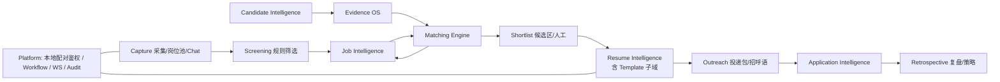

# 01 系统设计文档

> 版本：v1.1（个人本地单机版 + BOSS 求职闭环 + 简历模板系统）

## 定位

AI Resume OS 是运行在本人电脑上的**个人职业资产与求职操作系统**，不是“AI 写简历”工具，也不是自动海投机器人。v1.1 全链路为：

`扩展采集 → 岗位池 → 条件筛选 → JD 画像 → 候选人证据 → Fit/Gap/Risk + ATS 投递建议 → 人工确认候选区 → 三形态定制简历 + 招呼语 A/B → 人工发送 → 聊天/状态回采 → 单岗复盘与阶段汇总 → 策略建议（人工审核）`。

## 目标、角色与边界

| 目标 | v1.1 定义 |
|---|---|
| 决策 | 批量筛选可解释（淘汰定位到规则与字段值）；每个入池岗位给出建议/谨慎/不建议与逐项依据 |
| 效率 | 候选区确认后自动产出投递包（在线载荷/ATS 附件/可视化版 + 招呼语候选），人工只审核选择 |
| 真实性 | 已使用的简历与招呼语中不存在无证据或被证据矛盾的 Claim；模板不承载事实 |
| 触达可观测 | 漏斗 采集→初筛→候选→打招呼→回复→约面→Offer 各级数量、转化、淘汰原因可对账；不承诺沟通/约面结果 |
| 复盘 | 投递结果关联当时 JD、匹配、简历版本、模板、招呼语变体与聊天原文；策略建议人工审核生效 |

角色仅三个：**Owner（本人）**、**Extension Service Account**（本地配对 token、最小权限、只能 loopback）、本地维护进程。v1.0 的 Career Coach、Admin、租户体系删除。

非目标：自动投递/自动发消息/自动翻页、破解或复刻 BOSS/企业 ATS 私有逻辑、多租户与云托管、通用低代码工作流、把语义相似当事实、模板付费市场与自由画布设计软件。

## 领域划分

| 领域 | 责任 | 核心实体 |
|---|---|---|
| Capture | 扩展协议、采集会话、原始岗位、去重指纹、聊天回采 | CaptureSource、BatchRun、RawJob、ChatThread/Message |
| Screening | 纯规则 Stage-0 筛选、淘汰原因、捞回 | FilterSet、ScreenResult |
| Job | 解析 JD、要求、技能、硬约束 | Job、Requirement、Constraint |
| Candidate | 管理职业事实、原始资产与知识库冷启动 | Candidate、Experience、Project、Artifact |
| Evidence | 把资产转为可检索、可引用的事实 | Evidence、EvidenceLink |
| Matching | Stage-1 硬门槛、多信号匹配、投递建议 | MatchResult、MatchRequirement |
| Resume | Claim 规划/守卫/三渠道版本；**Template 子域**负责模板与渲染 | ResumeVersion、ResumeClaim、ResumeTemplate、Blueprint |
| Outreach | 投递包编排、招呼语 A/B、在线载荷 | ApplicationPackage、GreetingVariant |
| Application | 投递阶段事件（含聊天草稿确认） | Application、ApplicationEvent |
| Retrospective | 单岗/阶段复盘、策略建议生命周期 | Retrospective、StrategySuggestion |

## 核心不变量

1. 原始层（Raw Job/聊天原文/原件）、解析文本、结构化事实、模型推断、用户确认分层保存，不能覆盖。
2. 已使用 Resume Version 的每条 Claim、招呼语中的能力/成果陈述均至少关联一条有效 Evidence。
3. 历史 Match/Resume/Outcome/Retrospective 不可覆盖；新的运行创建新版本。
4. 所有 AI 结果持有输入快照哈希、模型、Prompt、工作流版本和 trace id。
5. 模板只改变呈现：同一 Claim 集合经任意模板渲染，Claim 文本与证据链不变。
6. 聊天原文仅存本机、默认不入第三方模型上下文；聊天信息不得自动成为事实或证据。
7. 系统不存在自动投递/自动发消息/自动翻页的代码路径；一切对外动作由本人触发。

## MVP（v1.1）范围

单用户本地 Compose；MV3 扩展列表/详情采集（弃用 Node+MySQL 8789 旁路与 TS 评分核心）；Stage-0 规则筛选与捞回；JD 需求提取、混合检索、可解释匹配与投递建议；候选区人工确认；知识库四类冷启动导入（`E:\Profile\work` 连接器、career-kb 导出、旧简历、JD 引导录入）；模板系统（精选内置 + DOCX 开源导入 + 网格库 + A4 编辑器 + PDF/PNG/HTML/DOCX/MD 导出）；三形态简历、招呼语 A/B、在线四模块人工填充；聊天网络层解码回采与事件草稿确认；单岗/阶段复盘与漏斗看板。

延后：其他招聘渠道（仅预留 `source`）、3D 画廊（默认关闭增强）、在线协同、自动调权、图数据库、可视化工作流编辑器。

## 用户场景与验收切片

| 场景 | 主路径 | 成功结果 |
|---|---|---|
| 冷启动建档 | 连接 Profile/work 目录 + 导入 career-kb 导出/旧简历，确认抽取；缺口按 JD 引导补录 | 获得可编辑事实与可检索资产；实战/二开/学习参考分类与表达红线生效；解析猜测不自动入账 |
| 批量采集筛选 | 扩展人工启动列表/详情采集 → 选 Filter Set 跑筛选 | 岗位池去重入库；逐岗淘汰原因可定位、可捞回 |
| 候选区决策 | 查看 JD 分析 + 匹配 + ATS 投递建议与依据 | 人工勾选进入候选区；建议不替人决策 |
| 制作投递包 | 确认候选岗位 → 选模板/接受推荐 → 并行生成三形态简历与招呼语 | 每条 Claim 可回链证据；招呼语多条候选；Guard 阻断项可见 |
| 人工触达 | 扩展填充在线简历（当场确认）+ 复制招呼语 → 本人点击发送 | 红线字段不被改；无自动发送；被选变体被记录 |
| 回采与复盘 | 聊天自动解码为事件草稿 → 人工确认；终态生成复盘 | 约面/拒绝正确入账；复盘引用全链路与聊天原文；策略建议待审核 |

## 控制台信息架构（页面地图）

```mermaid
flowchart TB
  ROOT[JobOS 控制台]
  ROOT --> CAP[采集中心]
  ROOT --> POOL[岗位池]
  ROOT --> SCR[筛选池]
  ROOT --> SH[候选区]
  ROOT --> PKG[投递包]
  ROOT --> EVT[事件确认台]
  ROOT --> TPL[模板中心]
  ROOT --> RT[复盘与漏斗]
  ROOT --> KB[知识库]
  ROOT --> SET[设置]

  CAP --> CAP1[扩展配对与状态]
  CAP --> CAP2[批次列表与风控提示]
  CAP --> CAP3[导入扩展导出的岗位列表]
  POOL --> POOL1[Raw Job 列表]
  POOL --> POOL2[人工入池与补全队列]
  POOL --> POOL3[岗位详情面板]
  SCR --> SCR1[A4 案卷：JD 画像与公司画像]
  SCR --> SCR2[评估与建议（占位，未接入）]
  SCR --> SCR3[进入候选区 / 忽略]
  SCR --> SCR4[Filter Set 编辑与运行]
  SCR --> SCR5[淘汰原因与捞回]
  SH --> SH1[JD 画像与匹配依据]
  SH --> SH2[ATS 投递建议]
  PKG --> PKG1[三形态简历预览导出]
  PKG --> PKG2[招呼语 A-B 与 Guard 清单]
  PKG --> PKG3[在线填充与人工发送回执]
  EVT --> EVT1[聊天事件草稿确认]
  EVT --> EVT2[状态投影时间线]
  TPL --> TPL1[网格模板库 3D 画廊默认关]
  TPL --> TPL2[A4 编辑器]
  TPL --> TPL3[DOCX 导入批与报告]
  RT --> RT1[单岗复盘]
  RT --> RT2[阶段漏斗看板]
  RT --> RT3[策略建议审核]
  KB --> KB1[Profile 与资产]
  KB --> KB2[Evidence 浏览]
  SET --> SET1[模型与密钥]
  SET --> SET2[节流与风控参数]
  SET --> SET3[备份与数据清除]
```

原则：页面动线即主流程顺序（采集→筛选→候选→投递包→确认台→复盘）；**候选区是唯一投递入口**；一切对外动作页只提供「填充预览/复制」，不提供「一键发送」。流转口径：岗位池补全完成（详情页 + 公司页）后自动流入筛选池；进入候选区必须由人工点击确认（ARCH-GOV-002），忽略为终态且数据保留可审计。

## 业务规则

1. “优先/加分”与“必须”分开建模，前者不能作为硬淘汰；Stage-0 只用规则，不调 LLM（AI 打分仅可选附加）。
2. 语义相似是检索/排序信号，不能替代事实、日期、年限、证书校验。
3. 用户确认优先于模型推断，但保留变更历史；筛选淘汰可人工捞回并记录。
4. 发布与发送都是用户动作；系统不以分数/建议替用户做职业选择，也不代用户对外发声。
5. 一次 Application 绑定不可变 Resume Version（含模板参数快照）、Match Result 与被选招呼语变体；重新优化派生新版本。
6. 学习参考项目不得写成在职经历；二开项目须标注许可；聊天内容不得作为 Claim 证据。

## 关键架构决策记录

| ADR | 决策 | 后果 |
|---|---|---|
| ADR-001 | 模块化单体 + 独立 Worker（本地 Compose） | 低复杂度交付，保留域边界 |
| ADR-002 | Evidence → Claim 强溯源，ATS/Showcase/Online 三渠道分离 | 渲染成本增加，杜绝展示排版破坏机读与在线红线 |
| ADR-003 | 结果学习先观测后校准 | 小样本不自动调权，避免偏见放大 |
| ADR-004 | 工作流与 AI 输出版本化、不可变、留痕 | 可重放、可审计 |
| ADR-005～012 | 本地 loopback 单机、聊天不出本机、招呼语 A/B、策略人工生效、禁自动投递、模板不承载事实、开源 DOCX 解析、聊天网络层解码 | 见总体方案 §2 与专题 21/22 |
