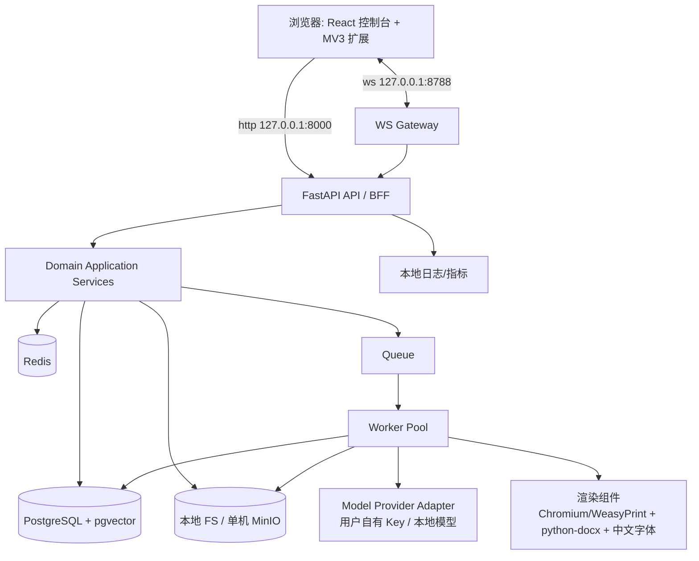

# 02 技术架构设计

> 版本：v1.1（本地优先模块化单体；替代 v1.0 云 SaaS 基线）

## 基线架构

v1.1 采用**个人本地单机的模块化单体 FastAPI + 独立异步 Worker**，以 **Docker Compose** 运行在用户 Windows 本机；全部端口只绑定 `127.0.0.1`，浏览器扩展是唯一对外（BOSS 页面）执行端。领域接口、事件与独立 schema 仍保留未来拆服务/多渠道的边界，但当前不引入任何云原生设施。

## 组件与职责

| 层 | 技术 | 职责 |
|---|---|---|
| Web | React/TS/Vite、TanStack Query、Zod | 漏斗看板、岗位池/筛选、候选区、投递包、模板网格库、A4 编辑器、事件确认台、复盘 |
| 扩展 | Chrome MV3、content script、service worker | 列表/详情采集、聊天网络层解码、在线简历填充；详见专题 21 |
| API | FastAPI、Pydantic | 本地配对鉴权、DTO、同步 CRUD、SSE、WS Gateway（8788） |
| 领域 | Python 模块化领域服务 | capture/screening/job/candidate/evidence/matching/resume/**template**/application/retrospective |
| 异步 | Redis + Celery 或 Arq | 筛选 fan-out、JD 解析、Embedding、模型调用、简历/招呼语生成、模板渲染、DOCX 批量导入 |
| 数据 | PostgreSQL + pgvector；本地目录/MinIO | 交易数据、向量；原件/导出件/模板 DOCX 与缩略图/聊天加密原文 |
| 渲染 | Chromium headless 或 WeasyPrint、python-docx、中文字体卷 | HTML→PDF/PNG、DOCX 回填、MD 序列化；无状态任务化 |
| AI | Provider Adapter、结构化 JSON | 用户自有 Key/本地模型、按任务路由、预算、Schema 校验 |
| 可观测 | 本地日志 + 轻量指标面板 | trace、漏斗指标、扩展连接状态、token 成本（不依赖 Prometheus/Grafana 栈） |

## 模块与边界

目录：`apps/api`、`domains/{capture,screening,job,candidate,evidence,matching,resume,template,application,retrospective}`、`platform/{workflow,ai,shared}`（`platform/auth` 简化为本地配对 token 模块）、`workers`、`extension`（独立 MV3 工程）。领域模块仅依赖 `platform/shared` 与显式领域 Port；禁止跨域直接写表；跨域副作用经 Application Service 或 Outbox Event。

同步：岗位池浏览、筛选配置、候选确认、看板（P95 目标 ≤ 300ms 本机）。异步返回 `202 + execution_id`：Stage-0 批量筛选、JD 分析、匹配、简历/招呼语生成、模板渲染、DOCX 批量导入、复盘。模型调用具备超时、限流、成本预算、熔断与重试。

## 与 v1.0 的差异（替换/删除项）

| v1.0 | v1.1 |
|---|---|
| CDN/WAF/Ingress、K8s、多环境 | 全部删除；仅 Compose + loopback |
| OAuth 2.1/OIDC、RBAC、RLS、tenant_id | 本地配对 token + origin 校验；单用户无租户 |
| S3 云对象存储、KMS | 本地 bind mount 目录（可选单机 MinIO）；本机文件权限 + 应用级加密 |
| Prometheus/Grafana/Alertmanager | 本地日志 + 控制台内置仪表盘 |
| 50 RPS/1000 MAU/水平扩缩 | 个人容量（见下），不做并发设计 |
| 新建 | WS Gateway:8788、渲染组件与中文字体、模板资产存储 |

## 请求、任务与数据流

1. 控制台/扩展调用 API（或 WS），完成配对 token 校验、origin 校验、DTO 与幂等检查。
2. 快速事务直接写 PostgreSQL；长任务先写 `workflow_execution` 与 Outbox 后返回 `202`。
3. Dispatcher 读 Outbox 投 Redis Queue；Worker 领任务，以同一 trace 执行。
4. 结构化结果经 schema/business guard 后短事务落库并发领域事件。
5. 采集与聊天数据走 WS 长连接；WS Gateway 将信封转为 capture 域的应用服务调用；风控信号可反向广播 `abort`。
6. 前端轮询/SSE 进度；控制台与扩展的业务语义都不依赖连接持续存在（断连可重放未确认事件）。

## 关键非功能设计

| 主题 | 设计 | 具体约束 |
|---|---|---|
| 幂等 | 配对 token + 任务唯一键 | `raw_job(source,ext_id)` upsert；相同创建请求 24h 窗口返回同一资源；Handler 以 execution/node/attempt 去重 |
| 一致性 | PG 事务 + Outbox | 事件至少一次、消费幂等；不使用跨库事务 |
| 本地可移植 | 容器内无状态，状态全在卷 | `pgdata`、`redisdata`、`./data/{files,templates,fonts,backup}`、配置目录可整体搬迁 |
| 降级 | 分类处理 | 模型不可用时保留规则筛选/抽取与草稿；聊天解码失败降级 DOM；DOCX 高保真失败降级 ATS 单栏并明示 |
| 配置 | `.env` + 本机配置目录 | 模型 Key、配对 token、可选高德 Key 不进镜像/仓库/前端 |
| 成本 | 执行/节点两级预算 | 超预算 `budget_exceeded`，不静默继续；复盘默认本机/脱敏侧推理 |
| 隐私 | loopback + 加密 + 出域开关 | `chat_message` 静态加密、默认不入第三方请求；网络断言测试验证零外发 |

## 服务接口（Ports）

`ArtifactStore`（本地 FS/MinIO 双 Adapter）、`EmbeddingProvider`、`LLMProvider`、`EventPublisher`、`Clock`、`ExtensionGateway`（WS 命令下发/事件接收）、`DocumentRenderer`（PDF/PNG/DOCX/MD）、`GeoProvider`（可选高德，未配置返回 skip）。删除 v1.0 的 `IdentityContext` 多租户实现，替换为本机 Owner 上下文。

## 容量与隔离

个人规模：单次采集数百至数千岗位、累计数万 Raw Job、数百 Resume Version、模板数百套（224 套 DOCX 按需导入，含缩略图约 GB 级，磁盘预算在专题 17 列明）。上传默认 20MB/文件；每 Evidence 检索任务限候选数；每节点限最大 token/时长。无并发租户，故无配额系统；仅保留任务级预算与存储水位提示。
