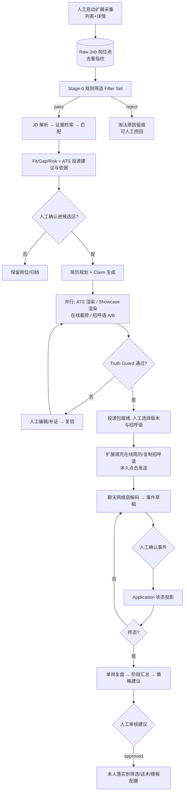
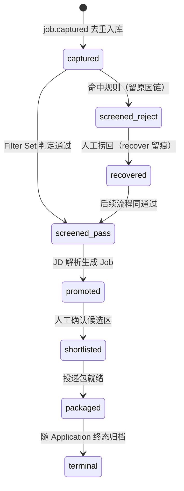
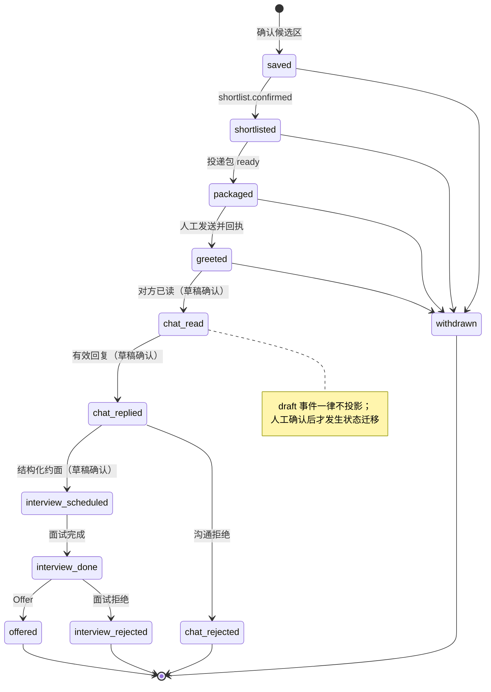
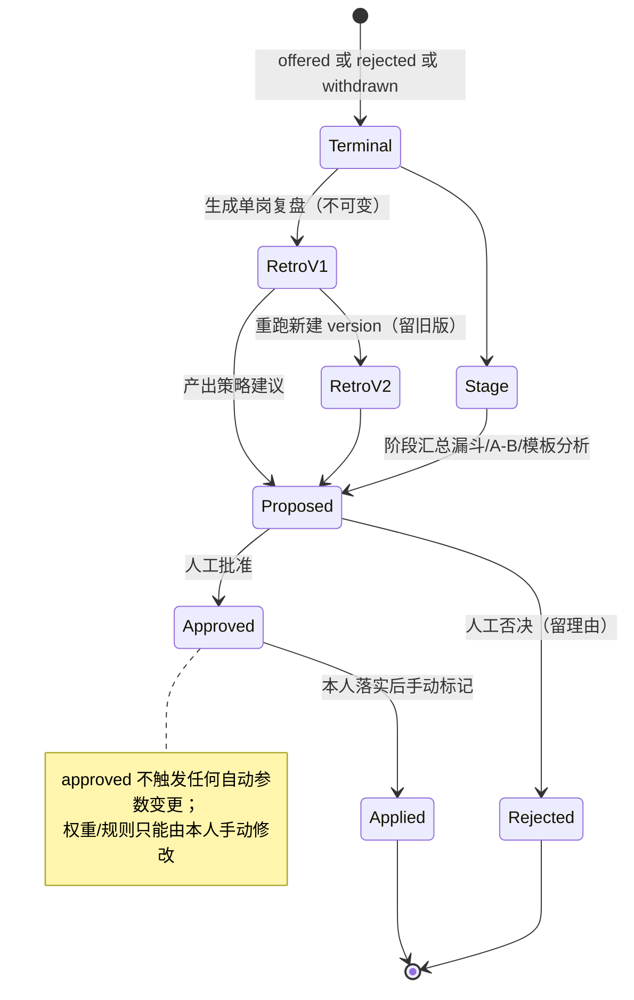

# 03 业务流程设计

> 版本：v1.1（BOSS 求职闭环；扩展采集、候选区、投递包、回采复盘）

## 主流程：采集到复盘



| 环节 | 输入 | 输出 | 人工介入点 |
|---|---|---|---|
| 采集 | 扩展（列表/详情，间隔抖动） | BatchRun、RawJob（原文/JSON 分层） | 启动/停止/翻页全部人工；风控即停 |
| Stage-0 筛选 | RawJob、FilterSet | pass/reject + 逐规则原因 | 编辑条件、捞回淘汰岗位 |
| JD/匹配 | 通过岗位、Evidence | 画像、逐项状态、投递建议 | 低置信确认；建议不替人决策 |
| 候选区 | 匹配结果与建议 | Shortlist(confirmed) | **唯一进入投递准备的入口** |
| 投递包 | Match、Evidence、模板选择 | 三渠道简历 + GreetingVariant[] | 选模板、选招呼语变体、处理 Guard 阻断 |
| 触达 | 填充载荷、招呼语 | application.greeted | 填充当场确认；发送动作本人完成 |
| 回采 | 扩展 chat.event（草稿） | ChatMessage、ApplicationEvent | 逐条确认/修正草稿才入账 |
| 复盘 | 终态岗位全链路 + 聊天原文 | Retrospective、StrategySuggestion | 建议审核 approved/rejected |

## 状态机

- **BatchRun**：`queued → running → completed|aborted|risk_halted|failed`。
- **RawJob（池内生命周期）**：`captured → screened_pass|screened_reject → promoted(生成 Job) → shortlisted → packaged → terminal`；`screened_reject ⇄ recovered`（捞回留痕）。
- **Job**：`draft → analyzing → ready → archived`；**Match**：`queued → running → completed|failed|cancelled`。
- **Resume Version**：`draft → review → published → archived`；发布后不可修改，只能派生；每次发布冻结模板版本与渲染参数。
- **Application（v1.1 扩展）**：

```text
saved → shortlisted → packaged → greeted
      → chat_read → chat_replied → interview_scheduled → interview_done
          → offered
          → interview_rejected
      → chat_rejected
      → withdrawn（任意阶段，本人主动终止）
```

### RawJob 池内生命周期



### Application 全状态机



阶段变更全部以不可变 `application_event` 追加（`source=extension/manual`、`confidence`、`review_status`）；扩展自动分类仅产生 `draft` 事件，确认后才投影。

- **Retrospective**：岗位终态可生成；**StrategySuggestion**：`proposed → approved|rejected → applied`（applied 由本人落实后标记，系统不自动改任何权重/规则）。

### 复盘与策略生命周期



## 四段交互契约

### A. 批量采集与筛选

控制台发起采集批次 → 扩展按 `capture_list/capture_details` 执行（不自动翻页）→ `job.captured/job.updated` 实时进池，去重计数为 dup → 选择 Filter Set 运行 → 结果页按「通过/淘汰（可展开原因链：规则、字段、期望值、实际值）」分组；淘汰岗位可单条/批量捞回，捞回原因入审计。

### B. 候选区确认

通过岗位自动/手动批量跑 JD 分析与匹配；详情页显示「ATS 投递建议与依据」（建议/谨慎/不建议、最强证据 3–5 条、可弥补 Gap、不可弥补 Risk、`ats_direct_post` 渠道提示）。勾选确认 = `shortlist.confirmed`；未确认岗位不生成任何投递包。

### C. 投递包生成与人工发送

确认后并行生成：ATS 附件（ATS 模板族）、Showcase 可视化版（用户选定/Advisor 推荐）、在线四模块载荷、招呼语 A/B（默认 3 条）。投递包页：三态简历预览/导出、招呼语卡片（变量槽高亮、证据引用、字数）、Guard 阻断清单。操作：①下发 `fill_online_resume`（扩展填充后逐模块预览，当场确认）；②`copy_greeting` 到剪贴板/输入框；③本人在 BOSS 页面点击发送并在控制台回执「已发送」（或由后续聊天回采自动生成 greeted 草稿待确认）。

### D. 回采与复盘

聊天页打开时扩展增量 `capture_chat`，网络层解码为 `chat.event` 草稿（类型 + 分类 + 置信度）；事件确认台统一处理。岗位终态后生成单岗复盘：JD/匹配分/各版简历与模板/被选招呼语/聊天关键节点 → 亮点、失败归因、可执行改进；阶段汇总给漏斗转化、拒绝原因分布、招呼语 A/B 回复率、模板使用效果，并产出策略建议（scope=screen/greeting/resume/template）。

## 模板相关子流程

模板库（默认网格，3D 画廊默认关闭）→ 多维筛选/搜索 → 静态多页预览 → 选用进入 A4 编辑器：排版改动只写 render_params，内容改动回写 Resume JSON 并触发 Claim 复验 → 导出走渲染队列 → 独立解析器回读校验 → 通过才入投递包。DOCX 导入为独立后台流程（详见专题 22）。

## 事件词表（v1.1）

- 采集/筛选：`job.captured`、`job.updated`、`capture.phase`、`capture.completed`、`capture.error{risk}`、`screen.completed`、`shortlist.confirmed`
- 投递包：`template.selected`、`greeting.generated`、`resume.published`、`resume.claim_guard_failed`、`application.greeted`
- 回采/复盘：`chat.event_received`、`application.stage_changed`、`retrospective.generated`、`strategy.proposed`
- 沿用：`artifact.ingested`、`job.profile_confirmed`、`match.completed`、`outcome.recorded`

事件 payload 只传资源 ID、版本、trace id（单用户无租户字段）；聊天原文绝不进队列消息，消费者按权限（本机）读取。

## 失败体验要求

可理解错误动作：风控暂停（红色提示+恢复指引）、登录失效、WS 断连（自动重连+未确认事件重放）、选择器/聊天接口变更（降级 DOM/提示升级扩展）、JD 低置信、证据不足、模型不可用、模板渲染失败（定位到模块/槽位）、DOCX 导入失败（失败报告）、Guard 拦截、审批过期。前端不暴露供应商错误/Prompt；每个失败提供重试、编辑或查看 trace id 的入口。
