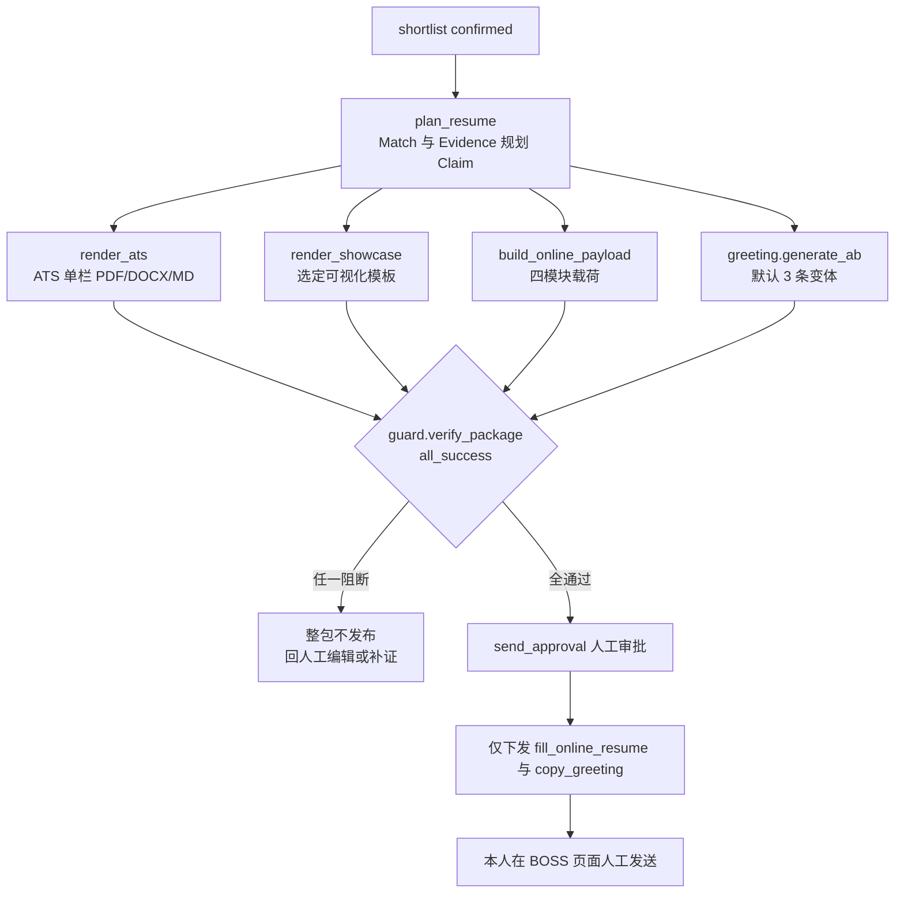

# 04 Workflow 编排设计

> 版本：v1.1（BOSS 闭环编排：采集筛选 → 候选区 → 投递包 → 回采复盘）

## 目标

将长时、可失败、需人工审批的职业任务编排为可恢复、版本冻结、可审计的执行图；不把流程散入 Controller，不支持任意用户脚本，**不注册任何对外发送/投递/翻页处理器**（ADR-009，静态门禁）。

| 节点类型 | 行为 | v1.1 示例 |
|---|---|---|
| `task` | 调用注册 Handler | `screening.run_rules`、`template.render`、`greeting.generate_ab` |
| `condition` | 安全表达式分支 | 是否存在致命硬约束、是否 atsDirectPost |
| `parallel/join` | 有界并行和汇合 | 三渠道渲染 + 招呼语并行；岗位池 fan-out |
| `human_approval` | 挂起等待本人决定 | 候选区确认、投递包发布确认 |
| `event_wait` | 等待领域事件（v1.1 新增） | 终态 `application_event` 触发复盘 |
| `delay/subworkflow` | 退避/冻结版本子图 | 单岗 `job_to_package@1.0` |

## 标准流程

### 4.1 批量主流程 `boss_batch@1.0`

```text
ingest_capture（WS 事件驱动入库）
  → screen_filter（纯规则，不调 LLM）
  → fan_out[parse_jd → retrieve_and_judge_evidence → calculate_match_with_advice]
  → shortlist_approval（人工确认；拒绝岗位在此终止）
  → fan_out[job_to_package@1.0]
```

### 4.2 单岗投递包子流程 `job_to_package@1.0`



```text
plan_resume
  → parallel:
      render_ats(channel=ats)
      render_showcase(channel=showcase, template_id 来自选择/Advisor 推荐)
      build_online_payload（四模块）
      greeting.generate_ab（默认 3 条变体，受限变量槽）
  → guard.verify_package（Claim + 招呼语 + 在线载荷 + 模板一致性）
  → send_approval（人工；通过后仅允许 fill_online_resume / copy_greeting，无发送 handler）
```

### 4.3 回采与复盘子流程 `retrospective@1.0`

```text
chat.event_received（review_status=confirmed 的事件入口）
  → application 投影更新
  → event_wait: terminal(offered|interview_rejected|chat_rejected|withdrawn)
  → retrospective.run（单岗：汇总 JD/Match/版本/模板/招呼语变体/聊天原文，本机或脱敏侧）
  → strategy.propose（scope=screen/greeting/resume/template）
  → 人工 review：approved|rejected；approved 后由本人标记 applied
```

## 执行保障

每次执行冻结 `definition_version、input_hash、prompt_version、model_route、renderer_version、template_versions`。节点以 `(execution_id,node_key,attempt)` 唯一，Handler 必须幂等。Outbox 投递事件、消费幂等键。节点输入输出存脱敏 JSON 或对象引用（聊天原文只传 `chat_message.id`）；每节点绑定 trace id、成本、错误分类。

状态：`queued → running → waiting_approval → running → succeeded`，或 `retry_wait/failed/cancelled`；采集类节点额外监听 `abort` 与风控暂停。默认 3 次指数退避；审批 72 小时超时取消；取消令牌传播到队列、模型调用与扩展命令。

## Node Contract

Handler 声明 `input_schema、output_schema、idempotency_scope、timeout_seconds、retry_policy、required_permissions、cost_class、side_effect_level`。

- `side_effect_level`：`local_read | local_write | extension_command`；**不存在 `external_send`**。注册器在启动时静态扫描，任何 handler 名/元数据涉及外部消息发送、投递、翻页即拒绝注册（测试断言）。
- `template.render` 必须声明 `channel` 与 `template_id?`；`greeting.*` 必须前置 evidence/match 输出，否则 Runner 拒绝调度。
- Runner 调用前校验依赖输出与权限，调用后校验输出 Schema；未声明字段不流向下游。返回 `success/retryable_failure/non_retryable_failure/waiting_approval`，禁止用异常字符串控流。

## 并行、重试与恢复

- 岗位池 fan-out 并发有界（本机默认 2–4），筛选 fan-out 为纯 CPU/DB 任务可更高；模型节点受预算限制。
- `join` 策略：JD/Evidence 允许 `allow_partial`（未完成项在 Match 中标识）；投递包并行组必须 `all_success`，缺一不可发布。
- 可重试：网络超时、供应商 429/5xx、渲染器偶发失败、临时 WS 断连。不可重试：Schema 违例、Guard 阻断、模板渠道不匹配、审批拒绝、DOCX 许可证缺失。
- 恢复从最近成功节点的冻结输出继续；定义/Prompt/模型路由/模板版本变更后不得恢复旧执行，新建 execution 并保留比较关系。

## 审批与审计

两个人工审批节点：**候选区确认**（shortlist_approval）与**投递包确认**（send_approval，确认后仍需本人在浏览器内点击发送）。审批消息含最小必要上下文（匹配结论、证据摘要、Guard 结果、招呼语全文）；审批人=Owner，决定/理由/时间/input snapshot hash 入审计。策略建议（ADR-008）不走 workflow 审批而走独立 review API，approved 也不触发自动参数修改。所有执行提供只读 timeline：节点、attempt、耗时、成本、模板/渲染器版本、输入输出引用与错误分类。
