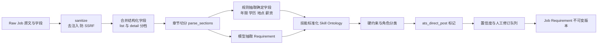

# 05 JD Intelligence 技术方案

> 版本：v1.1（输入源增加扩展结构化采集；支持批量解析）

## 目标与输入

将不规则 JD 转换为可审核的岗位画像，回答“企业真正要求什么”。v1.1 输入源：

1. **扩展结构化采集（主）**：`raw_job` 中扩展已抓取的明文字段（title/company/city/salary/exp/degree/industry/stage/scale/list_tags/skill_tags/boss 信息）+ `jd_text` + 完整 `list_json/detail_json`。
2. 粘贴文本、手工字段（保留，作为补录与非 BOSS 渠道兜底）。
3. 受控 URL 抓取保留但仅在本机手动触发；登录墙/反爬不绕过。

原始 JSON/原文永久保留在 Capture 层，模型产物不可覆盖；解析在 Job 层另建版本。所有岗位带 `source`（v1.1 仅 `boss|manual`，预留其他渠道）。

## 批量与去重

- Stage-0 筛选通过后，对 `raw_job` 批量 fan-out 解析；解析前检查 `fingerprint`（title+company+JD 正文归一化哈希），指纹相同且已有近期成功画像的岗位复用结果并标记 `reused_profile_from`，不重复花模型成本。
- 同一 `source+ext_id` 的详情更新触发增量重解析，生成新 revision，不覆盖旧版。
- 字段来源分档：列表可得（薪资原文/城市/学历/经验/标签）与详情可得（完整 JD/活跃度/HR 特征）；画像中每个字段标注 `field_source=list|detail|manual|inferred`，**详情字段未获取时不得用列表片段臆造**。

## 处理链路



`sanitize → merge_structured_fields → parse_sections → extract_requirements → normalize_skill → detect_constraints → classify_role → ats_direct_post_marker → confidence_and_review`

```json
{"source":"boss","role":"AI应用工程师","requirements":[{"text":"3年以上 Python 后端经验","category":"experience","mandatory":true,"importance":0.9,"min_years":3,"field_source":"detail"}],"skills":["Python","FastAPI"],"constraints":[{"type":"location","operator":"in","value":["杭州"]}],"salary":{"text":"25-40K·14薪","low":25,"high":40,"unit":"K_month"}}
```

## 提取规则

| 类别 | 示例 | 落库规则 |
|---|---|---|
| 必须技能 | Python、FastAPI | 映射 Skill Ontology，保留原词和同义词；扩展 `skill_tags` 作为先验但仍以正文校验 |
| 职责 | 设计 RAG 服务 | `responsibility`，用于 Experience/Evidence 匹配 |
| 年限/学历/地点 | 3 年、本科、杭州 | 优先用明文字段，正文抽取作为交叉校验，冲突入人工确认 |
| 薪资 | 25-40K / 300元/天 / 200元/时 | 解析为 `low/high + 口径(month_K/day/hour/year)`；口径不明置 confidence 低并保留原文，交给 Stage-0 薪资规则判定 |
| 加分项 | 有金融行业经验优先 | `mandatory=false`，不作淘汰条件 |
| 隐含能力 | 跨团队协作、B 端理解 | 低置信推断，必须可编辑、标 `inferred`，不进 HardGate |
| 渠道标记 | `ats_direct_post` | 透传扩展字段；供投递建议决定在线/附件侧重 |

模型 JSON Schema 校验；日期/年限/地点/薪资等确定字段走规则抽取。置信度 < 0.75 的 Requirement 进人工确认队列；扩展明文字段与正文冲突也进队列。URL 抓取禁内网、限跳转、移除页面指令文本（SSRF/Prompt Injection 防护）。

离线指标：Requirement F1 ≥ 0.80、Skill 标准化准确率 ≥ 0.90、薪资口径解析准确率（金标含时薪/日薪/年薪边界）≥ 0.95；金标集按职位族、中/英文、结构化程度分层，并包含扩展采集真实样本。

## Requirement Schema

每项含：`id、raw_text、category、mandatory、importance(0..1)、normalized_skill_ids[]、min_years、seniority、evidence_expectation、confidence、source_span、field_source、review_status`。`evidence_expectation` 区分“技能名出现/项目实践/量化成果/资格证书”，防止把技能栏词频误判为项目实践。

## Skill Ontology

canonical name、同义词、缩写、语言、上下位关系、禁用映射、版本。BOSS `skill_tags/list_tags` 规范化时永远保留原词并输出映射置信度，低于阈值进 review；「向量检索」可映射 RAG 相关能力，但不自动等同「熟练 LangChain」。词表变更需回归历史 JD。

## 准确性和偏差控制

禁止把年龄、婚育、民族、照片、健康等受保护/无关信息转为排序特征；活跃度、HR 身份等只在 Stage-0 规则中按本人配置使用，不进入 JD 画像语义。学历/地点等仅在 JD 明确要求且本人开启匹配时处理。隐含项标 `inferred` 不进 HardGate。按行业/语言/资历抽样监控漏抽误抽。

## 对外接口与失败策略

- `POST /pool/jobs/{id}:analyze`（或批量 `POST /jobs:analyze-batch`）返回 execution；`GET /pool/jobs/{id}/requirements?revision=` 返回可编辑画像；`POST /jobs/{id}/revisions/{r}:confirm` 冻结。
- 采集字段不全（如详情未抓）：返回缺字段清单并建议「补采详情」，不用列表残文臆造。
- 解析失败保留手工表单；URL 为空/登录墙/反爬不绕过；批量任务部分失败不影响其他岗位，失败岗位可在岗位池单独重试。
