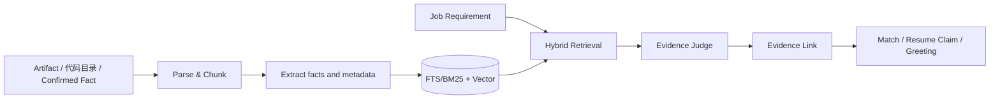

# 07 Evidence OS 技术方案

> 版本：v1.1（新增本地目录/代码库导入策略；明确聊天与模板内容不入证据库；单用户去租户化）

## 目标

Evidence OS 回答“这项能力凭什么成立”。它把项目文档、代码、原始资料、已确认经历转成带来源位置的最小证据单元，维护 `Requirement → Evidence → Resume Claim / Greeting 陈述` 的可审计链路。

## 证据来源白名单（v1.1）

| 来源 | 是否证据 | 备注 |
|---|---|---|
| Artifact（原始资料/证书/文档） | 是 | 字符区间可回溯 |
| 代码仓库切片（`E:\Profile\work` 只读连接器） | 是 | 路径/commit/函数符号定位；剔除密钥/锁文件/二进制/vendor |
| `项目经验.md` 等已确认文档 | 是（确认后） | 八段式段落锚点 |
| career-kb evidence 迁移 | 是（按 A-D 可信度） | C/D 仅低权重，需人工确认 |
| 用户确认事实 | 是 | self_reported 标类型，不当外部验证 |
| **聊天原文（Chat Message）** | **否** | 仅供复盘引用；HR 说的话不能证明本人能力，永不建立 claim_evidence |
| **JD/Raw Job 内容** | **否** | JD 只描述岗位要求，不能反写为本人技能证据 |
| **模板 Blueprint / DOCX 模板** | **否** | 模板是呈现资产，不含任何业务事实，不进证据索引 |
| 模型推断 | 否 | 仅建议 |

## 模型与处理链路

Evidence 字段：`source_type、artifact_id/project_id、quoted_span、text、occurred_at、skills、project_nature(real_world/secondary_dev/learning_ref)、embedding、confidence、verified_by_user、pii_level`。引用必须能回到原文件字符区间或已确认事实版本。

## 本地目录与代码索引策略

- 目录连接器以 SHA-256 + mtime 做增量；首次索引后台分批执行，控制台显示进度；`E:\Profile\work` 只读，不复制原件进容器（只读挂载），证据文本与向量入库。
- 代码切片：按文件/类/函数，每片 250–700 token；保留仓库、路径、commit（若有 git）、符号名；README/设计文档权重高于实现片段；生成代码、lock、minified、二进制跳过。
- 文档切片：语义段落/表格行，保留页码或字符区间、标题路径。
- 单用户本机无权限隔离，但保留 PII 标签：S3/S4（对应 career-kb 映射）默认不向量化、不进第三方 embedding 请求（可配置本地 embedding）。

## 检索与判定

先执行 candidate（固定本人）、时间、PII、项目性质等元数据过滤；再 FTS/BM25 + 向量召回，RRF 融合后交叉编码/受限 LLM 重排。Judge 只在给定文本内输出 `direct_support/partial_support/context_only/contradict/no_support` 与 0–1 confidence，不补充文档外事实。

- `direct_support && confidence≥0.75` 才能自动支持 Claim；
- **项目性质封顶**：`learning_ref` 证据对任何「在职/商业项目/主导上线」类 Claim 一律判 `no_support`；`secondary_dev` 不支持「从零设计/独立主导」措辞，只支持与其实际改动相符的陈述；
- `partial` 支持措辞降级；`context_only/no_support` 只作学习建议。
- 删除资产撤销索引、禁用引用并触发受影响 Claim/Greeting 复检。

质量门槛：Gold Set Recall@10 ≥ 85%、Claim Support Precision ≥ 95%；新增三类项目性质的负例集（学习项目冒充在职必须 100% 拦截）。

## 切片和元数据规范

每段保留文档版本、页码/字符区间、标题路径、创建时间、项目/经历归属、`project_nature`、语言、PII 标签。不得只存向量丢失原文位置。重叠不超过 15%。

## 检索策略细节

每个 Requirement 构造原词 query、canonical skill query、职责语义 query；BM25 命中技术名/证书名/精确短语，向量覆盖同义表述；RRF 后 top-50 给 reranker、top-10 进 Judge。时间只在 Feature 中衰减、不删除基础能力。招呼语的证据检索使用同一管线但上下文仅含该岗位字段与 approved facts，不注入 JD 原文以外的公司信息。

## 证据关系和冲突

Evidence Link：`requirement_id, evidence_id, relation, confidence, judge_run_id`；同一 Requirement 多证据可解释聚合；`contradict` 优先送 Truth Guard，日期/数字冲突不被其他支持证据掩盖。

## 运行和成本控制

解析/Embedding 以 Artifact SHA-256 + parser/model version 为缓存键；文档变更只重建受影响 chunks；本地批量导入受任务预算限制。Judge 仅处理有限 top-K，所有 LLM 判定带最大 token、超时与预算；聊天复盘需要的语义处理在本机/脱敏侧进行（ADR-006）。无 Evidence 是正常业务输出而非错误。
