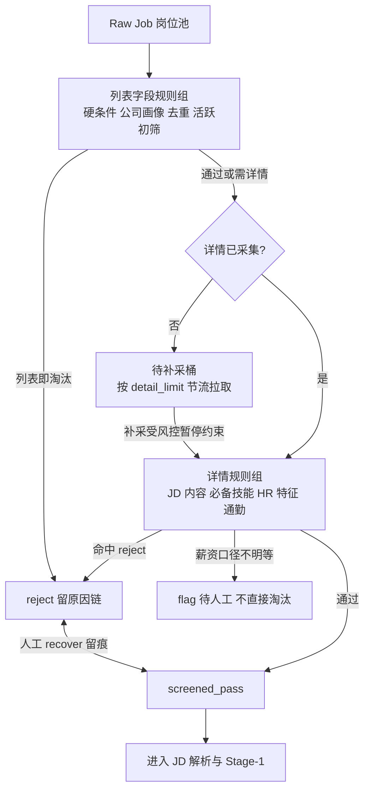

# 08 Matching Engine 技术方案

> 版本：v1.1（明确两阶段：Stage-0 纯规则筛选 + Stage-1 评分匹配与 ATS 投递建议；定义漏斗口径）

## 两阶段总览

```text
Raw Job 岗位池
  → Stage-0 筛选器（Screening 域；纯规则、零 LLM、可解释、可捞回）
      pass 的岗位才产生模型成本
  → Stage-1 评分匹配（Matching 域；硬门槛 + 软匹配 + Evidence）
      → Fit/Gap/Risk + ATS 投递建议与依据 → 人工确认候选区
```

## Stage-0 筛选器（规则引擎）



规则组织在 `filter_set.rule_json`，版本化（形状契约见 `contracts/filters/filter-set.schema.json`）；每条规则有稳定 `rule_id`、启用开关、参数与命中后 verdict（reject/flag）。筛选结果逐岗写 `screen_result.reasons_json = [{rule_id, group, field, operator, expected, actual}]`，淘汰原因必须能在 UI 展开到字段值。

| 规则组 | 规则 | 数据档 | 要点 |
|---|---|---|---|
| 硬条件 | 城市/区域 | 列表 | 支持多城市、远程标记 |
| | 薪资数值域 | 列表原文→服务端解析 | 区分 K 月薪、元/月、元/天、元/时、年薪；区间相交判定；口径不明不直接淘汰，转 flag 待人工 |
| | 学历/经验年限 | 列表明文字段 | 枚举匹配；「不限」放行 |
| | 岗位名白/黑名单 | 列表 title | 正则/包含，支持别名 |
| 公司画像 | 行业/规模/融资阶段 | 列表或详情 | 多选包含/排除 |
| | 公司名黑名单 | 列表 | 外包/中介公司库，可编辑 |
| | 猎头过滤 | 详情 `boss.isHeadhunter` | 命中默认 reject |
| | HR 职位白/黑名单 | 详情 boss title | 如「招聘专员/HRBP/业务面试官」 |
| | 金牌面试官标记 | 详情 | 可加权 flag，不默认淘汰 |
| JD 内容 | 关键词白/黑名单 | 详情 jd_text | 黑名单支持否定语境：`(?<!(不|无|没).{0,5})关键词`，并排除「XX 系统/软件/工具/服务」后缀误命中 |
| | 必备技能覆盖 | 详情 | 配置「出现任意/全部 N 个」；仅字面+同义词，不做语义 |
| | JD 完整度/发布时间 | 详情/列表 | 过短、过旧岗位 flag 或淘汰 |
| 去重频控 | 同公司、同 HR、JD 指纹 | 库内比对 | 近 N 天已沟通/已投递/已拒绝自动排除；fingerprint 去重 |
| | 已沟通/好友状态 | `boss.isFriend`、沟通表 | 已在聊的岗位不重复进入 |
| 活跃度 | BOSS 活跃时间 | 详情 active_time | 阈值可配（如 >7 天/30 天/半年/更久分档淘汰），解析「刚刚/今天/3天内/月内」 |
| 通勤（可选） | 地址→距离/时间 | 详情 address + 高德 Key | 未配置 Key 或地址缺失：skip 不淘汰；配置后按上限淘汰 |
| AI 打分 | 附加条件（默认关） | 详情 | 开启后作为边界条件；规则结果始终先行展示，AI 不覆盖规则 verdict |

执行策略：

1. **列表字段先筛**（零额外请求）；通过后按 `detail_limit` 节流补详情再跑详情规则；详情缺失岗位进入「待补采」桶而非直接淘汰。
2. 筛选是只读批任务：不修改 raw_job、不调模型；可按新版本 Filter Set 重跑，历史 screen_result 保留。
3. **捞回**：任何 reject 可人工 recover，记录捞回原因；捞回岗位在后续报告中带标记，用于校准规则。
4. 风控：筛选本身不触发任何页面动作；补详情受全局节流与风控暂停约束。

## Stage-1 评分模型

对通过 Stage-0 且完成 JD 画像的岗位计算，匹配不是“LLM 给一个 91%”：

```text
FinalScore = round(100 × HardGate × WeightedFit × EvidenceConfidence × RecencyFactor)
WeightedFit = .25 Skill + .20 Experience + .20 Evidence + .15 Semantic
            + .10 Industry + .05 Education + .05 Preference
```

权重为工程先验，非任何企业内部公式；Outcome 样本不足前不自动调权（ADR-003/008；复盘建议人工批准后才可改）。

| 特征 | 计算 | 解释 |
|---|---|---|
| HardGate | 地点、学历、年限、语言的结构化比较 | 每项约束、严重级别、可否人工豁免；JD 未明确属性（年龄/照片等）不参与 |
| Skill | 规范 Skill 的重要性加权覆盖 | 覆盖/邻近/缺失技能 |
| Experience | 职责、年限、复杂度、最近性 | 对应经历与日期范围 |
| Evidence | 每项 Requirement 最高有效证据（含项目性质封顶） | 证据摘要、定位、置信度 |
| Semantic | 相似度重排 | 仅线索，不等同事实 |
| Industry/Recency | 行业 taxonomy 距离、时间分段衰减 | 同/邻行业、衰减原因 |

逐 Requirement 固定输出 `met/partial/missing/risk`；输出 `raw_features、weights、gate、recency、final_score、score_band（宽区间）、confidence`。Evidence 稀少时降 confidence，不猜测抬分；解释必须引用 match_requirement 与 Evidence ID。

## ATS 投递建议与依据（v1.1 新增输出）

每个完成匹配的岗位产出结构化 `application_advice`：

```json
{
  "decision": "apply|cautious|not_apply",
  "channel_hint": {"ats_direct_post": true, "prefer": "online+ats_attachment"},
  "strong_evidence": ["…3-5 条，带 evidence_id"],
  "coverable_gaps": [{"requirement": "", "suggestion": "补证/调整表达/引导录入"}],
  "hard_risks": [{"constraint": "", "severity": ""}],
  "screen_trace": [{"rule_id": "", "verdict": ""}]
}
```

判定沿用：HardGate<0.7/致命约束→not_apply；≥75 无致命→apply；55–74→cautious；<55→低优先级。文案原则：给具体依据不给黑箱；没有证据写“未找到支持证据”，不写“你不具备”。渠道提示结合 `ats_direct_post`：直投岗建议附件 ATS 版 + 在线载荷双备。

## 漏斗口径（与 18 篇共用）

七级：`captured（去重后入库）→ screened_pass（当次 Filter Set）→ shortlisted（人工确认）→ greeted（已发送并回执/确认）→ replied（对方首个有效回复，自动分类草稿+人工确认）→ interview_scheduled（结构化约面确认）→ offered`。

口径规则：按岗位去重（同 source+ext_id 只计一次，跨阶段取最早时间）；撤回/拒绝单独计数不影响各级基数；筛选淘汰按 `rule_id` 归因（一岗位命中多条按首条命中+全量明细两套口径）；转化率分母统一为上一级；时间窗口在仪表盘可配。所有数字必须能与明细表 SQL 对账。

## 排序与反操纵

岗位池/候选区排序优先本人偏好（目标岗位、地点、薪资）与 Gate/Fit，不单凭总分。相同 Skill 在无上下文技能栏重复不线性增分；关键词只有被 Experience/Project/Evidence 支持才进高权重；自述 Skill 默认不强证据。Stage-0 的 AI 附加分仅用于排序提示，不产生硬淘汰。离线评估：nDCG@K、Calibration Error、逐项 F1、规则边界准确率；按职位族监控漂移。
