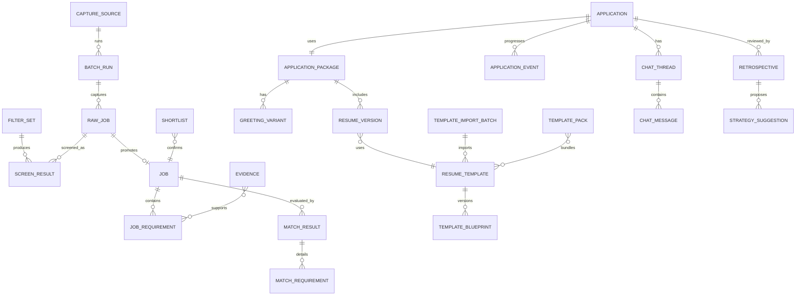

# 12 数据库设计

> 版本：v1.1（单用户本地模型；新增采集/筛选/候选/聊天/复盘/模板共 16 张表；废弃 RLS/tenant）
>
> 机器契约：PG16 DDL 草案见 [`../../contracts/db/0001_baseline.skeleton.sql`](../../contracts/db/0001_baseline.skeleton.sql)（v0-draft）；**本篇为语义真源**，P1 对账后以首个 Alembic 迁移冻结。

## 存储选型与原则

PostgreSQL 为唯一交易真源，pgvector 承载向量索引，Redis 仅作缓存/队列，**本地文件目录（可选单机 MinIO）**保存原件、导出件、模板 DOCX/缩略图与聊天加密原文包。单用户本地库：表不带 `tenant_id`，不启用 RLS；隔离靠 loopback 绑定 + 配对 token + 本机文件权限。所有表带 `id uuid、created_at、updated_at`。

## 一、采集与岗位池

| 表 | 关键字段与约束 |
|---|---|
| `capture_source` | `code text pk(boss)、display_name、enabled、config_json、protocol_version` |
| `batch_run` | `id、source_id、kind(list/detail/chat)、status(queued/running/completed/aborted/risk_halted/failed)、stats_json、risk_halted bool、started_at、finished_at、trigger(manual)` |
| `raw_job` | `id、source_id、ext_id、fingerprint、batch_id、list_json jsonb、detail_json jsonb、jd_text、title、company、city、salary_text、low_salary、high_salary、salary_unit(month_K/month_yuan/day/hour/year/unknown)、exp_text、degree、industry、stage、scale、address、list_tags[]、skill_tags[]、ats_direct_post、boss_json{name,title,is_headhunter,is_friend,has_interview,is_gold}、active_time、active_at、list_at、detail_at`；`uq(source_id,ext_id)`；`gin(fingerprint)` |
| `job`（原表扩展） | `raw_job_id、source、status(draft/analyzing/ready/archived)、profile_revision_id、…` 原 v1.0 字段 |

## 二、筛选与候选区

| 表 | 关键字段与约束 |
|---|---|
| `filter_set` | `id、name、version、rule_json、is_default、archived`；rule_json 分组：hard/company/jd_content/dedup/activity/social/commute/optional_ai |
| `screen_result` | `id、filter_set_id、filter_version、raw_job_id、batch_run_id、verdict(pass/reject/recovered)、reasons_json[{rule_id,group,field,expected,actual}]、recover_reason、screened_at`；`uq(filter_set_id,filter_version,raw_job_id)` |
| `shortlist` | `id、raw_job_id、job_id、match_result_id、status(confirmed/removed)、decided_at、note`；一个岗位同批仅一条有效 confirmed |

## 三、触达与投递

| 表 | 关键字段与约束 |
|---|---|
| `application_package` | `id、application_id、match_result_id、online_payload jsonb、ats_version_id、showcase_version_id、guard_run_id、status(draft/ready/used)、created_at` |
| `greeting_variant` | `id、package_id、variant_no、text、slots_json、evidence_ids[]、length_check jsonb、risk_flags[]、selected_at、status(generated/blocked/selected/used)` |
| `application`（原表扩展） | `id、source(boss/manual)、raw_job_id、job_id、current_stage、package_id、created_at`；阶段由事件投影 |
| `application_event`（扩展） | append-only：`id、application_id、type、source(extension/manual)、confidence、review_status(draft/confirmed/rejected)、payload jsonb、chat_message_id?、occurred_at、confirmed_at`；type 枚举：`shortlisted,packaged,greeted,chat_read,chat_replied,chat_rejected,interview_scheduled,interview_done,interview_rejected,offered,withdrawn` |

## 四、聊天（最高 PII）

| 表 | 关键字段与约束 |
|---|---|
| `chat_thread` | `id、application_id、source、ext_chat_id、counterpart_name、job_ext_id、last_msg_at、cursor_json`；`uq(source,ext_chat_id)` |
| `chat_message` | `id、thread_id、ext_msg_id、direction(inbound/outbound)、type(text/image/voice/video/interview/notify/article/action)、text_or_caption、structured jsonb、payload_enc bytea、payload_enc_meta、decode_source(network/dom)、sent_at、raw_object_key`；不建任何到 evidence 的外键；静态加密（本机密钥），默认不进模型/日志 |

## 五、模板子域

| 表 | 关键字段与约束 |
|---|---|
| `resume_template` | `id、code、name、channel(ats/showcase)、layout_type(P01-P23)、style_preset(S01-S34)、default_modules jsonb、slot_map jsonb、tags(type/occupation/style/lang)、lang、color、columns、pages、license、license_note、source(builtin/docx_import/user_copy)、quality_grade(A/B/C)、thumbnail_key、enabled、version` |
| `template_blueprint` | `id、template_id、version、spec_json、parser_engine(openxml/python-docx)、fidelity_grade、created_at` |
| `template_import_batch` | `id、source_dir、engine、total、succeeded、failed、failed_report jsonb、status(running/done/partial)、resume_cursor、created_at、finished_at` |
| `template_pack` | `id、name、license_note、created_at`；`template_pack_item(pack_id,template_id)` 关联表 |
| `resume_version`（扩展） | 原字段 + `template_id、template_version、render_params_json、channel(ats/showcase/online)、renderer_version、input_claim_hash、output_hash` |

## 六、复盘与策略

| 表 | 关键字段与约束 |
|---|---|
| `retrospective` | `id、application_id、kind(single/stage)、period_start/end?、content_json、funnel_snapshot jsonb、model_run_id、version、created_at`；不可变，重跑新建 version |
| `strategy_suggestion` | `id、retrospective_id、scope(screen/greeting/resume/template)、content_json、expected_effect、status(proposed/approved/rejected/applied)、reviewed_at、applied_note` |

## 七、v1.0 既有表（保留去租户化）

`candidate`（去掉 tenant_id）、`experience/project`（project 增 `nature、license_note、source_connector`）、`artifact`（增 `connector_type、source_path_readonly`）、`evidence`（增 `project_nature、pii_tier`）、`job_requirement/job_constraint`（增 `field_source`）、`match_result/match_requirement`（增 `application_advice jsonb`）、`resume/resume_claim/claim_evidence`、`job_profile_revision/candidate_revision`、`workflow_definition/execution/node_run`、`prompt_template/model_run`、`audit_log`、`outbox`。

## 索引与关键约束

- `raw_job(source_id,ext_id)` 唯一；HNSW cosine 向量索引沿用；`job/raw_job` 全文 GIN（中文分词配置）。
- `screen_result(filter_set_id,filter_version,raw_job_id)` 唯一；`application_event(application_id,occurred_at)`；`chat_message(thread_id,sent_at)`；模板多维检索用 `gin(tags)` + 常用列 B-tree。
- 漏斗对账：所有投影数字可由 `raw_job / screen_result / shortlist / application_event(greeted,chat_replied,interview_scheduled,offered)` 明细表复算（口径见 08 篇）。
- 校验约束：`resume_version.channel=ats → resume_template.channel=ats`；`greeting_variant.status=used` 必须存在 evidence 或全部陈述为变量槽/自述偏好；应用层断言 chat_message 与 evidence 无关联路径。

## 删除、版本与加密

- `artifact/raw_job/template` 软删除根对象；删除 artifact → evidence `revoked` + 索引撤销 + Claim 复检；模板软删除保证历史版本可重放。
- 不可变：revision/model_run/workflow_*/application_event/chat_message/retrospective；`application.current_stage`、看板与漏斗均为投影。
- 聊天原文使用本机密钥（配置目录，不进镜像/仓库）做列加密；原件在本地目录按 `files/templates/chat-raw` 分层，聊天原始包加密存储。
- UTC 存储；年月未知用精度字段，禁止虚构日期。

## 关键事务

**确认候选**：锁 shortlist 间隙 → 校验存在 confirmed 匹配/通过筛选 → upsert shortlist + 写 application(saved→shortlisted) 事件 + outbox。
**投递包就绪**：校验 Guard Run 通过（Claim/招呼语/载荷/模板一致性）→ 冻结三渠道版本与模板参数 → package=ready。
**事件确认**：草稿 `draft→confirmed` 原子更新 + 投影重算；拒绝留 rejected，不投影。
**工作流节点**：沿用 v1.0 锁 node run + outbox 幂等模式。

## 旧 MySQL（8789）迁移映射

`boss_jobs → raw_job`（ext_id、字段直映，薪资数值尽力回填否则 unknown，list_json 存原行）；`batch_runs → batch_run`；迁移执行一次，迁移行打 `migrated_from=mysql8789`，老库只读归档。迁移后 Node 8789 链路下线。

## 备份与保留

本地备份：pg_dump 定时任务 + `data/files、data/templates、配置目录` 复制到备份目录；聊天数据提供「按会话清除/导出后清除」。保留期限本机可配，删除传播到文件、索引、缓存与备份过期队列并记录完成证明。
