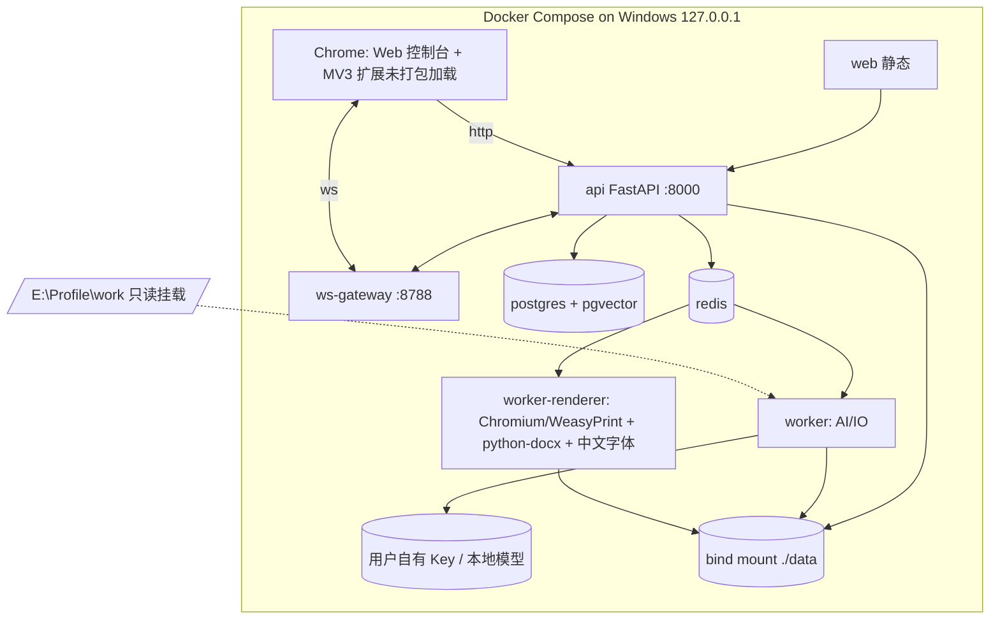

# 17 部署架构

> 版本：v1.1（Windows 本机 Docker Compose；替代 K8s/多云环境）

## 本机拓扑

## 端口与卷

| 项 | 值 | 说明 |
|---|---|---|
| API/Web | `127.0.0.1:8000` | 控制台 + REST |
| WS | `127.0.0.1:8788` | 扩展唯一接入；握手校验 token + Origin |
| PostgreSQL | 容器内，不暴露宿主 | pgvector 数据卷 pgdata |
| Redis | 容器内，不暴露宿主 | 队列/缓存 |
| `./data/files` | bind mount | 原件、导出件 |
| `./data/templates` | bind mount | 内置包、导入 DOCX、缩略图、Blueprint 产物 |
| `./data/chat-raw` | bind mount（加密文件） | 聊天原始包，单独目录便于清除 |
| `./data/fonts` | bind mount | 中文字体（思源宋/黑等可自由分发字体） |
| `./data/backup` | bind mount | pg_dump 与文件备份 |
| `E:\Profile\work` | **只读** bind mount | 知识库源目录，连接器永不写回 |

所有端口配置中显式写 `127.0.0.1:` 前缀；CI 检查 compose 文件不含 `0.0.0.0` 绑定。

## 组件镜像

- `api`：Python 3.12 + FastAPI；启动迁移、配对 token 初始化（配置目录不存在时生成并在控制台首启向导展示）。
- `worker`：AI/IO 任务；模型 SDK；目录连接器。
- `worker-renderer`：Chromium headless（PDF/PNG）或 WeasyPrint；python-docx（DOCX 回填）；中文字体；与业务镜像分离便于单独重建。
- `postgres`：官方镜像 + pgvector 扩展初始化脚本。
- `web`：Vite 构建产物由 api 静态托管，可省独立容器。
- MinIO 为可选项；默认直接用本地 FS（`ArtifactStore` 双 Adapter，接口一致）。

## 扩展安装与配对

1. Chrome `chrome://extensions` 开发者模式「加载已解压的扩展程序」，指向 `extension/dist`。
2. 控制台「扩展接入」：确认 `ws://127.0.0.1:8788/ws`，填入一次性配对码；服务端记录实例与协议版本。
3. 扩展最小权限：BOSS 域 host_permissions + `127.0.0.1` WS/REST；不申请 `<all_urls>`。
4. 版本不兼容时只提示升级，不自动拉取远程代码。

## 模型与密钥

- 模型 Provider Key（或本地模型 endpoint）仅存于宿主配置目录 / `.env`（不进镜像、不进 git）；启动时注入 worker。
- 默认配置不训练/不保留；聊天复盘默认走本地模型或脱敏摘要，第三方调用必须显式开关。
- 可选高德 Key 同路径管理；未配置时通勤规则 skip。

## 数据迁移与备份

- 首启迁移：PG schema migrate；旧 MySQL 8789 数据通过一次性迁移命令导入（映射见 12/21 篇），完成后老库仅只读归档、Node 8789 下线。
- 备份：每日 `pg_dump` + 每周 `data/` 目录增量复制到 `./data/backup`（路径可配到外置盘）；提供「一键导出备份包/恢复」命令。
- 恢复演练：每次大版本升级前在临时容器恢复一次。
- `E:\Profile\work` 不纳入应用备份（源目录由用户自行管理），应用只存其哈希索引。

## 磁盘与容量预算

| 资产 | 估算 |
|---|---|
| PG（数万 Raw Job + 索引 + 向量） | 数百 MB–2 GB |
| 原件/导出件 | 按实际，建议预留 5 GB |
| 模板：精选内置包 | < 100 MB（含缩略图） |
| 224 套 DOCX 全量按需导入（docx+jpg+blueprint 产物） | 约 1–3 GB，导入向导明示并允许分批/删除 |
| 聊天原始加密包 | 文本极小；图片/语音/视频类建议设置只留元数据开关 |

## 发布与升级（本地）

- 单环境 `local`；无 dev/staging/prod 与 canary。版本=compose 配置 + 镜像 tag + 迁移版本 + 工作流/Prompt 版本（在「关于」页展示）。
- CI 仍保留：lint → 测试 → 依赖/密钥扫描 → 镜像构建 → 迁移检查；升级前自动备份，数据库只允许 expand/contract 迁移。
- 扩展版本与协议版本独立协商；升级扩展后旧主系统在兼容窗口内可连。

## 发布清单

compose 端口审计（全 loopback）✅；中文字体渲染抽检（PDF 无豆腐块）✅；配对流程✅；备份恢复✅；风控/无发送路径扫描✅；模板许可证字段已填✅；聊天加密与清除✅；`E:\Profile\work` 只读验证✅；第三方 Key 不在镜像/日志中✅。
