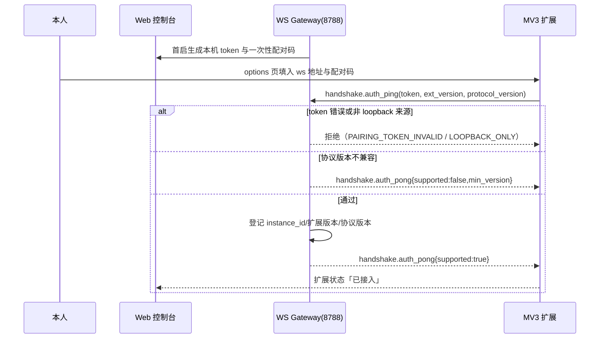
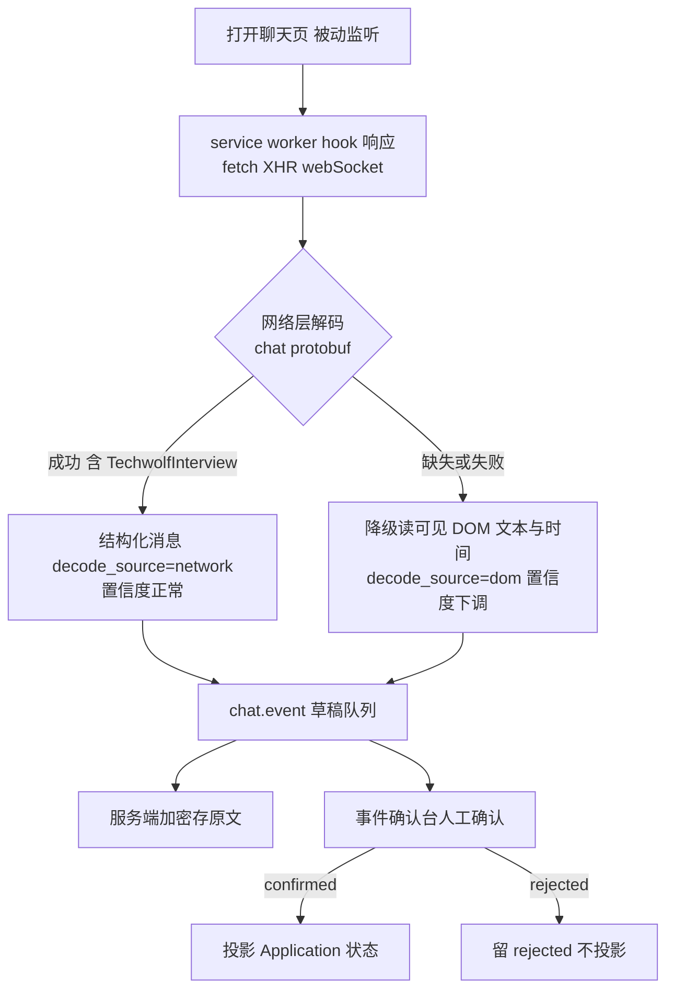

# 21 浏览器扩展集成协议

> 版本：v1.1 新增
> 关联：总体方案 §4/§5/§7、[03 业务流程](03-业务流程设计.md)、[12 数据库](12-数据库设计.md)、[13 API](13-API接口设计.md)、[17 部署](17-部署架构.md)
> 依据 ADR：005（本地单机+扩展唯一执行端）、006（聊天不出本机）、009（禁止自动投递/发送/翻页）、012（聊天网络层解码+草稿人工确认）

## 1. 定位与拓扑

浏览器扩展是系统在 BOSS 直聘页面上的**唯一执行端**，只承担浏览器侧能力：列表/详情采集、聊天数据回采、在线简历填充、侧栏展示。分析、评分、生成、匹配、渲染全部在主系统（本机 Docker Compose）完成。

```text
Chrome MV3 Extension
  ├─ content scripts（BOSS 列表页/详情页/聊天页）
  ├─ service worker（WS 客户端、任务编排、网络层解码）
  └─ sidebar（主系统视图嵌入/跳转）
        │  ws://127.0.0.1:8788/ws   （仅 loopback）
        ▼
本机 API 的 WS Gateway ── FastAPI domains/capture / application
```

- 服务端只绑定 `127.0.0.1`；校验 `Origin` 与配对 token。
- REST 作为 WS 不可用时的回退（批量结果上报、载荷拉取）。
- v1.0 旁路（Node HTTP `127.0.0.1:8789` + MySQL `boss_jobs/batch_runs`）**废弃**；TS 侧评分生成核心（jobProfile/workPattern/evidenceMatcher/resumeGenerator/scorer）**删除**，由主系统域接管。老数据一次性迁移（见第 9 节）。

## 2. 配对与鉴权



1. API 首次启动在本机配置目录生成本地配对 token；控制台「扩展接入」页展示一次性配对码（或二维码）。
2. 扩展 options 页填入：`ws://127.0.0.1:8788/ws` + token；连接后第一帧发起 `handshake.auth_ping`，成功后服务端记录 `extension_instance_id`、扩展版本、协议版本。
3. token 仅存扩展本地存储（chrome.storage.local）；支持在控制台轮换，轮换后旧连接立即失效。
4. 握手携带 `protocol_version`；不兼容时服务端返回 `handshake.auth_pong{supported:false, min_version, upgrade_url}`，扩展只提示不工作。握手完成前不得提交业务事件或接收业务命令。

握手使用独立信封 `{v:1,kind:"handshake",id,type:"auth_ping"|"auth_pong",payload}`，不计入服务端业务命令或扩展业务事件全集；机器形状见 `contracts/ws/handshake.schema.json`。鉴权失败使用统一错误信封后关闭连接。

## 3. 业务命令协议（服务端 → 扩展）

沿用现有 JSON 信封：`{v:1, kind:"command", id, type, capture_id/command_id, payload}`。

| 命令 | 状态 | payload | 说明 |
|---|---|---|---|
| `capture_list` | 沿用 | `query_url/list_params, max_items, delay_ms, auto_next_page=false` | **`auto_next_page` 恒为 false**；翻页只由用户手动操作后扩展继续采集 |
| `capture_details` | 沿用 | `ext_ids[], detail_limit, delay_ms` | 按节流上限逐个打开/接口拉取详情 |
| `abort` | 沿用 | `capture_id, reason` | 立即停止当前批次 |
| `fill_online_resume` | **新增** | `{application_id, payload:{advantage, work_experiences[], projects[], skills[]}, preflight}` | 四模块填充；扩展先回填预览并逐模块高亮，**必须当场人工确认**才写入 DOM；不改公司名/职位/起止时间/学历 |
| `copy_greeting` | **新增** | `{variant_id, text, target:"clipboard"\|"draft_input"}` | 仅写入剪贴板或聊天输入框草稿；**协议不存在 send 命令** |
| `capture_chat` | **新增** | `{thread_ids[], since_cursor, limit}` | 增量拉取指定会话消息（网络层解码结果），不发送任何消息 |

命令执行回执：`command.started / command.progress / command.completed / command.error`，均带原 `command_id`。

## 4. 事件协议（扩展 → 服务端）

| 事件 | 状态 | payload 要点 |
|---|---|---|
| `capture.phase` | 沿用 | `phase(list/detail), done, total, current` |
| `job.captured` | 沿用 | 列表岗位记录（见第 5 节契约），按 `source+ext_id` 幂等 upsert |
| `job.updated` | 沿用 | 详情补齐字段；服务端合并而非覆盖原始层 |
| `capture.completed` | 沿用 | `capture_id, stats{success,dup,risk_halted}, finished_at` |
| `capture.error` | 沿用+扩展 | `code,message,recoverable,risk`；**`risk:true` 时批次自动暂停**（风控词：账户存在异常/账号存在异常/风控/安全验证/环境存在异常/异常访问） |
| `chat.event` | **新增** | `{thread, messages[], draft_classification, confidence, decode_source}`，全部以 `review_status=draft` 入库，等待人工确认（ADR-012） |
| `fill.completed` | **新增** | `{application_id, modules_filled[], user_confirmed:true}`；未确认不得上报成功 |

业务侧领域事件（服务端内部，不经扩展）：`screen.completed、shortlist.confirmed、template.selected、greeting.generated、application.greeted、chat.event_received、retrospective.generated、strategy.proposed`。

## 5. 岗位数据契约

`job.captured`（列表）与 `job.updated`（详情）合并写入 `raw_job`；字段分「列表可得」与「详情可得」两档：

| 档位 | 字段 |
|---|---|
| 列表可得 | `ext_id, title, company(brandName), city, salary_text, low_salary, high_salary, exp_text, degree, list_tags, list_url, boss_name(部分)` |
| 详情可得 | `jd_text, skill_tags, industry, stage, scale, address, company_desc, active_time, ats_direct_post, boss_json{name,title,is_headhunter,is_friend,has_interview,is_gold_interviewer}, detail_json(完整原始 JSON)` |

规则：

- 薪资解析为数值域 `low_salary/high_salary`，须区分月薪（K/元）、时薪、日薪、年薪口径（解析在服务端 Screening 域，扩展只传原文与可得数值）。
- `fingerprint = hash(normalize(title)+normalize(company)+normalize(jd_text 前 N 字))`，用于跨批次与跨渠道去重。
- 原始 `list_json/detail_json` 全量保留，禁止用解析结果覆盖。
- 采集节流：默认间隔 ≥ 1.8s + 随机抖动；`detail_limit` 每批可配；所有节流参数在控制台可见可调，但设最小下限不允许设为 0。

## 6. 聊天采集方案（重点）

### 6.1 采集策略：网络层解码为主，DOM 为辅



> 全流程只被动读取：不注入、不改写、不调用发送/已读回执接口。

1. **网络层（主）**：在扩展 service worker 中 hook BOSS 聊天接口响应（fetch/XHR/webSocket），参照 BOSS 聊天 protobuf 定义（`cn.techwolf.boss.chat`，第三方开源项目 boss-helper 已验证其可行性，仅学习协议结构，不抄代码）解码：
   - 文本、图片、语音、视频、文章、系统通知；
   - `TechwolfInterview` 等**结构化约面消息**（时间/地点/轮次等字段）；
   - 动作类消息（已读、撤回、系统提示）。
2. **DOM（辅）**：网络层缺失或解码失败时，从聊天页 DOM 读取可见文本与时间，`decode_source="dom"`，置信度下调。
3. 扩展只做被动读取与解码，**不注入、不改写、不调用任何发送/已读回执接口**。

### 6.2 输出结构

```json
{
  "thread": {"ext_chat_id": "...", "counterpart_name": "...", "job_ext_id": "..."},
  "messages": [{
    "ext_msg_id": "...", "direction": "inbound|outbound",
    "type": "text|image|voice|video|interview|notify|article|action",
    "text_or_caption": "...", "structured": {"interview": {"time": "", "place": "", "round": ""}},
    "sent_at": "2026-09-13T10:00:00Z", "decode_source": "network",
    "raw_ref": "对象存储中加密原始包的 key"
  }],
  "draft_classification": "chat_replied|interview_scheduled|chat_rejected|interview_rejected|offered|none",
  "confidence": 0.0
}
```

### 6.3 草稿入账流程

`chat.event` → 写入 `chat_message`（加密）+ `application_event(review_status=draft, confidence)` → 控制台「事件确认台」列出草稿 → 人工确认/修正后转为 `confirmed` 并投影 Application 状态；拒绝则 `rejected` 留痕。**任何草稿不得自动改状态、不得作为复盘结论的唯一依据。**

## 7. 在线简历填充约束

- 载荷固定四模块：个人优势、工作内容、项目描述、技能；均为纯文本/受控列表。
- 红线字段（公司名、职位名、起止时间、学历）扩展侧禁止写入，即使载荷中出现也忽略并上报 `fill.completed{skipped_redline:[...]}`。
- 填充前预检：模块字数上限、换行/特殊字符、技能长度；预检失败返回待修正项，不写 DOM。
- 填充完成后页面停留在可编辑状态，由本人自行检查后点击保存/发送；扩展不模拟提交按钮。
- 不上传任何附件（附件简历由本人在 BOSS 页面手工上传系统导出的 ATS 文件）。

## 8. 风控红线（账号安全）

1. 不自动投递、不自动发消息、不自动点击「继续沟通」、不自动翻页、不自动上传附件（ADR-009）。协议层不注册任何对应命令。
2. 采集间隔 + 随机抖动，并发恒为 1；检测到风控词或验证码/滑块页 → `capture.error{risk:true}` 立即暂停整批并在控制台红色提示，需人工恢复。
3. 登录态失效（跳登录页/cookie 过期）→ 暂停并提示，不尝试重登。
4. 最小 host 权限：仅申请 BOSS 相关域与 `127.0.0.1` 的 WS/REST；不申请 `<all_urls>`、不申请 tabs 全量读取。
5. README 与控制台均明示：使用采集能力存在黑号/封号/降权风险，风险由用户自行承担；任何时段都可一键 abort 并断开 WS。
6. 工程组织可参考成熟开源扩展的有序任务注册表与按日统计（success/total/repeat/各规则淘汰数），但**不引入其自动投递/自动打招呼工作流**。

## 9. 迁移与兼容

| 项 | 处理 |
|---|---|
| 旧 MySQL `boss_jobs` | 一次性迁移脚本映射到 `raw_job`（`ext_id→ext_id`、薪资原文保留、数值域尽力回填、无法回填置空待重采详情） |
| 旧 MySQL `batch_runs` | 映射到 `batch_run`（kind=list，stats_json 搬运） |
| 协议版本 | 握手协商；信封 `v:1` 保持不变；新增字段一律可选，旧版扩展可连上但服务端标记能力缺失 |
| 旧 TS 核心 | 删除后，本地历史评分/生成结果仅作只读归档，不进入 v1.1 数据表 |

## 10. 验收切片

1. 未配对/错误 token/非 loopback 来源的连接全部被拒，审计可见。
2. 列表采集 → PG `raw_job` upsert 幂等；重复批次 `dup` 计数正确；详情合并不覆盖原文。
3. `abort` 与风控词暂停在 1 个采集间隔内生效；协议层 grep 不到任何 send/deliver/翻页指令。
4. `chat.event` 网络层解码约面消息成功并生成 draft；人工确认后状态投影正确；解码失败自动降级 DOM。
5. 在线填充：红线字段永不被写入；未人工确认不产生 `fill.completed`。
6. 老 MySQL 数据迁移后字段抽样对账一致。
