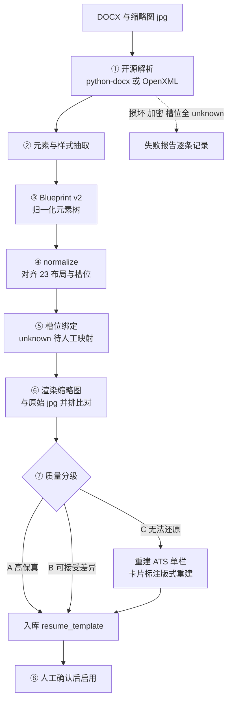
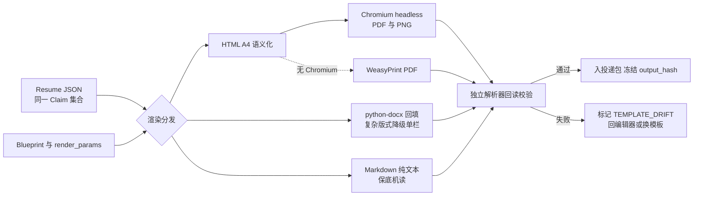

# 22 简历模板与渲染引擎技术方案

> 版本：v1.1 新增
> 关联：总体方案 §10、[09 ATS Simulator](09-ATS-Simulator技术方案.md)、[10 Resume Engine](10-Resume-Engine技术方案.md)、[11 Truth Guard](11-Truth-Guard技术方案.md)、[12 数据库](12-数据库设计.md)、[16 测试](16-测试与评估方案.md)
> 依据 ADR：010（模板只承载呈现/正交模型/渠道边界）、011（开源 DOCX 解析，复杂版式降级）、002（Claim 溯源不被排版破坏）
> 设计参考：a4cv（内容/布局/风格正交的 A4 编辑器，PolyForm-Noncommercial，仅借鉴设计、个人使用）、resume-3d-orbit（224 套 DOCX 模板、Blueprint 管线、3D 画廊与三栏编辑器 PRD，仅借鉴思路）

## 1. 定位与边界

模板子域回答「同一份简历内容**长什么样**」，不回答「内容是什么」。

- 输入：Resume Engine 产出的结构化 Resume JSON（含带证据链的 Claim 集合）+ 模板参数。
- 输出：ATS 附件（PDF/DOCX/Markdown）、可视化版本（PDF/PNG/HTML）、（在线载荷不在本子域，由 Resume Engine 直接生成）。
- 硬边界：
  1. 模板槽位只能引用 Resume JSON 已存在的字段/Claim，**模板内不允许出现任何业务事实文本**；
  2. 同一 Claim 集合经任意模板渲染，导出回读后 Claim 文本集合必须一致（Truth Guard 守卫）；
  3. ATS 与 Showcase 两条渠道边界强隔离（见 1.1）；
  4. 不做模板市场/付费/在线协同，不做完全自由拖拽的设计软件——编辑只发生在受控布局网格内。

### 1.1 渠道族（channel）

| 族 | channel | 形式 | 设计取向 | 可用于 |
|---|---|---|---|---|
| ATS 模板族 | `ats` | 单栏、标准字体、无头像/图形/表格承载正文 | 机器解析优先 | 附件上传、机筛渠道 |
| Showcase 模板族 | `showcase` | 双栏/配色/头像/装饰/时间轴等 | 人眼阅读优先 | 作品集、邮件附件、个人主页 |
| 在线载荷 | `online` | 不走模板渲染 | 纯文本四模块 | BOSS 在线简历填充 |

Showcase 模板在模板库中带明确标签；在 ATS 场景被选用时系统强制渠道提示并阻止进入 ATS 导出队列。

## 2. 正交内容模型

模板 = **Layout（布局）× Style（风格）+ 默认模块组合 + 槽位映射**，四个维度正交组合，参数可覆盖并随 Resume Version 冻结。

### 2.1 Content Module（内容模块，25 类）

五类 25 个模块 M01–M25：基本信息类（姓名/联系方式/求职意向/头像/二维码…）、教育类（教育背景/证书/语言…）、经历类（工作经历/项目经历/实习/社团/志愿…）、能力类（技能/作品集/开源/专利/论文/获奖…）、补充类（自我评价/兴趣/推荐人…）。

每个模块：字段级显隐、字段排序、模块排序、自定义标题、模块级显隐；模块带「ATS 兼容」标记（如头像/二维码模块在 ATS 渠道自动隐藏）。模块的**内容**全部来自 Resume JSON 与 Claim，编辑器不能新建无证据事实。

### 2.2 Layout（布局，23 种 P01–P23）

四大类：单栏、双栏（主侧栏比例可调）、三栏、混合（页眉横幅+双栏等）。可调参数：栏数与栏宽、模块跨栏、密度（行高/段距）、页边距、字号档位、单页/两页/自动分页、页眉页脚、分隔方式。

### 2.3 Style（风格，34 种 S01–S34）

预设组合：配色（16 色系）、中英文字体配对、12 种章节标题样式、标签/技能条样式、装饰元素、日期排版、头像形状/尺寸、8 种一键样式。风格参数均可在模板上覆盖；ATS 渠道仅开放不破坏解析的子集（配色不影响黑白解析、无图标字体）。

### 2.4 模板实体

一个 `resume_template` = 固定的 layout_type + style_preset + 默认模块组合与顺序 + 槽位映射表（slot → Resume JSON 路径）+ 适用渠道 + 元数据标签。用户在模板上的微调保存为 `render_params_json`（挂在 resume_version 上），不回写模板本身；可「另存为我的预设」（复制出新模板，source=user_copy）。

## 3. 模板库与检索

### 3.1 元数据维度

`type`（社招/校招/实习/应届）、`occupation`（17 个职业类）、`style`、`lang`（中/英/双语）、`color`、`columns`、`pages`、`channel`（ats/showcase）、`license`（builtin/free-docx/own）、`quality_grade`（A/B/C 解析质量分级）、`source`（builtin/docx_import/user_copy）。

### 3.2 界面（简洁优先）

1. **默认：简洁网格库**。卡片=缩略图+名称+渠道徽标+质量分级+收藏；顶栏多维 tag 过滤（维度内 OR、维度间 AND）+ 关键词搜索；一屏信息密度优先，无动效。
2. **A4 预览**：点击卡片进入静态多页缩略预览（翻页），再进入编辑器。
3. **3D 环绕画廊/翻页预览**：作为**默认关闭的增强功能**（设置项开启），仅用于浏览 224 套大库；日常选择不依赖它。

## 4. DOCX 模板导入管线

### 4.1 管线步骤



```text
DOCX + 缩略图(jpg)
  → ① 开源解析（python-docx / 直接读 OpenXML）
  → ② 元素/样式抽取（段落/表格/文本框/图片/页眉页脚/字体/颜色/绝对位置）
  → ③ Template JSON v2 Blueprint（归一化元素树 + 位置 + 样式）
  → ④ normalize_blueprint（对齐 23 布局分类、识别槽位、降级不支持元素）
  → ⑤ 内容槽位绑定（启发式匹配标签：姓名/经历/技能…，不确定则标 unknown 待人工映射）
  → ⑥ 渲染缩略图（与原始 jpg 并排比对）
  → ⑦ 解析质量分级（A 高保真 / B 可接受差异 / C 降级 ATS 单栏）
  → ⑧ 人工确认入库（resume_template + template_blueprint）
```

- 批量导入（如 224 套）走 Worker 任务队列：支持断点续跑、逐条成功/失败记录、失败报告（损坏文件/加密/无法识别版式/槽位全 unknown）。
- 导入记录 `license` 与来源目录；仅允许免费授权模板与自有模板入库；来源不明/禁止商用的模板不得进入内置包。
- **ADR-011**：Aspose.Words 等商业库只允许存在于独立实验环境，默认发行栈零依赖；C 级模板入库时强制 `default_channel=ats`（降级为单栏重建），并在卡片标注「版式重建」。

### 4.2 Blueprint 数据结构（摘要）

```json
{
  "version": 2,
  "page": {"width_mm": 210, "height_mm": 297, "margin_mm": [12, 18, 12, 18]},
  "elements": [
    {"id": "el_1", "kind": "textbox|paragraph|table|image|rect|line",
     "bbox": {"x": 0, "y": 0, "w": 0, "h": 0}, "style": {},
     "slot": "profile.name|experience[].title|skill_groups[].items|null"}
  ],
  "slot_map": {"...": "resume_json 路径"},
  "unsupported": ["text_art_3"],
  "parser_engine": "openxml",
  "fidelity_grade": "B"
}
```

## 5. 渲染引擎



### 5.1 渲染路径

| 输出 | 路径 |
|---|---|
| HTML | Resume JSON + Blueprint/内置模板 → 语义化 A4 HTML（固定 mm 尺寸、中文字体栈、图片本地化/base64、打印分页 CSS） |
| PDF | HTML → Chromium headless 打印（首选，保真高）；WeasyPrint 作为无 Chromium 环境备选（CSS 子集） |
| PNG/JPG | HTML → 按页截图（html2canvas/Chromium screenshot） |
| DOCX | Resume JSON + DOCX 骨架模板 → python-docx 回填；复杂视觉版式（绝对定位/图形）不承诺还原，自动降级 ATS 单栏并显式告知 |
| Markdown/纯文本 | 由 Resume JSON 直接序列化（与模板无关），作为保底机读版本 |

渲染为**无状态 Worker 任务**：输入（Resume JSON hash + template_id/version + render_params + renderer_version）决定输出 hash；同输入必须同输出（PDF 嵌入时间戳除外，另存 content_hash）。

### 5.2 回读校验（与 09 共用独立解析器）

每个导出件立即经独立解析路径回读：

- ATS 族：PDF 文本提取 + DOCX XML 解析，跑 ATS 解析矩阵；
- 字段一致性：回读字段集合与 Resume JSON Claim 集合比对，缺失/多出即失败；
- 视觉检查：空白页、内容溢出、孤行、中文乱码（豆腐块）、图片裂图、页码重叠；
- 缩略图与正文一致性抽查。

任一项失败：阻断导出并定位到 `模块/槽位/元素`，返回编辑器修复；DOCX 降级路径必须在 UI 明示差异清单。

## 6. 可视化编辑器

三栏布局，控件克制：

```text
左栏：模块库（25 模块拖拽）+ 模板库入口
中栏：A4 所见即所得画布（缩放/单双页/分页辅助线/压一页提示）
右栏：属性面板（选中元素：布局参数/风格参数） + Claim 抽屉（选中内容：证据链与原文）
```

- 支持：模块拖拽排序与跨栏、显隐开关、字段级显隐、自定义模块标题、栏宽/密度/边距/字号、配色/字体/标题样式切换、头像上传与裁剪、自动压一页/两页模式。
- **两类编辑严格分流**：
  - 内容编辑（改文字/增条目）→ 写回 Resume JSON → 触发 Claim 复验与 Truth Guard → 生成新 Resume Version；
  - 排版编辑（移动/样式/显隐）→ 只写 `render_params`，可快速保存，不触碰事实。
- 编辑器状态（editor-state：画布焦点/撤销栈不入库，持久态=模块顺序+显隐+参数）与 Resume Version 绑定；参考 a4cv 的交互密度但不做 git 式分支（v1.1 用版本列表 + diff 预览即可）。

## 7. 版本与数据模型（与 12 篇一致）

- `resume_template`：模板元数据与渠道/授权/质量标签，版本化。
- `template_blueprint`：模板蓝图版本（导入引擎与保真分级）。
- `template_import_batch`：批量导入任务与失败报告。
- `template_pack`：模板包（内置精选包、用户自选包、224 套分批导入包）。
- `resume_version` 扩展：`template_id, template_version, render_params_json, channel(ats/showcase/online), renderer_version, input_hash, output_hash`。
- 冻结语义：每次导出冻结模板版本 + 全部参数 + Claim 快照 + renderer 版本；复盘与重放依赖该快照。模板被停用/修改不影响历史版本复现（蓝图与模板软删除，不物理删除）。

## 8. 模板推荐（Template Advisor）

规则优先、可拒绝、不自动替用户决定：

1. 按渠道：BOSS 附件/ATS 岗（`ats_direct_post=true`）默认推荐 ATS 单栏；作品集/邮件场景推荐 Showcase。
2. 按职位族：技术岗推荐简洁单/双栏克制配色；设计岗可推荐强风格模板（仍提醒 ATS 场景另出一版）。
3. 按内容量：模块数/字数超过阈值时推荐高密度/双页模板，避免压一页导致的溢出；内容少时推荐单页紧凑模板。
4. 推荐结果在库顶部以「为该岗位推荐」横滑组呈现，标注理由；用户忽略即不追问；选择行为记录用于复盘模板效果（不用于自动调权）。

## 9. 质量与测试（详见 16 篇）

| 测试面 | 关键断言 |
|---|---|
| 槽位映射 | 全部槽位正确绑定；unknown 槽位不静默丢弃；槽位不能产生新事实 |
| 导入回归 | 精选 DOCX 集导入成功率达标；A/B/C 分级与人工判定一致；断点续跑不重复入库 |
| 渲染保真 | HTML/PDF 与缩略图布局偏差在阈值内；中文字体无乱码；无空白页/溢出/孤行 |
| 导出一致 | PDF↔DOCX↔Markdown 回读字段集合一致；同输入 content_hash 稳定 |
| 渠道隔离 | Showcase 不能进入 ATS 导出；ATS 导出中无头像/二维码/图形正文 |
| 守卫联动 | 任意模板渲染前后 Claim 集合一致；内容编辑触发 Guard 复验 |
| 性能 | 单份 PDF 渲染 P95 ≤ 8s（本机 Worker）；批量导入可后台续跑 |

## 10. 非目标

- 不做在线模板市场、模板付费/分享/协同编辑。
- 不做像素级自由画布（元素不得脱离受控布局网格任意定位）。
- 不承诺所有第三方 DOCX 高保真还原；C 级模板一律降级重建。
- 不内置商业解析库（Aspose）与非免费授权模板。
- 不由模板系统生成或润色任何事实文本（润色是 Resume Writer 的职责，且必须过 Guard）。
