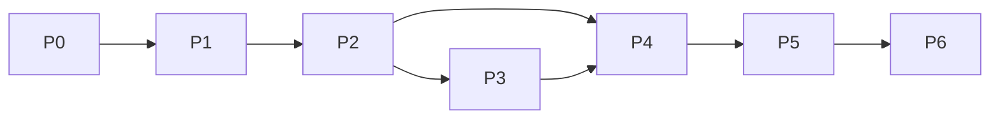

# 03 排期与里程碑

> 排期纪律（与 [19 篇](../architecture/19-项目实施计划.md) 一致）：**按阶段门禁推进，不承诺日历日期**。本文给的是「人周（PW）工作量估算 + 依赖关系 + 两种人员配置下的日历换算方法」，P0 结束后必须用真实速率重新校准（re-baseline），之后每阶段末滚动一次。

## 1. 估算口径与假设

- 单位：**人周（PW）**，1 PW = 1 名熟练工程师 1 个全职工作周（含自测，不含评审等待）。
- 估算含设计、编码、单元测试、文档同步；不含需求犹豫与中断。
- 假设：开发者已读架构文档、契约 v1 已冻结（P0 后）、本机环境 1 天内可起、AI 代理承担约 30–40% 机械编码量（但评审/调试时间不省）。
- 每个阶段额外加 **15–20% 缓冲**（接口变更、页面结构变化、Gold Set 返工是本项目最大不确定性）。
- 数字是**规划估算，不是承诺**；用于排顺序、识关键路径，不用于赶工压测。

## 2. 分阶段工作量估算

| 阶段 | 主要工作 | 工作量（PW） | 不确定性 | 最大返工风险 |
|---|---|---|---|---|
| **P0** 文档契约 | 契约冻结、Gold Set v0、测试计划、评审门建立 | 1.5–2 | 低（主体已完成，剩冻结评审） | 契约返工拖累双端 |
| **P1** 骨架+扩展重写 | Compose、配对/WS、Alembic、扩展去 8789、迁移、控制台壳 | 3.5–5 | 中 | 老 MySQL 数据迁移；WS 边界 |
| **P2** 采集+筛选+JD/匹配 | Stage-0 八组规则、补采桶、JD 解析、Stage-1、候选流 | 4–5.5 | 高 | 薪资/活跃度解析边界；页面字段变化 |
| **P3** 模板系统 | 正交模型、内置包、DOCX 导入、编辑器、多格式导出 | 4–5.5 | 高 | DOCX 保真分级；中文字体/分页 |
| **P4** 简历+招呼语+填充 | 投递包 DAG、Guard、A/B、四模块填充、红队 | 3–4 | 中 | Claim 溯源；红线字段剥离 |
| **P5** 聊天回采+事件 | protobuf 解码、DOM 降级、确认台、加密、清除 | 2.5–3.5 | 高 | proto 结构变化；分类准确率 |
| **P6** 复盘+漏斗+UAT | 复盘、看板、策略生命周期、全链路对账、恢复演练 | 2–3 | 中 | 漏斗口径对账 |
| **合计（净工作量）** | | **20.5–28.5 PW** | | 加缓冲后约 **24–34 PW** |

## 3. 依赖关系与关键路径

- **关键路径**：P0 → P1 → P2 → P4 → P5 → P6。
- **P3 是唯一可并行的阶段**：它只依赖数据/简历契约，可在 P2 后半段启动（与 [19 篇](../architecture/19-项目实施计划.md) 一致）；但 P4 必须等 P3 完成，所以 P3 延期会吃掉并行红利。
- P5 依赖 P4（事件投影建立在投递包/状态机之上）；P6 必须最后做（它要观测前面所有环节的真实数据）。
- 每阶段内部顺序：契约/接口先行（10–20%）→ 实现（50–60%）→ 测试与取证（20–25%）→ 出口评审（≤10%）。

## 4. 两种配置的日历换算

### 方案 A：单人全栈（角色 R0–R9 全兼）

- 有效投入按每周 4–5 个工作日、且架构/产品事务占 20% 计。
- P3 无法与 P2 真并行（同一人），总日历 ≈ 净工作量 ÷ 0.8（事务折损）。
- **预计总周期：约 6–8.5 个月**（26–37 周），建议对自己承诺 **8 个月**，提前完成是盈余。
- 建议节奏：每 2 周一个 Sprint，每阶段末留 3–5 天「评审 + 缓冲 + 文档」固定窗口。

| 阶段 | 单人日历（周） |
|---|---|
| P0 | 2 |
| P1 | 4–6 |
| P2 | 5–7 |
| P3 | 5–7（串行排在 P2 后） |
| P4 | 4–5 |
| P5 | 3–4 |
| P6 | 3–4 |

### 方案 B：3 人小队（本人 R0/R1 + 后端AI + 前端扩展渲染）

- P1/P2/P4/P5 可前后端并行；P3 由前端/渲染角色主线推进，后端在 P2 后半支持。
- 并行折损（联调/评审/互相阻塞）按 0.7 系数估。
- **预计总周期：约 3.5–5 个月**（15–22 周）。
- 4 人配置（含专职 QA/安全 R7/R8）再缩短约 15–20%，主要省在 P4/P6 的取证与返工。

| 阶段 | 3 人小队日历（周） |
|---|---|
| P0 | 1.5 |
| P1 | 2.5–3 |
| P2 | 3–4 |
| P3 | 3–4（与 P2 后半并行，墙钟约 4–5） |
| P4 | 2.5–3 |
| P5 | 2–2.5 |
| P6 | 2–3 |

## 5. 里程碑（对外只承诺这些，不承诺内部日期）

| 里程碑 | 含义 | 评审门 | 可演示成果 |
|---|---|---|---|
| **M0 契约冻结** | WS/核心 API/规则 Schema 转 v1 | G3 | 双端契约测试互跑通过 |
| **M1 采集闭环** | 扩展采集真实岗位入池，迁移完成 | G6(P1) | ≤30 条真实列表+详情样本，风控暂停可演 |
| **M2 筛选与候选** | 规则筛选+JD+建议+人工候选 | G6(P2) | 漏斗前两级可对账，首轮真实候选确认 |
| **M3 模板可用** | 内置包+DOCX 导入+五格式导出 | G6(P3) | 用本人简历真实导出并回读 |
| **M4 可投递包** | 三形态简历+招呼语+填充，红线全证 | G5+G6(P4) | 第一个真实岗位的完整投递包（人工发送） |
| **M5 回采闭环** | 聊天解码+事件确认+状态投影 | G6(P5) | 真实沟通消息正确入账 |
| **M6 全漏斗上线** | 复盘/看板/策略/UAT/备份演练 | G8 | 真实小批量全漏斗 Go 结论 |

M4 是全项目风险最高的里程碑（真实性 + 账号 + 法律红线交汇），排期上应保证 P4 不被压缩。

## 6. Sprint 节奏（2 周）

每个 Sprint：第 1 天计划会（按任务头认领，引用 ARCH/契约/红线）→ 第 10 天演示**真实数据** → 评审单 → 下个 Sprint 计划。

- 每个 Sprint 只放入「可在演示日看到效果」的后端到端切片，不按技术层水平拆 Sprint。
- Sprint 内冻结需求；变更进 backlog（[04 §5](04-评审与需求把关.md)）。
- 单人时把「演示/评审」日历事件固定下来，当作对利益相关者（未来的自己）的承诺。

## 7. 排期风险管理

| 情况 | 处理 |
|---|---|
| BOSS 页面/接口变化 | 立即暂停受影响阶段任务；启用 DOM 降级；耗时超预算 30% 则缩范围（如通勤规则延后）并更新本估算 |
| Gold Set 指标达不到（F1/解析率） | 不加人不加夜，先补样本与规则；门禁不放水，必要时把该能力降级为「人工辅助」 |
| 契约在阶段中被发现错误 | 走变更流程，重估后续阶段；宁可推迟日历，不带着错契约定上层 |
| 账号出现风控信号 | 所有真实站点任务立即停止，排期全部让位给安全排查，R0 决定恢复时间 |
| 单人疲劳/中断 | Sprint 容量按 0.8 规划；连续两个 Sprint 未达容量则重排（re-baseline），不累积技术债赶进度 |

## 8. 排期表维护规则

- 本文只维护**相对估算与顺序**；具体 Sprint 起止日期放团队日历/任务板，不回写本文档。
- 每阶段出口评审后更新：实际 PW、偏差原因、后续阶段新估算（滚动规划）。
- 禁止行为：为赶里程碑跳过评审门、跳过负向测试、让 AI「先实现后补契约」。
