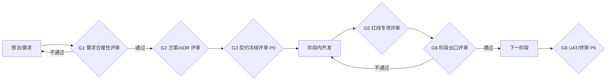

# 04 评审与需求把关

> 本文定义「什么时候必须停下来检查」以及「需求到底合不合理怎么判」。目标是用最少的评审次数拦住最贵的错误：账号风险、隐私泄露、事实造假、契约返工。

## 1. 评审门总览



另有两个**随时触发**的轻量门：PR 代码评审（每个任务）、需求变更评审（见 §5）。

## 2. 各评审门的输入、参与者、检查单

### G1 需求合理性评审（写代码前；P0 内集中做一次，之后每个需求增量做）

参与者：R0（A）、R1；必要时 R3/R4 咨询。
输入：一页纸需求（问题、目标用户动作、非目标、成功指标、风险直觉）。

需求合理性检查单（任一项答不上来，需求打回）：

1. **真问题**：它对应求职闭环里哪个真实动作？没有对应动作的是「自嗨功能」，砍。
2. **可验证成功**：成功指标可测量吗？（例：淘汰原因 100% 可解释，而不是「筛选更准」）
3. **与红线相容**：是否要求自动发送/翻页/外发聊天原文/自动改权重？要求即否决或改为人工辅助形态。
4. **账号成本**：需要对真实站点做什么动作？频率多高？风控代价是否大于收益？（ADR-009 的精神）
5. **数据可得**：依赖的字段页面/接口真的拿得到吗？拿不到的需求降级为「人工录入」或删除。
6. **可逆性**：做错了能否撤回？不可逆动作（发送、上传、删除原文）必须改成「生成草稿 + 人工执行」。
7. **非目标明确**：明确写出本阶段**不做**什么（多渠道、自动投递、3D 默认开等）。
8. **投入产出**：它在 P0–P6 哪一阶段？是否阻塞主线？非阻塞的进 backlog。

需求分级（评审时给结论）：

| 级别 | 含义 | 去向 |
|---|---|---|
| 合理且必须 | 主线闭环需要 | 进当前阶段 |
| 合理但延后 | 有价值但非主线/成本高 | backlog，标注触发条件 |
| 需重新设计 | 触碰红线或数据不可得 | 改为人工辅助形态后重提 |
| 否决 | 违 ADR/账号风险/无真实场景 | 记录否决理由，不再反复讨论 |

### G2 方案 / ADR 评审

参与者：R1（A）、相关域 owner、R8（涉安全隐私时）。
- 是否有适用 ARCH 条目（索引库 §3）？新模式先补 ARCH 条目或 ADR。
- domain_owner、核心实体、不变量、跨域协作方式是否明确。
- 同步/异步、幂等键、失败归属、PII 接触面、成本预算是否写清。
- 结论：accepted / rejected / 有条件通过（列出关闭条件）。

### G3 契约冻结评审（P0 出口）

参与者：R1+R2+R4+R5+R7。
- WS 七命令七事件、错误码映射、Filter/DSL Schema、OpenAPI 核心路径、DDL 与 12 篇逐字段对账。
- 「协议里没有 send 类命令」由自动化测试证明，不靠口头保证。
- 冻结后破坏性变更走契约版本升级 + ADR（ARCH-CONTRACT-001）。

### G5 红线专项评审（每阶段开发中、碰红线代码即触发）

| 专项 | 触发时机 | 评审人 | 通过证据 |
|---|---|---|---|
| 账号风控 | 扩展采集/节流/选择器/proto 任何改动合并前 | R8+R1 | 风控词即停测试、无 send 路径扫描、节流下限断言 |
| 聊天隐私 | chat 入库/解密/复盘引用相关改动 | R8 | 出站零 chat 断言、KEK 检查、清除链路验证 |
| 真实性 | Claim/Guard/Prompt/招呼语改动 | R1+R0 | 红队集全绿；unsupported Claim = 0 |
| 模板合规 | 新模板入库/导入器改动 | R8 | license 字段完整；渠道阻断测试 |

红线评审**不接受口头 LGTM**：必须在评审单附测试名/截图/报告链接。

### G6 阶段出口评审（P1–P6 每阶段末）

参与者：R0（A）、R1、R7、R8；演示用真实脱敏样本。
逐项对照：
1. [19 篇](../architecture/19-项目实施计划.md) 该阶段出口门禁；
2. [02 交付物清单](02-交付物清单.md) 该阶段表格全部有物可验；
3. 本夹 [05](05-测试策略与验收.md) 的阶段测试门槛；
4. 漏斗/指标数字能下钻对账；
5. 遗留问题清单（含「接受的风险」需 R0 签字）。
不通过：缩范围回炉，**不允许带红线缺口进入下一阶段**。

### G8 UAT / 终审（P6）

参与者：R0 主验，R7 取证，R8 终审安全项。
- 按 [20 篇 Go/No-Go](../architecture/20-风险与验收标准.md) 逐条核；
- 真实账号小批量、人工节奏跑完整漏斗；
- 输出 UAT 结论：Go / 有条件 Go（列修复期限）/ No-Go。

## 3. PR 级评审（每个任务）

- 作者以外的人 Approve；单人项目用「隔夜 + 清单 + 自动门禁」替代（[01](01-角色与职责.md) §3）。
- 必看：ARCH 引用、契约 diff、红线负向测试、日志是否含 PII、是否超任务范围。
- AI 生成代码：按 [24 篇 §4 自评清单](../architecture/24-AI协作开发规范与边界.md) 检查；AI 不得 Approve。

## 4. 需求「写完后回头看合不合理」机制

除了前置评审，在两个点做**后验**：

1. **阶段演示日（每阶段末）**：用真实数据回答 G1 的第 1、2 条——当初要解决的问题解决了吗？指标改善了吗？没有则需求降级或废弃，已写代码进入「保留但不推广」清单。
2. **漏斗复盘（P6 及以后每 7/30/90 天）**：用真实转化数据检验功能价值（参考 [20 篇](../architecture/20-风险与验收标准.md) 复验节奏）。例：某类筛选规则是否误杀过多？某模板导出后回复率是否异常？数据观测只产出**待审建议**，不自动改规则（ADR-008）。

需求后验常见「不合理信号」：
- 功能做完但本人从不在真实流程里点开它；
- 为支持它引入了新依赖/新风险，而使用频次极低；
- 指标无法归因（说不清它改善了漏斗哪一级）；
- 它让「人工确认」步骤变得繁琐到想绕过——这是设计缺陷，不得通过放宽红线解决，要改交互。

## 5. 需求变更流程

```text
变更提出（写明动机/影响阶段/触碰的契约与红线）
  → R1 影响评估（对照索引库 §4.3 变更影响矩阵）
  → 是否触碰 ADR/红线？
       是 → 必须新 ADR + R0/R8 评审，通过才做
       否 → 排期决策（当前阶段插入 or 进 backlog）
  → 契约/文档/测试同步更新后才允许动代码
```

- 当前阶段进行中插入变更：默认拒绝，除非是修复红线缺陷或阻断性 bug。
- 任何「顺手做了」的变更在评审中一律回退。

## 6. 评审记录模板（存 `docs/delivery/reviews/`，建议命名 `Gx-阶段-主题-日期.md`）

```markdown
# 评审单：<G1~G8> <主题>
- 日期/参与者/结论（通过/有条件通过/打回/否决）
- 评审对象与版本（文档/契约 commit/构建号）
- 检查项逐条结论与证据链接
- 红线项：对应测试名/报告
- 遗留问题：[ ] 事项 / 责任人 / 关闭期限
- R0（或 R8）签字确认
```
