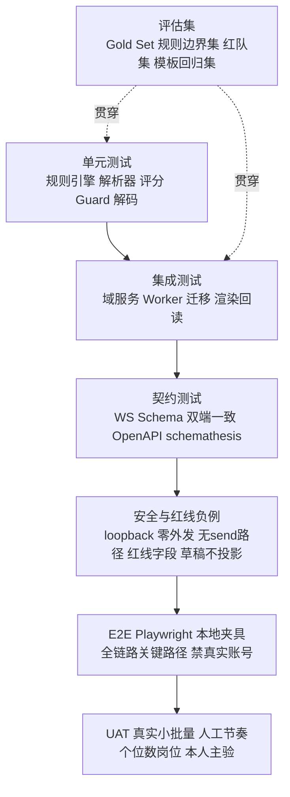

# 05 测试策略与验收

> 技术级测试设计见 [16-测试与评估方案](../architecture/16-测试与评估方案.md)，量化门槛见 [20-风险与验收标准](../architecture/20-风险与验收标准.md)。本文回答交付管理问题：**每个阶段测什么、谁测、用什么数据、过什么门才算完成**。

## 1. 测试金字塔（本项目形态）

- 底层大量、快速、无外部依赖；LLM 调用在单测/集成层全部用录制响应或本地小模型替身。
- 红线负例不是「可选安全测试」，而是与功能测试同级的必备项。
- AI 质量不靠主观感觉，全部由冻结版本的评估集给数字。

## 2. 测试数据铁律

1. **自动化测试永不登录、不访问真实 BOSS 账号**；WS/页面交互使用录制夹具（脱敏后的 list_json/detail_json/聊天 proto 样本）。
2. 真实数据只用于两类活动：本人手动 UAT（人工节奏、小批量）、本地一次性迁移验证。
3. 聊天样本进仓库前必须脱敏（人名、公司、消息原文替换）；真实原文只存在本机 `data/`，不进 git。
4. 评估集冻结版本：指标只与同版本集比较；改集必须重跑历史基线并记录。
5. 夹具按来源分目录：`tests/golden/`（金标）、`tests/fixtures/boss/`（采集样本）、`tests/redteam/`（攻击/造假样本）、`tests/templates/`（DOCX 样本与缩略图）。

## 3. 四套核心评估集（谁建、建什么）

| 评估集 | 建设人 | 内容 | 主要门槛 |
|---|---|---|---|
| Gold Set v0+ | R3 建、R0 确认、R7 管版本 | JD 解析金标、Evidence 判定、招呼语合规、聊天事件分类 | Requirement F1≥.80；Claim Support Precision≥95%；约面/拒绝分类≥.90 |
| 规则边界集 | R0+R3 出口径、R2/R7 落样例 | 各薪资口径、活跃度分档、否定语境、工具后缀、同 HR/好友/猎头、通勤缺失 | 每条 reject 可解释；零误杀白名单样例 |
| 红队集 | R7 建、R8 复核 | 无证据 Claim、学习项目冒充在职、模板注入事实、JD 提示注入、承诺/虚构了解话术、绕过红线字段的载荷 | 拦截率 100%，无后门标志位 |
| 模板回归集 | R6+R7 | 内置模板 + A/B/C 级 DOCX 各若干、期望缩略图、期望机读字段 | ATS 解析 ≥98%、关键字段 ≥95%；C 级降级有告知 |

## 4. 分阶段测试计划

### P0 — 先立规矩
- 产出：测试计划（本文实例化）、四套评估集 v0、CI 骨架（ruff/mypy、eslint/tsc、pytest、vitest）。
- 出口：CI 在空仓可运行；契约目录有至少 1 正 1 反样例。

### P1 — 骨架与扩展重写
| 测试 | 方法 | 责任 |
|---|---|---|
| 配对鉴权负例 | 非 loopback/错 token/错版本/错 Origin 必须拒 | R2+R7 |
| WS 契约一致性 | 双端加载同一 JSON Schema，正反例校验 | R4+R7 |
| 命令白名单 | 注册表出现 send/deliver/next_page 名字即启动失败 | R7 |
| 迁移 | upgrade/downgrade 双向；老 MySQL 样本对账 | R2+R4 |
| 幂等 | 重复 job.captured/chat.event 不产生重复行 | R2+R7 |
| 启动冒烟 | 全新机器一键起，健康检查全绿 | R9 |

### P2 — 采集/筛选/JD/匹配
- Stage-0：规则边界集全过；**断言筛选路径 LLM 调用次数为 0**；reject 原因字段完整性；捞回可往返。
- 采集：节流 ≥1800ms 与抖动的统计断言；abort 即时；`capture.error{risk}` 后批次 halted 且不自动重试。
- JD：Gold Set 报 F1；解析器版本写入记录；人工修订产生新版本。
- 匹配：输出必须含 Fit/Gap/Risk/建议与逐项依据；缺依据的评分项视为缺陷；文案扫描无结果承诺。
- 漏斗：captured→screened_pass 计数与明细 SQL 对账。

### P3 — 模板系统
- 槽位映射回归；模板中出现事实文本即入库失败。
- DOCX 导入：A/B/C 分级人工抽检一致；损坏/加密/槽位全 unknown 进失败报告；license 缺失拒绝。
- 导出：PDF/DOCX 独立解析器回读；字段一致率；中文字体/分页截图基线（视觉回归）。
- 渠道：showcase 进 ATS 队列返回 TEMPLATE_WRONG_CHANNEL；依赖扫描无 Aspose/GPL 命中。

### P4 — 简历/招呼语/在线填充（红线交汇，测试最重）
- Claim：unsupported Claim 在 ready/used 包中为 0；三形态 Claim 快照一致。
- Guard 红队集：100% 拦截；逐条留拦截原因。
- 招呼语：每条变体可溯源到证据或合规变量槽；长度/禁用词；A/B 选择留痕。
- 在线载荷：构造含公司/职位/时间/学历的载荷，断言扩展**零写入且上报 skipped_redline**。
- 外发路径：静态扫描 handler/DSL/命令全集 + 红队 E2E，双重证明无可达自动外发；UI 上不存在「一键发送」。
- 填充确认：未当场人工确认时 fill.completed 不得产生。

### P5 — 聊天回采与事件
- 解码：网络层 proto 样本结构化正确；缺 proto 时自动 DOM 降级，置信度下调。
- 隐私：出站替身抓包，第三方请求 payload 断言零 chat 字段；日志扫描无原文；KEK 文件权限。
- 草稿：draft 事件投影前后 Application 状态不变；confirmed 才迁移；重复确认 409。
- 分类：Gold Set ≥.90；寒暄/通知不误判约面或拒绝。
- 清除：按会话删除后，缓存/索引/临时文件断言不存在。

### P6 — 复盘/漏斗/UAT
- 非终态岗位生成复盘返回错误；复盘版本不可变；策略 approved 后配置参数无任何变化（可对比配置快照）。
- 七级漏斗端到端与明细对账；下钻数字一致。
- 备份恢复演练：pg_dump + 目录恢复，记录 RTO。
- UAT（本人执行）：真实账号、人工节奏、个位数岗位完整漏斗；记录每个确认动作；观察账号无异常。

## 5. 红线「证明做不到」测试清单（合并闸门，缺一不可）

| 红线 | 测试形式 |
|---|---|
| 无自动发送/投递/翻页/上传 | ① 注册表黑名单单测 ② DSL 静态门禁 ③ 协议 Schema 无 send 命令 ④ E2E 红队尝试触发 |
| 节流不可放宽 | delay_ms<1800 / concurrency>1 / auto_next_page=true 被 Schema 或服务端拒绝 |
| 聊天不出本机 | 出站拦截断言 + 日志/错误上报内容扫描 |
| 草稿不自动入账 | draft→状态不变 单测 + E2E |
| 红线字段不填充 | 载荷注入四字段，断言零写入 + skipped_redline |
| 无证据不发布 | ready/used 包 unsupported=0 断言 + 红队集 |
| 非 loopback 拒绝 | WS/HTTP 来源负例 |
| 渠道不混用 | showcase→ATS 阻断 |
| 商业/传染性许可不进栈 | 依赖+许可证扫描 CI 任务 |

## 6. Bug 分级与处理

| 级别 | 定义 | 处理时限 |
|---|---|---|
| P0 | 红线可被绕过、数据丢失/泄露、真实账号有风险 | 立即停止相关阶段，修复并加回归测试后才恢复 |
| P1 | 主流程阻断（采集/筛选/投递包/回采）、指标计算错误 | 当前 Sprint 修复 |
| P2 | 非阻断功能错误、降级路径失效、模板 C 级误标 | 下个 Sprint |
| P3 | 文案、样式、体验问题 | 排期处理 |

P0 修复必须补「同类攻击」用例（不是只补触发的那一个）。

## 7. 验收证据包（每阶段出口必备）

1. 本阶段交付物逐项对照 [02 交付物清单](02-交付物清单.md)；
2. 评估集报告（版本号、样本量、指标、与上版对比）；
3. 红线负例清单与运行结果；
4. 真实脱敏样本的演示录屏或现场演示（UAT 用真实小批量）；
5. 契约测试与 CI 记录；遗留缺陷登记（分级+接受人签字）；
6. P6 额外提供：全漏斗对账表、备份恢复记录、[20 篇](../architecture/20-风险与验收标准.md) Go/No-Go 逐条核对。

## 8. 责任矩阵（测试活动）

| 活动 | 主责 | 复核 |
|---|---|---|
| 单元/集成测试 | 各功能开发者（含 AI 生成代码的作者） | R7 抽审 |
| 契约测试 | R2/R4/R5 各写消费侧 | R7 |
| 评估集建设与指标 | R3 | R0（口径）、R7（版本） |
| 红线/安全负例 | R7 设计，开发者实现 | R8 终审 |
| E2E | R7 | R1 |
| UAT | R0 | R7 取证 |
| 验收 Go/No-Go | R0 | R1/R7/R8 会签 |
